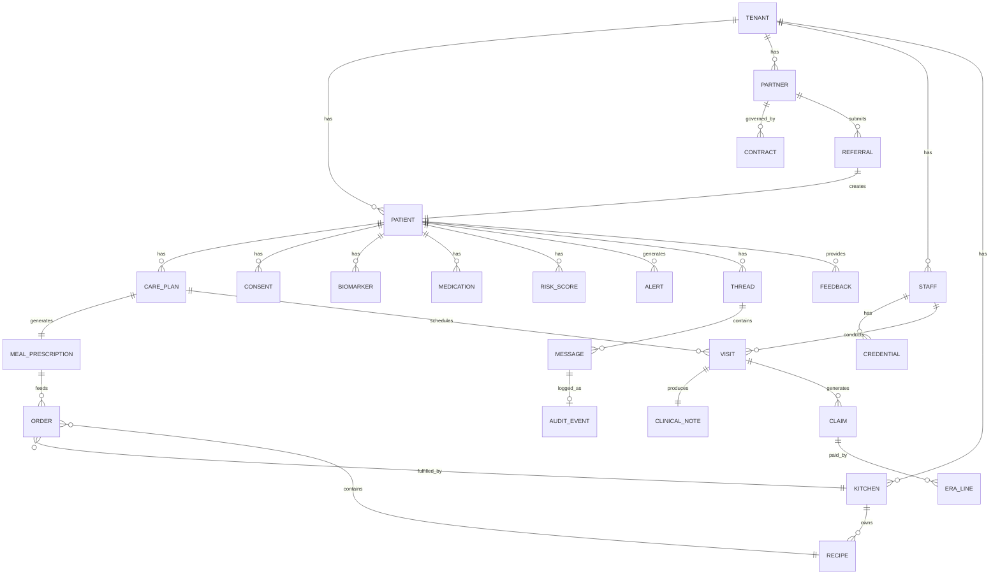

# Data Model

> Core entities and their relationships. This is the schema that spans all domains —
> the shared vocabulary that agents, orchestrators, and UI surfaces all speak.
>
> Updated to reflect all 10 deep workflow docs and architectural decisions AD-01 through AD-07.

---

## Architectural context

- **Database:** Postgres on GCP (AD-01)
- **Tenant isolation:** Shared DB with `tenant_id` column + Postgres RLS (AD-04)
- **Research tier:** De-identified data exported via ETL to BigQuery (AD-05)
- **Billing platform:** Athena Health (OQ-03)
- **EHR integration:** Multi-EHR — Epic FHIR R4 (Cedars), Athena API (Vanderbilt), none (UConn phase 1) per OQ-01

---

## Entity map



---

## Platform infrastructure

### Tenant
The top-level isolation boundary. Every PHI record has a `tenant_id`. Postgres RLS
enforces isolation at the database layer (AD-04). Application queries include `tenant_id`
via a scoped context — never raw queries without tenant filtering.

```
Tenant {
  id: uuid
  name: string
  slug: string                  // URL-safe identifier
  config: {
    features: string[]          // enabled feature flags
    branding: object            // white-label config (future)
  }
  status: active | suspended | terminated
  created_at: timestamp
}
```

### AuditEvent
Immutable append-only record of every action. The thread is the UX surface for this data;
AuditEvent is the compliance-queryable version. Separate storage from application DB
for immutability guarantees. (Domain 6.2)

```
AuditEvent {
  id: uuid
  tenant_id: uuid               // hard partition key
  session_id: uuid               // links to thread
  actor_id: uuid                 // user or agent id
  actor_role: string             // RBAC role at time of action
  action_type: tool_call | data_read | data_write | login | consent_check | approval
  resource_type: string          // Patient | CarePlan | LabResult | ...
  resource_id: uuid              // token reference — not raw PHI
  phi_fields_accessed: string[]  // field names accessed, not values
  outcome: success | denied | error
  timestamp: timestamp (UTC)
  // immutable: enforced at storage layer — no UPDATE or DELETE permitted
}
```

### Thread and Message
The UX surface, audit trail, and compliance record in one structure. Every agent action,
human decision, and system event is a message.

```
Thread {
  id: uuid
  tenant_id: uuid
  type: patient_workflow | clinical_visit | meal_cycle | claim |
        partner_report | alert | crisis | system
  subject_id: uuid              // patient_id, order_id, claim_id, etc.
  subject_type: string
  status: active | awaiting_human | completed | failed
  created_at: timestamp
  updated_at: timestamp
}

Message {
  id: uuid
  thread_id: uuid
  tenant_id: uuid
  timestamp: timestamp
  actor: Actor
  content_type: system_event | agent_tool_call | agent_tool_result |
                approval_request | approval_response | human_message
  payload: object               // type-specific — see agent-framework.md
  visible_to: Role[]            // access control per message
  phi_present: boolean          // encrypted at rest, not rendered in thread UI
  requires_approval: boolean
  approved_by: uuid | null
  approved_at: timestamp | null
}

Actor {
  type: agent | human | system
  id: string
  display_name: string
  role: string | null
}
```

---

## People

### Patient
The central entity. Everything else is linked to or derived from a patient record. (Domain 1)

```
Patient {
  id: uuid
  tenant_id: uuid

  // Identity
  first_name, last_name, middle_name: string
  date_of_birth: date
  ssn_encrypted: string         // encrypted at rest, never in logs or thread payloads
  gender_legal: string
  gender_identity: string

  // Contact
  phone_primary: string
  phone_secondary: string
  email: string
  address_delivery: Address     // where meals go
  address_mailing: Address
  emergency_contact: { name: string, phone: string, relationship: string }
  preferred_contact_method: phone | sms | email
  best_contact_time: string
  language_preference: string   // en | es at launch

  // Insurance
  insurance_primary: InsuranceRecord
  insurance_secondary: InsuranceRecord | null

  // Program
  status: PatientStatus
  risk_tier: low | medium | high | critical
  engagement_score: number      // 0-100, updated per 7.6
  care_plan_id: uuid | null     // current approved version
  referral_id: uuid
  partner_id: uuid              // referring partner
  enrolled_at: timestamp | null
  discharged_at: timestamp | null
  discharge_reason: string | null

  // Consent
  consents: ConsentRecord[]

  // Research
  research_enrolled: boolean    // separate from clinical consent
  research_cohort_id: uuid | null

  created_at: timestamp
  updated_at: timestamp
}

PatientStatus = referral_received | eligibility_pending | eligibility_failed |
                enrollment_pending | assessment_pending | care_plan_pending |
                active | care_plan_update_pending | high_risk | on_hold | discharged

Address {
  street1, street2, city, state, zip: string
  validated: boolean
  delivery_instructions: string | null  // gate code, leave at door, etc.
}

InsuranceRecord {
  payer_id: uuid
  payer_name: string
  type: medicaid | medicare | medicare_advantage | commercial | tricare
  member_id: string
  group_number: string
  subscriber_name: string
  subscriber_relationship: self | spouse | dependent
  effective_date: date
  end_date: date | null
  eligibility_last_checked: timestamp
  eligibility_status: active | inactive | pending
  fam_benefit_covered: boolean | null   // checked at eligibility (Domain 1.2)
}
```

### Staff
Providers and operational staff. Drives RBAC (Domain 6.3) and credentialing (6.8, 8.2).

```
Staff {
  id: uuid
  tenant_id: uuid
  name: string
  email: string
  role: rdn | bhn | care_coordinator | admin | engineer | kitchen_staff
  status: onboarding | active | on_leave | terminated
  credentialing_status: pending | partial | active | lapsed
  hire_date: date
  termination_date: date | null
  ooo_until: date | null        // for alert routing fallback (Domain 7.2)
  backup_staff_id: uuid | null  // coverage assignment for OOO
}

CredentialRecord {
  id: uuid
  staff_id: uuid
  tenant_id: uuid
  credential_type: state_license | payer_enrollment | malpractice | npi | dea
  license_number: string
  issuing_state: string | null  // for state licenses — multi-state tracking
  payer_id: uuid | null         // for payer enrollments
  issue_date: date
  expiry_date: date
  status: active | expiring_soon | expired | suspended
  alerts_sent: date[]           // 90, 30, 7-day alerts
  scheduling_blocked: boolean   // auto-set when expired (soft block per OQ-29)
}
```

---

## Clinical

### CarePlan
Versioned and immutable once approved. Changes create new versions. Full history preserved.
(Domain 1.5, 1.9)

```
CarePlan {
  id: uuid
  patient_id: uuid
  tenant_id: uuid
  version: string               // "1.0", "1.1", "2.0", "1.0e" (emergency)
  version_type: initial | minor_update | major_update | emergency
  status: draft | pending_rdn | pending_bhn | pending_coordinator | approved | superseded

  goals: Goal[]
  nutrition_plan: NutritionPlan
  behavioral_health_plan: BHPlan | null
  visit_schedule: VisitScheduleItem[]
  monitoring_schedule: MonitoringSchedule
  meal_delivery_config: MealDeliveryConfig
  medications: MedicationReference[]  // snapshot at plan creation
  risk_flags: string[]

  // Approval chain
  rdn_approved_by: uuid | null
  rdn_approved_at: timestamp | null
  rdn_notes: string | null
  bhn_approved_by: uuid | null
  bhn_approved_at: timestamp | null
  coordinator_approved_by: uuid | null
  coordinator_approved_at: timestamp | null

  triggered_by: string | null   // what caused this version (lab result, provider request, etc.)
  superseded_by: uuid | null
  created_at: timestamp
}

NutritionPlan {
  calories_min, calories_max: number
  protein_min_g, fat_max_g, carb_max_g: number
  sodium_max_mg: number
  potassium_max_mg: number
  allergen_exclusions: string[] // HARD — never override
  preference_tags: string[]     // soft
  cultural_preferences: string[]
  drug_nutrient_flags: string[] // from medication reconciliation (Domain 2.7)
}

MealDeliveryConfig {
  meals_per_week: number
  delivery_days: DayOfWeek[]
  format: fresh | frozen        // per OQ-17
  hot_cold_preference: hot | cold | either
  max_meal_budget_cents: number // from partner contract
}

MonitoringSchedule {
  checkin_frequency: weekly | biweekly | monthly
  phq9_frequency: monthly | quarterly
  lab_schedule: [{ biomarker: string, loinc: string, frequency: string, next_due: date }]
  vitals_self_report: [{ type: string, frequency: string }]
}
```

### ClinicalVisit
Every encounter — RDN, BHN, telehealth, in-person. (Domain 2.1, 2.2, 2.4)

```
ClinicalVisit {
  id: uuid
  patient_id: uuid
  provider_id: uuid
  tenant_id: uuid

  type: rdn_initial | rdn_followup | bhn_initial | bhn_followup | pcp_coordination
  modality: in_person | video | phone   // audio-only supported per OQ-15
  place_of_service_code: string         // 02 telehealth, 11 office

  scheduled_at: timestamp
  occurred_at: timestamp | null
  duration_minutes: number | null
  status: scheduled | confirmed | in_progress | completed | no_show | cancelled

  // Billing prerequisites
  physician_referral_order_id: uuid | null  // required for Medicare MNT
  telehealth_consent_on_file: boolean
  provider_credentialed_with_payer: boolean
  provider_licensed_in_state: boolean       // per OQ-29

  // Medicare MNT tracking
  mnt_visit_number_this_year: number | null // 1-5, agent tracks cap
  mnt_visits_remaining: number | null

  // Billing modifiers
  modifiers: string[]                       // GT, 95, etc. per payer rules (Domain 2.4)

  note_id: uuid | null
  claim_id: uuid | null
  thread_id: uuid
  created_at: timestamp
}
```

### ClinicalNote
Agent-drafted, provider-signed. Immutable after signature. Amendments are separate linked records.
(Domain 2.5)

```
ClinicalNote {
  id: uuid
  visit_id: uuid
  patient_id: uuid
  author_id: uuid
  tenant_id: uuid

  type: soap_note | progress_note | safety_plan | transition_summary
  status: draft | pending_signature | signed | amended
  format: soap | ncp             // per OQ-16 — pending clinical ops director decision

  subjective: string
  objective: string
  assessment: string
  plan: string

  // Coding (separate fields — never conflate NCP and ICD-10)
  ncp_diagnosis: string | null   // eNCPT terminology for RDN
  icd10_codes: [{ code: string, sequence: number }]
  cpt_codes: [{ code: string, units: number, modifiers: string[] }]
  time_spent_minutes: number     // for time-based CPT billing

  signed_at: timestamp | null
  signed_attestation: string | null
  cosigner_id: uuid | null
  cosigner_at: timestamp | null

  // Amendment (append-only — original never modified)
  amendment_of: uuid | null      // links to original note
  amendment_reason: string | null

  fhir_document_reference_id: string | null
  created_at: timestamp
}
```

### Biomarker
Lab results and clinical measurements. Unified entity replacing the separate LabResult
and BiomarkerRecord from earlier drafts. (Domain 2.6)

```
Biomarker {
  id: uuid
  patient_id: uuid
  tenant_id: uuid

  type: hba1c | fasting_glucose | ldl | hdl | triglycerides | creatinine |
        egfr | weight | bmi | systolic_bp | diastolic_bp | phq9 | gad7
  loinc_code: string
  value: number
  unit: string
  reference_range: { low: number | null, high: number | null }
  status: normal | borderline | abnormal | critical

  source: ehr_import | lab_vendor | patient_self_report | clinical_measurement | ava_checkin
  ehr_source: epic | athena | manual    // which EHR, if imported (per OQ-01)
  ordering_provider_npi: string | null
  collected_at: date
  received_at: timestamp

  // Trend (computed)
  trend_direction: improving | stable | worsening | reversal
  previous_value: number | null
  alert_triggered: boolean

  fhir_observation_id: string | null
}
```

### Medication
Reconciled medication list. Patient-reported meds are `unverified` until confirmed against
EHR or pharmacy data. (Domain 2.7)

```
Medication {
  id: uuid
  patient_id: uuid
  tenant_id: uuid

  medication_name: string
  rxnorm_code: string | null
  dose: string
  frequency: string
  route: string
  prescribing_provider: string | null

  status: active | discontinued | on_hold | unknown
  reconciliation_status: confirmed | discrepant | unverified
  source: ehr_import | patient_reported | pharmacy_feed | coordinator_entry

  // Drug-nutrient interaction flags (Domain 2.7)
  nutrient_interactions: [{ nutrient: string, implication: string }] | null

  start_date: date | null
  end_date: date | null
  last_reconciled_at: timestamp
  fhir_medication_request_id: string | null
}
```

### ConsentRecord
Three independent consent types per patient. (Domain 6.4)

```
ConsentRecord {
  id: uuid
  patient_id: uuid
  tenant_id: uuid

  consent_type: clinical | research | program | telehealth
  document_version: string      // ties to versioned consent document
  status: active | withdrawn | expired | pending_re_consent

  signed_at: timestamp
  signed_by: uuid               // patient or guardian
  sign_method: electronic | verbal_coordinator_attested
  scroll_depth_pct: number | null  // for electronic — did they read it?

  witnessed_by: uuid | null
  irb_protocol_version: string | null  // research type only

  withdrawal_at: timestamp | null
  withdrawal_reason: string | null
}
```

---

## Meal operations

### Recipe
Kitchen-owned, RDN-validated. (Domain 3.1, 3.2)

```
Recipe {
  id: uuid
  kitchen_id: uuid
  tenant_id: uuid

  name: string
  description: string
  ingredients: [{ item: string, quantity: number, unit: string }]
  variations: [{ name: string, ingredient_deltas: object }]
  prep_instructions: string

  // Nutritional (agent-estimated, RDN-validated)
  nutritional_values: {
    calories, protein_g, fat_g, carb_g, sodium_mg, potassium_mg,
    fiber_g, sugar_g, vitamin_k_mcg: number
  }

  // Tags
  allergen_tags: string[]       // HARD constraints — matched against patient exclusions
  preference_tags: string[]     // hot | cold | vegetarian | spicy | etc.
  cultural_tags: string[]       // latin | asian | soul_food | etc.
  drug_nutrient_tags: string[]  // high_potassium | variable_vitamin_k | contains_grapefruit

  status: draft | pending_nutritional_review | active | inactive
  created_by: uuid              // kitchen staff
  nutritional_approved_by: uuid | null  // RDN
  nutritional_approved_at: timestamp | null
  created_at: timestamp
}
```

### Kitchen
Partner kitchen that prepares and (optionally) delivers meals. (Domain 3.6)

```
Kitchen {
  id: uuid
  tenant_id: uuid
  partner_id: uuid | null       // linked to a partner org, or independent

  name: string
  address: Address
  delivery_model: own_staff | third_party | hybrid   // per OQ-18
  formats_supported: [fresh | frozen]                 // per OQ-17
  capacity_meals_per_day: number
  baa_status: pending | executed | not_required       // per OQ-28 (pending Vanessa)

  status: active | paused | terminated
}
```

### Order
A specific delivery to a specific patient. (Domain 3.5, 3.7)

```
Order {
  id: uuid
  patient_id: uuid
  kitchen_id: uuid
  tenant_id: uuid
  meal_prescription_id: uuid

  delivery_date: date
  delivery_address: Address
  delivery_window: string
  format: fresh | frozen

  meals: [{ recipe_id: uuid, variation_id: uuid | null, quantity: number }]
  dietary_notes: string         // rendered for packing slip
  allergen_flags: string[]      // prominent on packing slip

  status: pending | prepping | packed | quality_checked | dispatched |
          delivered | delivery_failed | cancelled
  driver_id: uuid | null
  dispatched_at: timestamp | null
  delivery_confirmed_at: timestamp | null
  confirmation_photo_url: string | null

  // Food safety (Domain 3.10)
  temp_log: { prep_temp: number | null, pack_temp: number | null,
              delivery_temp: number | null }
  allergen_verified: boolean
  quality_checked_by: uuid | null

  feedback_id: uuid | null
  thread_id: uuid
  created_at: timestamp
}
```

### MealPrescription
Derived from CarePlan nutrition section. Bridge between clinical intent and kitchen execution.
(Domain 1.6)

```
MealPrescription {
  id: uuid
  patient_id: uuid
  care_plan_id: uuid
  care_plan_version: string
  tenant_id: uuid

  effective_date: date
  expiry_date: date | null      // null = valid until superseded

  // From NutritionPlan (denormalized)
  calories_min, calories_max: number
  allergen_exclusions: string[]
  preference_tags: string[]
  cultural_preferences: string[]
  drug_nutrient_flags: string[]  // from medication reconciliation
  format: fresh | frozen
  hot_cold_preference: hot | cold | either
  meals_per_week: number
  delivery_days: DayOfWeek[]
  max_meal_budget_cents: number

  // Matching history
  last_matched_at: timestamp | null
  recipes_excluded_by_patient: uuid[]  // patient said "don't send again" (OQ-21)
}
```

### Feedback
Patient meal feedback. Drives recipe rotation and kitchen quality tracking. (Domain 3.9)

```
Feedback {
  id: uuid
  patient_id: uuid
  order_id: uuid
  tenant_id: uuid

  overall_rating: good | ok | bad   // 3-point emoji scale
  comment: string | null
  recipe_exclusions: [{ recipe_id: uuid, reason: dont_like | delivery_problem | made_sick }]
  collected_via: ava_call | app | coordinator

  // Safety routing
  safety_event_triggered: boolean  // true if "made me feel sick"
  safety_event_id: uuid | null     // links to Domain 7 incident

  created_at: timestamp
}
```

---

## Risk and quality

### RiskScore
Multi-dimensional composite score, recalculated after every data event. (Domain 7.1)

```
RiskScore {
  id: uuid
  patient_id: uuid
  tenant_id: uuid

  composite_score: number       // 0-100
  tier: low | medium | high | crisis

  dimensions: {
    clinical: { score: number, signals: string[] }
    behavioral: { score: number, signals: string[] }
    social: { score: number, signals: string[] }
    engagement: { score: number, signals: string[] }
  }

  tier_changed: boolean
  previous_tier: string | null
  trigger_event: string         // what data event caused this recalculation

  timestamp: timestamp
}
```

### Alert
Structured alert with severity, routing, and SLA. (Domain 7.2)

```
Alert {
  id: uuid
  patient_id: uuid
  tenant_id: uuid

  type: risk_threshold | lab_critical | crisis | missed_checkins | care_gap |
        drug_interaction | missed_delivery | food_safety | eligibility |
        credential_expiring | sla_breach | engagement_decline
  alert_category: clinical | behavioral | social | engagement | operational
  severity: p1 | p2 | p3

  triggered_by: string
  trigger_context: object       // snapshot of triggering data
  recommended_action: string

  assigned_to_role: string
  assigned_to_user: uuid | null
  sla_deadline: timestamp

  // Suppression (Domain 7.2 — prevent alert fatigue)
  suppressed: boolean           // true if within suppression window for same signal
  suppression_window_hours: number

  acknowledged_by: uuid | null
  acknowledged_at: timestamp | null
  resolved_at: timestamp | null
  outcome_note: string | null
  escalated_to: uuid | null
  escalated_at: timestamp | null
  escalation_count: number

  thread_id: uuid
  created_at: timestamp
}
```

### QualityMeasure
HEDIS and contract-specific quality measures. (Domain 7.4, 7.5, 10.3)

```
QualityMeasure {
  id: uuid
  tenant_id: uuid

  measure_code: string          // HEDIS ID or contract-specific
  measure_name: string
  source: hedis | cms_star | contract_specific

  measurement_period: { start: date, end: date }
  denominator_definition: object  // who qualifies
  numerator_definition: object    // what counts as passing

  current_rate: number          // computed
  target_rate: number           // from contract or benchmark
  gap_count: number             // patients in denominator but not numerator

  contract_id: uuid | null      // if contract-specific
}

CareGap {
  id: uuid
  patient_id: uuid
  tenant_id: uuid
  measure_id: uuid

  gap_type: string              // e.g., "hba1c_not_tested", "depression_not_screened"
  open_date: date
  close_deadline: date          // measurement period end
  days_remaining: number        // computed
  status: open | closed | outreach_scheduled

  outreach_attempts: number
  last_outreach_at: timestamp | null
}
```

---

## Partners and revenue

### Partner
External organizations — health systems, MCOs, payers, research institutions. (Domain 4.1)

```
Partner {
  id: uuid
  tenant_id: uuid

  name: string
  type: health_system | mco | payer | research | kitchen
  ehr_type: epic | athena | none         // per OQ-01
  ehr_config: object | null              // FHIR endpoint, API credentials reference

  referral_config: {
    method: fhir_api | hl7 | web_form | manual
    endpoint: string | null
    test_status: passed | failed | not_tested
  }
  reporting_config: {
    cadence: weekly | monthly | quarterly
    recipients: string[]
    format: pdf | data_export | portal
  }

  baa_status: pending | executed | expired
  baa_executed_date: date | null
  baa_expiry_date: date | null

  status: onboarding | active | paused | terminated
  created_at: timestamp
}
```

### Contract
Governs billing, reporting, SLAs, and shared savings for a partner. (Domain 4.2)

```
Contract {
  id: uuid
  partner_id: uuid
  tenant_id: uuid

  type: ffs | pmpm | shared_savings | pmpm_ffs | research_grant
  effective_date: date
  end_date: date
  renewal_date: date
  version: string               // amendments create new versions

  payment_terms: {
    pmpm_rate_cents: number | null
    savings_split_pct: number | null
    quality_gates: [{ measure: string, threshold: number }]
    ffs_carve_outs: string[]    // CPT codes excluded from cap, billed FFS
  }
  sla_commitments: {
    referral_response_hours: number
    report_delivery_days: number
  }
  reporting_obligations: string[]
  attribution_model: string     // per OQ-35 — contract-dependent

  baa_document_id: string | null
  status: draft | active | up_for_renewal | expired | terminated
  created_at: timestamp
}
```

### Referral
Inbound patient referral from a partner. (Domain 1.1)

```
Referral {
  id: uuid
  patient_id: uuid | null       // null until patient record created
  partner_id: uuid
  tenant_id: uuid

  source_type: fhir_api | hl7 | web_form | fax | manual
  referring_provider_name: string
  referring_provider_npi: string | null
  reason_for_referral: string
  diagnosis_codes: string[]
  attached_documents: [{ name: string, url: string, type: string }]

  // Completeness
  quality_score: number         // 0-100 (Domain 4.5)
  missing_fields: string[]
  data_request_sent: boolean
  data_request_response_deadline: date | null

  status: received | incomplete | eligible | ineligible | enrolled | declined | expired
  acknowledged_at: timestamp | null
  created_at: timestamp
}
```

### Claim
FFS, PMPM, or shared savings billing record. (Domain 5.2)

```
Claim {
  id: uuid
  patient_id: uuid
  visit_id: uuid | null         // null for PMPM
  tenant_id: uuid

  type: ffs | pmpm_invoice | shared_savings_settlement
  status: draft | staged | submitted | accepted | denied | appealed | paid | written_off

  // FFS fields
  cpt_codes: [{ code: string, units: number, modifiers: string[] }]
  icd10_codes: [{ code: string, sequence: number }]
  place_of_service_code: string | null
  rendering_provider_npi: string | null
  billing_provider_npi: string | null    // Cena organizational NPI
  referring_provider_npi: string | null

  service_date: date | null
  amount_billed_cents: number
  amount_allowed_cents: number | null
  amount_paid_cents: number | null
  patient_responsibility_cents: number | null

  // Denial tracking
  denial_carc_code: string | null
  denial_rarc_code: string | null
  denial_category: correctable | appealable | write_off | null
  appeal_deadline: date | null

  // Timing
  timely_filing_deadline: date
  days_since_service: number    // computed — for filing risk alerts (Domain 5.3)

  submitted_at: timestamp | null
  paid_at: timestamp | null
  athena_claim_id: string | null  // Athena billing system reference
  clearinghouse_claim_id: string | null

  thread_id: uuid
  created_at: timestamp
}
```

### ERALine
Payment detail from 835 ERA. One claim may have multiple ERA lines. (Domain 5.4)

```
ERALine {
  id: uuid
  claim_id: uuid
  tenant_id: uuid

  payer_id: uuid
  check_date: date
  check_number: string | null

  allowed_amount_cents: number
  paid_amount_cents: number
  patient_responsibility_cents: number
  adjustments: [{ carc_code: string, rarc_code: string, amount_cents: number,
                  category: co | pr | oa | pi }]

  posted: boolean
  posted_at: timestamp | null
  posted_by: uuid | null        // auto or human
}
```

---

## Business development (lightweight — not core PHI)

### Prospect
BD pipeline tracking. No PHI. (Domain 9.2)

```
Prospect {
  id: uuid
  org_name: string
  org_type: health_system | mco | employer | government
  pipeline_stage: identified | outreach | discovery | qualified |
                  proposal | negotiation | closed_won | closed_lost
  fit_score: number
  decision_makers: [{ name: string, title: string, contact: string }]
  last_activity_at: timestamp
  notes_thread_id: uuid
}
```

---

## Design decisions

**Postgres + RLS (AD-04).** Single shared database with `tenant_id` on every PHI table.
Postgres Row-Level Security as defense-in-depth. Automated tests verify cross-tenant queries
return zero rows. Per-tenant physical isolation available later if a contract requires it.

**BigQuery for research (AD-05).** Clinical Postgres DB is the source of truth. Scheduled ETL
exports de-identified data to BigQuery. UConn accesses BigQuery, never the clinical DB.
De-identification at the ETL boundary using Safe Harbor method.

**UUIDs everywhere.** All IDs are UUIDs. Enables multi-region creation without coordination
and prevents enumeration attacks.

**Soft deletes only.** No records are deleted. `status` fields manage lifecycle. HIPAA requires
6-year retention. Shared savings reconciliation may reference records years after creation.

**Versioned care plans.** Immutable once approved. Updates create new versions linked via
`superseded_by`. Emergency versions use the `e` suffix ("1.0e").

**PHI encryption.** SSN and high-sensitivity fields encrypted at column level. Thread message
payloads flagged `phi_present: true` encrypted at rest and not rendered in the thread UI.

**LOINC for biomarkers.** All lab/biomarker values use LOINC codes. Enables HEDIS measure
calculation regardless of source lab system.

**NCP and ICD-10 are separate fields.** Clinical notes use NCP terminology (RDN documentation).
Claims use ICD-10 codes. These are never conflated — separate fields, separate purposes.

**Athena as billing system of record.** Claims, eligibility checks, and ERA processing flow
through Athena's APIs. The platform orchestrates, Athena executes.

---

## Entity count summary

| Domain | Entities |
|---|---|
| Platform infrastructure | Tenant, AuditEvent, Thread, Message |
| People | Patient, Staff, CredentialRecord, ConsentRecord |
| Clinical | CarePlan, ClinicalVisit, ClinicalNote, Biomarker, Medication |
| Meal operations | Recipe, Kitchen, Order, MealPrescription, Feedback |
| Risk and quality | RiskScore, Alert, QualityMeasure, CareGap |
| Partners and revenue | Partner, Contract, Referral, Claim, ERALine |
| Business development | Prospect |
| **Total** | **26 entities** |
