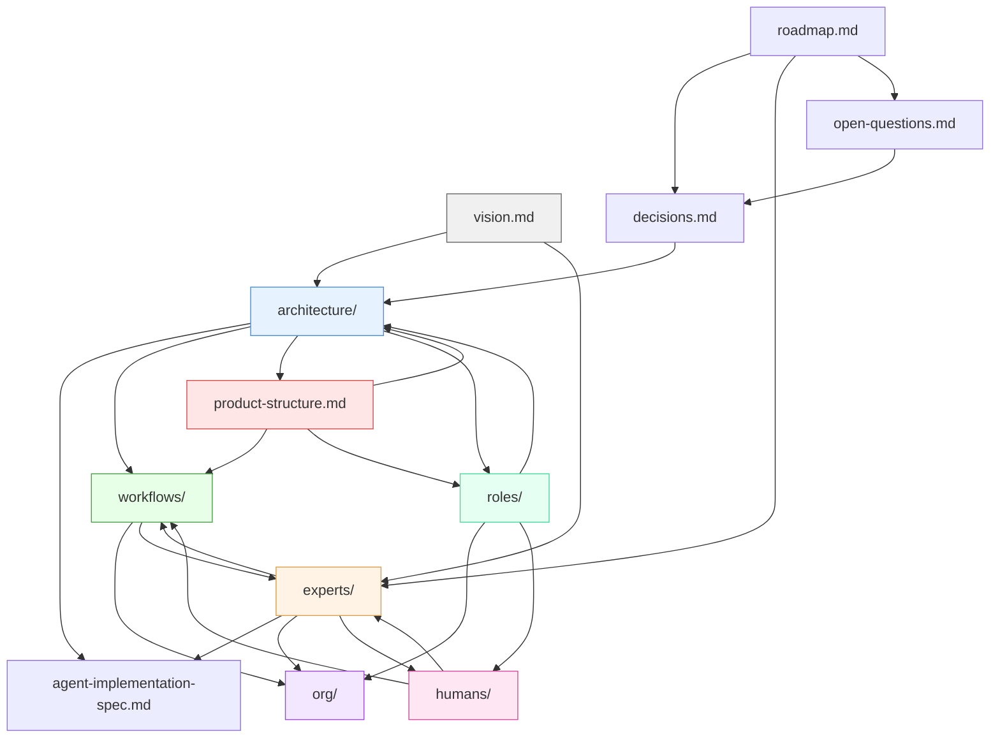

# Documentation Dependencies

> The dependency graph for the docs themselves. When you change one doc, this map
> tells you which other docs to check. Think of it as `dependencies.md` for the
> project's knowledge layer — the same principle experts use for their interfaces,
> applied to the documentation system.
>
> **How to use:** Before committing changes to a doc, check this map. If your
> change touches a row in the dependency table, verify the downstream docs are
> still accurate. If they're not, update them in the same commit or file an issue.
>
> **How to maintain:** When you create a new doc or add a cross-reference between
> existing docs, add the dependency here. During periodic reviews, scan for stale
> entries. This map is only useful if it reflects reality.

---

## Document inventory

Every planning doc and its role in the system. Grouped by layer.

### Foundation layer — why we exist and where we're headed

| Doc | Purpose | Stability |
|---|---|---|
| `vision.md` | Core principles and goals. Decision filter for everything else. | Very stable — principles change rarely |
| `roadmap.md` | Phased plan from current state to operational maturity. | Updates as phases complete or priorities shift |
| `decisions.md` | Architectural decisions log (AD-XX). Rationale preserved. | Append-only — decisions don't change, new ones are added |
| `open-questions.md` | Unresolved decisions with owners and blockers. | Shrinks over time as questions resolve |

### Team layer — shared understanding for contributors

| Doc | Purpose | Stability |
|---|---|---|
| `team/project-brief.md` | Team-readable summary of what Ava is, the hypothesis, and technical foundations | Derived from vision.md and decisions.md — updates when they change |
| `team/status-and-roadmap.md` | Current phase, what exists, what's blocked, roadmap summary | Derived from roadmap.md — updates frequently |
| `team/contribution-guide.md` | Per-person pending proposals and how to review | Derived from decisions.md and open-questions.md — updates as items resolve |
| `team/kickoff-agenda.md` | Meeting agenda for initial walkthrough | One-time use, may be archived after kickoff |

### Architecture layer — how the system works

| Doc | Purpose | Stability |
|---|---|---|
| `architecture/agent-framework.md` | Agent taxonomy, orchestration patterns, handoff mechanics, SLA escalation | Stable structure, details evolve with implementation |
| `architecture/data-model.md` | Core schema: entities, relationships, constraints, multi-tenancy | Evolves significantly before implementation, stabilizes after |
| `architecture/ui-patterns.md` | Universal layout, interaction patterns, responsive behavior | Stable pattern, new surfaces and components added |
| `architecture/agent-implementation-spec.md` | Agent classification (LLM vs code vs function), model routing, extraction inventory, runtime patterns | Evolves with implementation decisions |
| `architecture/data-model-validation.md` | Cross-reference validation: data model entities vs expert outputs and workflow I/O | Snapshot — re-run when data model or expert contracts change |
| `architecture/thread-engine-spec.md` | Thread storage, real-time sync, visibility enforcement, approval gates, immutability | Stable after authoring, updates with thread model changes |
| `architecture/expert-runtime-spec.md` | Expert activation, selective loading, extraction coexistence, health gating, retro system | Evolves with expert system maturation |

### Domain layer — what the company does

| Doc | Purpose | Stability |
|---|---|---|
| `org/org-chart.md` | Functions, owners, automation status | Updates with every role/agent/function change |
| `org/functions/*.md` | Per-function detail: sub-functions, interfaces, quality checks | Updates when function scope changes |
| `org/automation-readiness.md` | Scoring rubric for automation targets | Stable rubric, scores update per function |
| `business-functions.md` | 10 domains, 55 sub-functions mapped | Stable after initial authoring |
| `roles/*.md` | Per-role capabilities, workflows, permissions, PHI access | Updates when role responsibilities change |
| `product-structure.md` | Module/feature/screen hierarchy with priorities | Evolves through implementation — features added, reprioritized |

### Workflow layer — how work flows through the system

| Doc | Purpose | Stability |
|---|---|---|
| `workflows/README.md` | Index + cross-domain dependency map + critical path | Stable index, updates when domains change |
| `workflows/0X-*.md` | Per-domain workflow definitions with flow diagrams | Deep detail, stable after authoring |
| `workflows/care-plan-creation/` | Step-level spec: care plan from assessment to activation | Evolves with expert maturation |
| `workflows/meal-prescription/` | Step-level spec: nutrition plan to meal delivery pipeline | Evolves with expert maturation |
| `workflows/<name>/` | Step-level workflow specs (expert assignments, SLAs, fallbacks) | Evolves with expert system maturation |

### Expert layer — the capability system

| Doc | Purpose | Stability |
|---|---|---|
| `experts/expert-spec.md` | Template anatomy for all experts | Evolves via RFC process (governance.md) |
| `experts/workflow-spec.md` | Template anatomy for multi-expert workflows | Evolves via RFC process |
| `experts/README.md` | Registry, dependency graph, health status, context budget | Updates with every expert change |
| `experts/shared-principles.md` | 11 constitutional defaults for all experts | Stable — changes are Constitutional tier |
| `experts/<name>/*.md` | Individual expert specs (9 layers + retro log) | Evolve through retro/review cycles |
| `experts/human-expert-protocol.md` | Human registry, expert↔human channels, feedback capture, onboarding | Stable infrastructure — changes via RFC |
| `humans/*.md` | Human registry entries (when created) | Updates with team changes |
| `experts/*.md` (system specs) | Fallback modes, shadowing, convocation, queue prioritization, governance, postmortem | Stable infrastructure — changes via RFC |

---

## Dependency table

When you change a doc in the **Source** column, check the docs in the
**Downstream** column. The **What breaks** column tells you what to look for.

### Architecture changes cascade outward

| Source | Downstream | What breaks | Check method |
|---|---|---|---|
| `architecture/agent-framework.md` — new agent or orchestrator | `org/org-chart.md` | Agent coverage map is missing the new agent | Check agent-coverage Mermaid diagram |
| | `workflows/0X-*.md` | Workflows may reference old agent behavior or miss new capabilities | Grep workflows for agent names mentioned in the change |
| | `product-structure.md` | Features may reference old agent behavior | Grep product-structure for affected agent names |
| | `experts/*/task-routing.md` | Expert task routing may assume outdated agent capabilities | Check task maps in experts that interact with changed agents |
| | `roles/*.md` | Role permissions may need updating for new agent capabilities | Check if new agent serves a specific role |
| | `architecture/agent-implementation-spec.md` | Implementation classifications may need updating for new/changed agents | Check classification matrix and runtime patterns |
| `architecture/agent-framework.md` — SLA or escalation change | `experts/*/escalation-thresholds.md` | Expert escalation timing may conflict with framework SLAs | Compare expert thresholds against framework table |
| | `architecture/thread-engine-spec.md` | Thread engine approval gates and SLA enforcement may need updating | Check approval gate SLAs and escalation tiers |
| `architecture/agent-implementation-spec.md` — runtime pattern change | `architecture/thread-engine-spec.md` | Storage split, sync mechanism, or Pub/Sub patterns may be stale | Check state persistence and Pattern 3 human gate sections |
| | `architecture/expert-runtime-spec.md` | Agent classification or model routing changes affect expert activation | Check expert activation model and extraction lifecycle |
| `experts/expert-spec.md` — layer or loading profile change | `architecture/expert-runtime-spec.md` | Runtime loading protocol may reference stale layer definitions or profiles | Check selective loading and context assembly sections |
| | `workflows/care-plan-creation/steps.md` | Step SLAs may conflict with framework SLAs | Compare step SLAs against framework table |
| `architecture/data-model.md` — new entity or field | `workflows/0X-*.md` | Workflow data flows may not reference new entities | Check if workflows that use this data domain need updating |
| | `product-structure.md` | Feature data requirements may be outdated | Check feature data dependency notes |
| | `experts/*/output-contract.md` | Expert output fields may not align with data model | Compare output contract fields against schema |
| | `architecture/data-model-validation.md` | Validation findings may be stale | Re-run validation pass |
| `architecture/data-model.md` — entity removed or renamed | `workflows/0X-*.md` | Workflows reference entities that no longer exist | Grep workflows for old entity name |
| | `product-structure.md` | Features reference stale entities | Grep for old entity name |
| `architecture/ui-patterns.md` — new surface or layout change | `experts/ux-design-lead/domain-knowledge.md` | UX expert's knowledge is stale | Already covered by UX freshness triggers |
| | `product-structure.md` | Module/feature hierarchy may need new surface section | Check if product-structure covers the new surface |
| | `roles/*.md` | New surface may serve a role not yet defined | Check if role has permissions for new surface |

### Workflow changes cascade to org and experts

| Source | Downstream | What breaks | Check method |
|---|---|---|---|
| `workflows/0X-*.md` — new or significantly changed workflow | `org/org-chart.md` | Function table may be missing this workflow | CLAUDE.md agentic trigger (already exists) |
| | `org/functions/*.md` | Sub-function table may be stale | Check relevant function file |
| | `workflows/README.md` | Cross-domain dependency map may be stale | Check Mermaid diagram |
| | `experts/*/dependencies.md` | Expert dependency graph may miss new workflow connections | Check experts that participate in the changed workflow |
| `workflows/<name>/steps.md` — step change | `experts/*/output-contract.md` | Expert output contract may not match new step inputs | Compare step input fields against expert output contract |
| | `experts/*/task-routing.md` | Task model tier or determinism may need adjustment | Check if the step's model_tier changed |
| | `workflows/<name>/checkpoints.md` | Checkpoint gates may need updating | Check if approval chain changed |

### Expert system changes cascade to architecture and workflows

| Source | Downstream | What breaks | Check method |
|---|---|---|---|
| `experts/expert-spec.md` — template change | `experts/*/` (all experts) | Existing experts may not conform to new template | Audit all expert directories for compliance |
| | `experts/README.md` | Registry structure may need updating | Check if new fields or sections were added |
| `experts/<name>/output-contract.md` — field change | `experts/*/dependencies.md` (consumers) | Downstream experts built against old contract | Check depended-on-by table for consumers to notify |
| | `workflows/<name>/steps.md` | Steps that consume this output may break | Check step inputs that reference this expert |
| `experts/<name>/task-routing.md` — tier or extraction change | `architecture/agent-implementation-spec.md` | Model routing table and extraction inventory may be stale | Update Sections 2-3 of implementation spec |
| `experts/README.md` — new expert added | `org/org-chart.md` | Function table may need expert assignment | Check if function now has agent coverage |
| | Dependency graphs of related experts | Existing experts may gain new upstream/downstream connections | Check new expert's dependencies.md for interface partners |

### Role and org changes cascade inward

| Source | Downstream | What breaks | Check method |
|---|---|---|---|
| `roles/*.md` — new role or responsibility change | `org/org-chart.md` | Org chart may not reflect new role structure | CLAUDE.md agentic trigger (already exists) |
| | `architecture/ui-patterns.md` | May need new surface or density calibration for new role | Check if role interacts with a UI surface |
| | `experts/ux-design-lead/domain-knowledge.md` | UX expert needs to know about new role for density heuristics | Already covered by UX freshness triggers |
| | `product-structure.md` | Features may need to serve new role | Check module assignments |
| `org/org-chart.md` — ownership change | `experts/*/escalation-thresholds.md` | "Escalate to [person]" may point to wrong human | Grep expert escalation tables for the changed owner |
| | `experts/README.md` | Registry reviewer assignments may be stale | Check health status table |

### Human-expert protocol changes

| Source | Downstream | What breaks | Check method |
|---|---|---|---|
| `experts/human-expert-protocol.md` — channel format change | `architecture/agent-framework.md` | QueueManager and AlertRouter implement these formats | Check agent framework payload definitions |
| | `architecture/ui-patterns.md` | Approval cards and queue items render these formats | Check UI pattern specs for gate rendering |
| | `experts/*/escalation-thresholds.md` | Expert escalation tiers reference protocol channels | Check that tier→channel mapping still holds |
| | `experts/workflow-spec.md` | Checkpoint definitions reference feedback capture | Check checkpoint structure and review system sections |
| `humans/*.md` — person added/changed/departed | `experts/*/escalation-thresholds.md` | "Escalate to [person]" references may be stale | Check escalation targets in related experts |
| | `experts/README.md` | Registry reviewer assignments may change | Check reviewer column |
| | `workflows/*/checkpoints.md` | Gate audience assignments may be stale | Check checkpoint audience fields |
| `roles/*.md` — role change | `humans/*.md` | Human registry entries reference roles | Check role mapping in affected entries |

### Team docs cascade from working docs

| Source | Downstream | What breaks | Check method |
|---|---|---|---|
| `vision.md` — principle change | `team/project-brief.md` | Brief may not reflect updated principles | Compare brief principles against vision.md |
| `roadmap.md` — phase status change | `team/status-and-roadmap.md` | Team status doc shows stale phase info | Update phase status and blockers table |
| `decisions.md` — new or changed AD | `team/project-brief.md` | Technical foundations table may be stale | Check brief's decision table |
| | `team/contribution-guide.md` | Pending proposals may be resolved | Remove resolved items from contributor sections |
| `open-questions.md` — question resolved | `team/contribution-guide.md` | Pending proposals list shows resolved items | Remove from contributor sections |
| | `team/status-and-roadmap.md` | Blockers table may show resolved blockers | Update blockers table |
| `experts/README.md` — new expert added | `team/status-and-roadmap.md` | Expert coverage count may be stale | Update "what exists today" table |

### Foundation changes cascade everywhere

| Source | Downstream | What breaks | Check method |
|---|---|---|---|
| `vision.md` — principle change | Everything | Core principles are decision filters. Changing one potentially affects every downstream doc. | Full audit — this should be rare and handled as Constitutional tier per governance.md |
| `decisions.md` — new AD | `architecture/*.md` | Architecture docs should reflect the decision | Check which architecture area the decision affects |
| | `roadmap.md` | Decision may unblock a roadmap item | Check if any roadmap item listed this decision as a dependency |
| `open-questions.md` — question resolved | `decisions.md` | Resolution may need to be logged as a formal decision | Check if the resolution is architectural |
| | Relevant domain docs | Answer should propagate to the docs that were waiting on it | Check the "Blocks" column in the question entry |

---

## Maintenance protocol

### When creating a new doc

1. Add it to the **Document inventory** table in the appropriate layer
2. Add dependency rows for any docs it references or is referenced by
3. If it's an expert layer doc, also update `experts/README.md`

### When adding a cross-reference between docs

If doc A now says "see doc B," add a dependency row: B is upstream of A.
The question to ask: "If B changes, would A need checking?" If yes, it's a
dependency.

### Periodic review

During quarterly sweeps (or when this doc exceeds 300 lines):

1. **Audit for stale entries** — Are there dependencies listed for docs that
   no longer exist or references that were removed?
2. **Audit for missing entries** — Grep the project for cross-references
   (`see `, `referenced by`, file paths) and verify they're in this map.
3. **Check dependency direction** — Dependencies should flow from more-stable
   to less-stable docs. If you see a lot of reverse flow (unstable docs
   breaking stable ones), the architecture may need restructuring.

---

## Visualization

Arrows show the primary direction of dependency: when the source changes,
the target may need checking. Many relationships are bidirectional in practice
(workflows inform architecture and vice versa), but the dependency direction
indicates which doc is more authoritative when they conflict.
