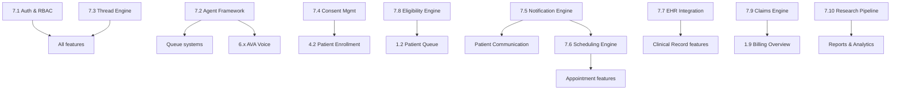

# Product Structure & Features

Ava's module/feature/screen hierarchy organized by app surface. Each feature is prioritized
P0-P3 and mapped to the workflows, roles, and data objects that drive it.

**Priority framework:**
- **P0** — MVP launch blocker. Cannot serve a patient without this.
- **P1** — needed within first quarter of operation. Significant workflow gap without it.
- **P2** — improves efficiency or experience, not blocking.
- **P3** — future. Good idea, no immediate need.

**MVP critical path reference** (from workflows README):
Internal Ops → Compliance → Partner & Payer → Patient Operations → Meal Operations → Clinical Care → Revenue Cycle

---

## System hierarchy

```
Ava Platform (System)
├── Admin App (Module) ─────── Coordinator, Admin
├── Provider App (Module) ──── RDN, BHN
├── Kitchen App (Module) ───── Kitchen Staff
├── Patient App (Module) ───── Patient
├── Partner Portal (Module) ── External partners (read-heavy)
├── AVA Voice Agent (Module) ─ No screen — telephony pipeline
└── Platform Core (Module) ─── Shared infrastructure, agent framework, compliance
```

All modules share the three-panel layout (left sidebar / center content / right thread)
except AVA (voice-only) and Platform Core (no direct user surface).

---

## Module 1: Admin App

**Purpose:** Operational command center. Coordinators run their day here — managing patient
queues, reviewing agent work, approving care plans, coordinating with partners.

**Users:** Care Coordinator (primary), Admin

### Feature 1.1: Patient Queue — P0
**Purpose:** Prioritized list of items requiring human action, sorted by urgency and SLA.
**Workflows:** 1.1–1.11 (all patient lifecycle workflows generate queue items)
**Screens:**
- Queue list (left sidebar) — grouped by urgency tier
- Queue item detail (center panel) — patient context, what happened, agent recommendation
- Action thread (right panel) — approve/reject/edit inline

**Key interactions:**
- One-tap approve on agent recommendations
- Inline edit before approval
- Reject with note (agent receives feedback)
- SLA countdown visible per item — escalation indicator when overdue

### Feature 1.2: Patient List & Records — P0
**Purpose:** Browse, search, and view all patients in the coordinator's caseload.
**Workflows:** 1.3 (enrollment), 1.4 (assessment), 1.5 (care plan)
**Screens:**
- Patient list (center panel) — filterable by status, risk tier, last activity
- Patient detail (center panel) — demographics, care plan summary, status timeline
- Patient thread (right panel) — full workflow history for this patient

**Key interactions:**
- Click patient → center shows record, right shows thread
- Status badge per patient (active, high_risk, on_hold, etc.)
- Risk tier indicator with trend arrow

### Feature 1.3: Care Plan Review — P0
**Purpose:** Review and approve care plans after RDN/BHN sign-off.
**Workflows:** 1.5 (creation), 1.9 (updates)
**Screens:**
- Care plan viewer (center panel) — full plan with section-level status (RDN approved, BHN pending, etc.)
- Diff view for updates — what changed between versions
- Approval thread (right panel) — who reviewed, when, notes

**Key interactions:**
- Section-by-section status indicators
- Approve full plan (primary action)
- Send back to specific reviewer with note
- Version history navigation

### Feature 1.4: Scheduling Dashboard — P1
**Purpose:** View and manage appointment schedules across patients and providers.
**Workflows:** 1.8 (appointment scheduling)
**Screens:**
- Calendar view (center panel) — provider calendars, patient appointments
- Unconfirmed appointments list
- No-show/reschedule queue

### Feature 1.5: Patient Communication Center — P1
**Purpose:** Review and approve outbound patient communications.
**Workflows:** 1.10 (patient communication)
**Screens:**
- Outbound message queue (items requiring review before send)
- Communication history per patient
- Template management

### Feature 1.6: Discharge Management — P0
**Purpose:** Process patient discharges and generate transition summaries.
**Workflows:** 1.11 (discharge)
**Screens:**
- Discharge initiation form
- Transition summary review (agent-generated, coordinator-approved)
- Outcome summary for partner reporting

### Feature 1.7: Partner Management — P1
**Purpose:** Manage partner configurations, referral pipelines, and SLA tracking.
**Workflows:** Domain 4 (partner & payer relations)
**Screens:**
- Partner list with status
- Partner detail — contract terms, SLA status, referral volume
- Partner communication thread

### Feature 1.8: Reports & Analytics — P1
**Purpose:** Generate, review, and distribute operational reports.
**Workflows:** Domain 10 (data & analytics), Domain 4 (partner reporting)
**Screens:**
- Report library (generated reports)
- Report builder (configurable filters)
- Distribution queue (reports pending approval to send to partners)

### Feature 1.9: Billing Overview — P1
**Purpose:** Claim status visibility, revenue cycle health, and exception handling.
**Workflows:** Domain 5 (revenue cycle)
**Screens:**
- Claims dashboard — submitted, pending, denied, paid
- Denial queue — items requiring action
- Billing exception thread

**Note:** Admin role sees full billing detail. Coordinator sees status summaries only.

### Feature 1.10: User & Tenant Administration — P0
**Purpose:** Manage users, roles, and tenant-level configuration.
**Workflows:** Domain 8 (internal operations)
**Screens:**
- User list — active users, roles, last activity
- User detail — role assignment, credential status
- Tenant settings — branding, partner config, feature toggles

---

## Module 2: Provider App

**Purpose:** Clinical workspace. RDNs and BHNs review patient data, sign documentation,
approve clinical sections of care plans, and monitor biomarker trends.

**Users:** RDN (primary), BHN

### Feature 2.1: Clinical Queue — P0
**Purpose:** Prioritized list of clinical items requiring provider action.
**Workflows:** 1.5 (care plan review), 2.5 (documentation), 1.9 (care plan updates)
**Screens:**
- Clinical queue (left sidebar) — care plan reviews, SOAP note drafts, lab flags
- Queue item detail (center panel) — patient clinical context
- Clinical thread (right panel) — agent actions, prior clinical decisions

**Queue item types per role:**
- **RDN:** nutrition plan reviews, SOAP note signatures, lab flags, meal match exceptions
- **BHN:** behavioral health plan reviews, PHQ-9 escalations, crisis protocol items

### Feature 2.2: Patient Clinical Record — P0
**Purpose:** View patient clinical data, biomarker trends, and care plan details.
**Workflows:** 1.4 (assessment), 1.5 (care plan), 1.7 (monitoring)
**Screens:**
- Clinical summary (center panel) — current care plan, active goals, medications
- Biomarker trends (center panel tab) — charts for HbA1c, weight, BP, lipids over time
- Assessment history — structured view of all intake and follow-up assessments
- Meal delivery + satisfaction data (RDN only — relevant to adherence)

### Feature 2.3: Care Plan Clinical Review — P0
**Purpose:** Review and approve the clinical sections of care plans (nutrition for RDN, behavioral for BHN).
**Workflows:** 1.5 (creation), 1.9 (updates)
**Screens:**
- Care plan section view — focused on the reviewer's domain
- Agent-drafted content with inline editing
- Approval controls — approve, edit and approve, reject with note

### Feature 2.4: Visit Documentation — P0
**Purpose:** Review, edit, and sign agent-drafted clinical notes after visits.
**Workflows:** Domain 2 (clinical care — documentation)
**Screens:**
- SOAP note editor (RDN: NCP terminology; BHN: behavioral health format)
- ICD-10 code mapping review (agent-populated, provider confirms)
- Signature confirmation with attestation
- Physician referral order status (warning if missing)

**Processing services:**
- Agent drafts SOAP note from visit data
- Agent maps NCP terminology → ICD-10 codes
- Agent checks physician referral order is on file
- Agent tracks Medicare MNT visit cap (warns when approaching limit)

### Feature 2.5: Caseload Overview — P1
**Purpose:** At-a-glance view of all patients in the provider's caseload.
**Workflows:** 1.7 (monitoring)
**Screens:**
- Caseload list — patients sorted by next action due, risk tier, or alphabetical
- Risk heatmap — visual indicator of patient panel health
- Upcoming visits

### Feature 2.6: Lab Results Viewer — P1
**Purpose:** Review lab results with clinical context and trend visualization.
**Workflows:** 1.7 (monitoring), 1.9 (care plan updates)
**Screens:**
- Lab results feed — new results highlighted
- Trend charts per biomarker
- Agent-generated clinical significance notes

---

## Module 3: Kitchen App

**Purpose:** Meal production and delivery operations. Kitchen staff see what to make,
for whom (without clinical detail), and track fulfillment.

**Users:** Kitchen Staff

### Feature 3.1: Order Queue — P0
**Purpose:** Today's orders and upcoming production schedule.
**Workflows:** Domain 3 (meal operations — order generation)
**Screens:**
- Daily order list (left sidebar) — today's production, tomorrow's prep
- Order detail (center panel) — recipe, quantity, dietary tags (no diagnosis info), delivery info
- Order thread (right panel) — status updates, flags

**Format handling:** Orders include a format indicator (fresh or frozen) per OQ-17. Production
and packing workflows differ by format — fresh has tighter time windows, frozen can be
batched in advance.

**PHI boundary:** Kitchen sees dietary restriction tags (e.g., "low-sodium, nut-free")
but never diagnosis codes, clinical notes, or insurance information.

### Feature 3.2: Recipe Catalog — P1
**Purpose:** Browse and manage available recipes with nutritional data.
**Workflows:** Domain 3 (recipe management)
**Screens:**
- Recipe list — filterable by dietary tags, nutritional profile
- Recipe detail — ingredients, prep instructions, nutritional breakdown
- Recipe status (active, pending RDN validation, retired)

### Feature 3.3: Delivery Tracking — P0
**Purpose:** Track meal deliveries from dispatch to confirmation.
**Workflows:** Domain 3 (delivery)
**Screens:**
- Delivery manifest — today's deliveries with status
- Delivery confirmation — mark delivered, flag issues
- Issue reporting — wrong address, missed delivery, quality concern

**Delivery model:** Varies by kitchen per OQ-18 — some kitchens deliver with their own
staff, others use third-party logistics. The interface is the same; PHI exposure on
packing slips is scoped to minimum necessary regardless of who delivers.

### Feature 3.4: Grocery & Inventory — P2
**Purpose:** Aggregate ingredient needs across orders for procurement planning.
**Workflows:** Domain 3 (kitchen operations)
**Screens:**
- Aggregated grocery list by time period
- Inventory status (if tracked)

---

## Module 4: Patient App

**Purpose:** Patient self-service. Program participation, feedback, self-reported data,
appointment management, and communication with care team.

**Users:** Patient

### Feature 4.1: Home Dashboard — P0
**Purpose:** At-a-glance view of upcoming events, recent activity, and care team info.
**Workflows:** 1.7 (monitoring), 1.8 (scheduling), 1.10 (communication)
**Screens:**
- Dashboard (center panel) — upcoming appointments, next delivery, care team contacts
- Recent activity feed — what's happened recently
- Quick actions — report a concern, give meal feedback, message care team

### Feature 4.2: Enrollment & Onboarding — P0
**Purpose:** Self-service registration, consent collection, and initial profile setup.
**Workflows:** 1.3 (enrollment)
**Screens:**
- Registration form (pre-filled from referral data)
- Consent collection — treatment, HIPAA, program participation, research (optional)
- Profile completion — preferences, contact info, emergency contact

### Feature 4.3: Meal History & Feedback — P1
**Purpose:** View past and upcoming meals, provide feedback on deliveries.
**Workflows:** Domain 3 (meal feedback loop), 1.7 (monitoring)
**Screens:**
- Meal calendar — past deliveries, upcoming meals
- Meal feedback form — rating, comments, "don't send again" option
- Preference management — update dietary preferences, allergen info

### Feature 4.4: Health Self-Reporting — P1
**Purpose:** Enter weight, vitals, and other self-reported health data between visits.
**Workflows:** 1.7 (monitoring)
**Screens:**
- Data entry form — weight, blood pressure, blood glucose
- Trend view — simple charts of self-reported data over time

### Feature 4.5: Appointments — P0
**Purpose:** View, confirm, and reschedule appointments.
**Workflows:** 1.8 (scheduling)
**Screens:**
- Upcoming appointments list
- Appointment detail — provider, time, telehealth link
- Confirm/reschedule/cancel actions

### Feature 4.6: Messaging — P1
**Purpose:** Communicate with care team (non-urgent).
**Workflows:** 1.10 (patient communication)
**Screens:**
- Message thread with care team
- Agent handles administrative replies; clinical questions route to human

### Feature 4.7: AVA Call Summaries — P1
**Purpose:** Review what was discussed during AVA voice check-ins.
**Workflows:** 1.7 (monitoring)
**Screens:**
- Call history list
- Call summary — structured data collected, any follow-ups noted

---

## Module 5: Partner Portal

**Purpose:** External-facing read-heavy surface for health system partners. Referral
submission, outcome reports, and program status.

**Users:** Partner staff (external)

### Feature 5.1: Referral Submission — P0
**Purpose:** Submit and track patient referrals.
**Workflows:** 1.1 (referral intake)
**Screens:**
- Referral form (structured submission)
- Referral status tracker — submitted, acknowledged, enrolled, active, discharged
- Referral thread (right panel) — status updates and communications

### Feature 5.2: Outcomes Reports — P1
**Purpose:** View program outcomes and performance data.
**Workflows:** Domain 10 (analytics), Domain 4 (partner reporting)
**Screens:**
- Report library — available reports by period
- Report detail — outcomes metrics, population summaries

### Feature 5.3: Patient Status View — P1
**Purpose:** High-level status of referred patients (de-identified where required).
**Workflows:** 1.7 (monitoring), 1.11 (discharge)
**Screens:**
- Referred patient list — status, program phase, last activity
- Discharge summaries

**PHI boundary:** Partners see only what the data sharing agreement permits. Defaults to
de-identified aggregate unless BAA authorizes identified data.

---

## Module 6: AVA Voice Agent

**Purpose:** Automated voice agent for patient outreach. No screen — telephony pipeline
(Twilio → STT → Claude → TTS → Twilio).

**Users:** Patients (as call recipients)

### Feature 6.1: Scheduled Check-in Calls — P0
**Purpose:** Conduct structured check-ins per monitoring schedule.
**Workflows:** 1.7 (monitoring)
**Call types:**
- Weekly wellness (mood, energy, pain, sleep)
- Meal feedback (satisfaction, issues)
- PHQ-9 follow-up (monthly depression screening)
- Medication adherence (taking meds, side effects)

### Feature 6.2: Appointment Reminders — P1
**Purpose:** Outbound reminder calls for upcoming appointments.
**Workflows:** 1.8 (scheduling)

### Feature 6.3: Intake Data Collection — P1
**Purpose:** Conduct intake assessment components via voice when patient can't use app.
**Workflows:** 1.4 (intake assessment)
**Components:** SDOH, PHQ-9, GAD-7, dietary history, cultural preferences

### Feature 6.4: Inbound Patient Line — P2
**Purpose:** Receive patient calls, route to appropriate handler.
**Workflows:** 1.10 (patient communication)

**Hard stops (all call types):**
- Suicidal ideation → crisis protocol, warm transfer to human
- Medical emergency → 911 guidance, notify care team
- Patient requests human → immediate transfer to coordinator

**Processing services:**
- Twilio telephony (call routing, recording)
- Speech-to-text (Deepgram)
- LLM processing (Claude via Vertex)
- Text-to-speech (Google Cloud TTS or ElevenLabs)
- Response structuring and validation
- Call transcript → thread record

---

## Module 7: Platform Core

**Purpose:** Shared infrastructure that all modules depend on. No direct user surface.

### Feature 7.1: Authentication & Authorization — P0
**Purpose:** User login, role-based access control, tenant isolation.
**Depends on:** AD-04 (shared DB with tenant_id + RLS)
**Components:**
- Login/SSO
- Role assignment and permission enforcement
- Tenant-scoped data access
- Session management
- MFA (HIPAA requirement)

### Feature 7.2: Agent Framework — P0
**Purpose:** Agent orchestration, tool registry, execution engine.
**Components:**
- Agent taxonomy (meta, orchestrator, specialist layers)
- Tool registry with per-agent permission scoping
- Execution engine with approval gates
- Thread/audit log generation

### Feature 7.3: Thread & Audit Engine — P0
**Purpose:** The compliance backbone. Every action is a thread message.
**Components:**
- Thread creation and message persistence
- Message type rendering (system, tool_call, approval_request, human_message)
- Query interface for compliance/audit
- Immutable append-only log

### Feature 7.4: Consent Management — P0
**Purpose:** Track, version, and enforce consent gates.
**Components:**
- Consent document versioning
- E-signature capture with scroll tracking
- Re-consent triggers when documents change
- Consent withdrawal handling (halts workflows)

### Feature 7.5: Notification Engine — P0
**Purpose:** Multi-channel notifications (SMS, email, in-app, push).
**Components:**
- Channel routing per patient preference
- Template management with language support
- Delivery tracking and retry
- Opt-out management

### Feature 7.6: Scheduling Engine — P1
**Purpose:** Calendar integration, appointment management, reminder automation.
**Components:**
- Provider availability management
- Patient booking flow
- Reminder automation (24h before)
- No-show detection and rebooking

### Feature 7.7: EHR Integration Layer — P1
**Purpose:** Data exchange with partner EHR systems — multi-EHR from day one.
**Resolved:** OQ-01 — Cedars uses Epic, Vanderbilt uses Athena, UConn skips integration for phase 1.
**Components:**
- FHIR R4 client (Epic)
- Athena Health API client (Vanderbilt — Athena is also our billing platform per OQ-03)
- Data mapping and transformation per EHR type
- Import (labs, meds, conditions) and export (transition summaries)
- HL7 v2 fallback for partners without FHIR or Athena
- Per-partner integration configuration (which EHR, which tier, what data flows)

### Feature 7.8: Eligibility & Benefits Engine — P0
**Purpose:** Real-time payer eligibility checks.
**Components:**
- Payer API integration (270/271 transactions)
- Coverage verification
- Benefit detail extraction
- Retry and fallback logic

### Feature 7.9: Claims & Billing Engine — P1
**Purpose:** Claim generation, submission, and tracking via Athena Health.
**Resolved:** OQ-03 — Athena confirmed for billing and practice management.
**Components:**
- Athena Health billing API integration
- Claim generation from visit + diagnosis data
- 837 Professional claim submission
- ERA/835 payment posting
- Denial management workflow
- BHN independent billing line (OQ-13 — BHN bills separately for PHQ-9/GAD-7)

### Feature 7.10: Research Data Pipeline — P2
**Purpose:** De-identified data export to BigQuery for research.
**Depends on:** AD-05 (hybrid data separation)
**Components:**
- ETL pipeline (clinical DB → de-identified → BigQuery)
- De-identification engine (Safe Harbor or Expert Determination)
- Access control for research tier
- IRB protocol enforcement

---

## Cross-module features

These capabilities appear across multiple modules:

| Feature | Appears in | Implementation |
|---|---|---|
| Three-panel layout | All screen-based modules | Shared layout component |
| Thread viewer | All modules | Shared component, context-scoped per record |
| Queue system | Admin, Provider, Kitchen | Shared engine, role-scoped items |
| Patient search | Admin, Provider | Shared component, PHI-scoped per role |
| Notification preferences | Admin, Patient | Shared engine |
| Language/translation | Patient, AVA | Shared service |

---

## Shared design components

Components reusable across modules (candidates for the Haven design system):

- **Queue item card** — urgency indicator, subject, agent recommendation, time in queue
- **Approval card** — context summary, primary/secondary actions, note input
- **Thread message** — system, agent, human, approval variants
- **Patient status badge** — color-coded by lifecycle status
- **Risk tier indicator** — with trend arrow
- **Biomarker trend chart** — sparkline for inline use, full chart for detail view
- **Care plan section viewer** — with approval status per section
- **Consent collection flow** — versioned document + e-signature

---

## Feature dependency map



---

## P0 features (MVP launch set)

The minimum feature set to serve a first patient end-to-end:

**Admin App:** Patient Queue, Patient List & Records, Care Plan Review, Discharge Management, User & Tenant Admin
**Provider App:** Clinical Queue, Patient Clinical Record, Care Plan Clinical Review, Visit Documentation
**Kitchen App:** Order Queue, Delivery Tracking
**Patient App:** Home Dashboard, Enrollment & Onboarding, Appointments
**Partner Portal:** Referral Submission
**AVA Voice:** Scheduled Check-in Calls
**Platform Core:** Auth & RBAC, Agent Framework, Thread & Audit Engine, Consent Management, Notification Engine, Eligibility Engine

Total: **20 P0 features** across 7 modules.

---

## What this document does NOT cover

- Screen-level wireframes (next step — user journey mapping, then wireframes)
- Interaction specifications (animation, transitions, responsive breakpoints)
- Data model per feature (see `architecture/data-model.md`)
- Agent behavior specifications per feature (see `architecture/agent-framework.md`)
- Brand/visual design (see `Lab/cena-health-brand/`)
