# Workflows: Patient Operations

> **Domain 1 of 10** — the spine of the platform. Every other domain either feeds into or
> depends on patient lifecycle state. The workflows here define data structures, agent trigger
> conditions, and human decision gates that propagate outward.

Patient state flows in one direction through the lifecycle, but branches constantly. The agent's
job is to advance patients through each stage automatically, surface exceptions cleanly, and
never let a patient fall through a gap.

---

## Patient lifecycle overview

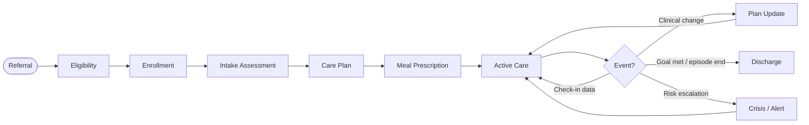

A patient's `status` field drives what the agent does next. Status values:

| Status | Meaning |
|---|---|
| `referral_received` | Referral logged, not yet validated |
| `eligibility_pending` | Eligibility check in progress |
| `eligibility_failed` | Did not qualify — requires human review |
| `enrollment_pending` | Eligible, awaiting registration completion |
| `assessment_pending` | Enrolled, intake assessment not yet complete |
| `care_plan_pending` | Assessment complete, care plan not yet approved |
| `active` | In program, receiving care and meals |
| `care_plan_update_pending` | Active, but plan revision triggered and awaiting approval |
| `high_risk` | Active, elevated risk flag — care team notified |
| `discharged` | Episode closed |
| `on_hold` | Active but temporarily paused (patient request, logistics issue, etc.) |

---

## 1.1 — Referral Intake

**Goal:** Receive a patient referral, validate it is complete and actionable, route it, and
acknowledge receipt to the referral source.

**Trigger:** Inbound referral via FHIR API, HL7 message, form submission, or manual entry.

**Inputs:**
- Patient demographics (name, DOB, address, phone)
- Insurance information (payer, member ID)
- Referring provider (name, NPI, organization)
- Reason for referral / diagnosis codes
- Any attached clinical documents

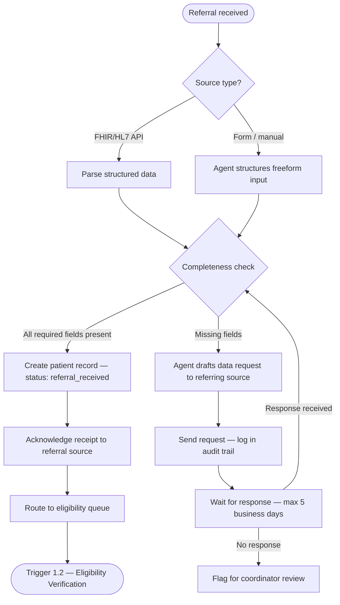

**Outputs:**
- Patient record created with `status: referral_received`
- Acknowledgement sent to referral source
- Referral event logged in audit trail

**Error states:**
- Duplicate patient detected → merge or link logic, flag for human review
- Referral from unknown/unconfigured partner → flag for coordinator, do not auto-create record
- Data request to referral source unanswered after 5 days → coordinator notified, partner SLA flagged

**Agent vs. human:**
- Agent handles 100% of structured referrals end-to-end
- Human reviews: duplicate detection, unknown partner sources, data request non-responses

---

## 1.2 — Eligibility Verification

**Goal:** Confirm the patient qualifies for the program — insurance active, benefit covers FAM
services, and patient meets clinical criteria.

**Trigger:** Patient status transitions to `referral_received` and is in eligibility queue.

**Inputs:**
- Insurance info from referral record
- Patient demographics (for identity match)
- Program clinical criteria (diagnosis codes, risk tier thresholds)

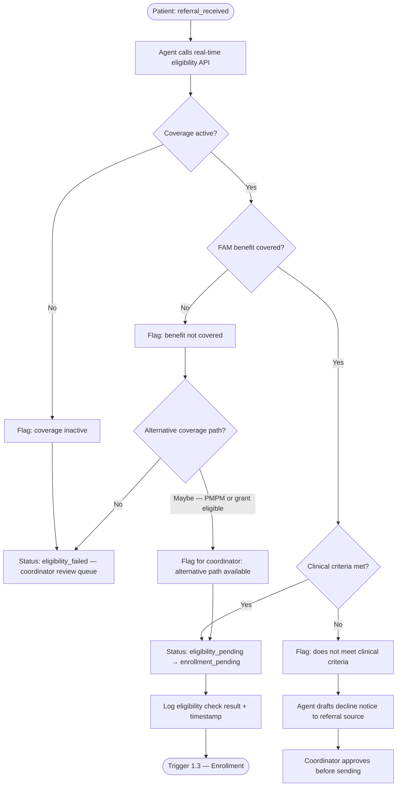

**Outputs:**
- Coverage status logged with payer response details
- Patient status updated to `enrollment_pending` (if eligible) or `eligibility_failed`
- Ineligibility notices drafted for coordinator approval

**Error states:**
- Payer API timeout → retry 3x with backoff, then flag for coordinator manual verification
- Ambiguous coverage (benefit covered but MCO restrictions unclear) → coordinator review
- Active coverage but wrong MCO for our contracts → flag, agent identifies correct MCO contact

**Agent vs. human:**
- Agent handles all clean eligibility checks autonomously
- Human reviews: failures, ambiguous coverage, alternative path decisions

**HIPAA note:** Eligibility check results are PHI. All API calls are logged with purpose, accessor,
and timestamp.

---

## 1.3 — Patient Enrollment & Registration

**Goal:** Capture complete patient profile, create the authoritative patient record, and collect
required consents before any care activity begins.

**Trigger:** Patient status is `enrollment_pending`.

**Inputs:**
- Demographics from referral (pre-filled)
- Insurance from eligibility check (pre-filled)
- Additional required fields: emergency contact, language preference, preferred contact method,
  mailing address, best time to contact

**Collection channels (in priority order):**
1. Patient self-completes via Patient app invite link
2. Coordinator completes with patient on a call
3. Agent completes via AVA intake call (voice)

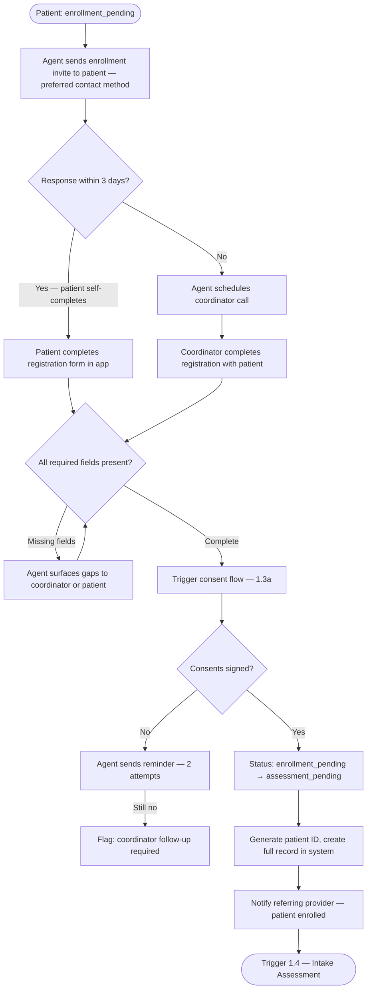

**1.3a — Consent sub-flow:**

Required consents before any clinical activity:
- Treatment consent
- HIPAA authorization
- Program participation consent (meal delivery, care coordination)
- Research consent (if UConn or research-enabled partner) — optional, patient-controlled

Agent presents consents digitally (Patient app), captures e-signature with scroll-tracking, logs
version number and timestamp. All consent documents are versioned — if consent form text changes,
existing patients are re-consented at next interaction.

**Outputs:**
- Full patient record with status `assessment_pending`
- Consents logged with version, timestamp, and signature
- Referring provider notified of enrollment
- Patient app account activated

**Error states:**
- Patient unreachable after 3 coordinator attempts → partner notified, referral paused
- Patient declines enrollment → partner notified, record archived with reason
- Consent withdrawn after enrollment → care activity halted, legal/compliance notified

---

## 1.4 — Intake Assessment

**Goal:** Build a complete clinical, behavioral, social, and nutritional profile for the patient.
This feeds care plan creation, risk scoring, and meal prescription.

**Trigger:** Patient status is `assessment_pending`.

**Assessment components:**

| Component | Collected by | Format |
|---|---|---|
| Social Determinants of Health (SDOH) | AVA (voice) or coordinator | Structured questionnaire |
| PHQ-9 depression screening | AVA (voice) or patient app | 9-item validated scale |
| GAD-7 anxiety screening | AVA (voice) or patient app | 7-item validated scale |
| Dietary history & restrictions | AVA (voice) or patient app | Freeform → structured tags |
| Cultural food preferences | AVA (voice) or patient app | Multi-select + freeform |
| Medical history & conditions | Coordinator + EHR import | ICD-10 coded |
| Current medications | Coordinator + pharmacy/EHR | Structured list |
| Recent lab values | EHR import + manual entry | Structured biomarkers |
| Vital signs | Clinical visit or self-report | Numeric values |

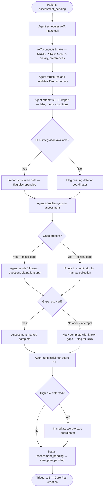

**PHQ-9 handling:**
- Score 0–4: minimal, log and continue
- Score 5–9: mild, flag for BHN awareness
- Score 10–14: moderate, BHN session scheduled before care plan finalized
- Score 15–27: severe → immediate BHN alert, care plan creation paused pending BHN review
- Suicidal ideation (Q9 > 0): crisis protocol triggered immediately (see 7.3)

**Outputs:**
- Structured patient profile (clinical, social, nutritional)
- Initial PHQ-9 and GAD-7 scores logged
- Risk score calculated and logged
- Assessment flagged for RDN review before care plan creation

**Agent vs. human:**
- AVA conducts voice collection autonomously
- Agent structures and validates responses, identifies gaps
- Coordinator fills clinical gaps, reviews PHQ-9 escalations
- RDN reviews full assessment before approving care plan creation

---

## 1.5 — Care Plan Creation

**Goal:** Generate an individualized, multi-disciplinary care plan that serves as the operational
blueprint for all care delivery, meal prescription, and monitoring for this patient.

**Trigger:** Patient status is `care_plan_pending` and assessment is complete.

**Care plan components:**

| Section | Owner | Content |
|---|---|---|
| Goals | RDN + Care Coordinator | 3–5 SMART goals (clinical, behavioral, nutritional) |
| Nutrition plan | RDN | Caloric targets, macro limits, dietary restrictions, meal prescription parameters |
| Behavioral health plan | BHN | PHQ-9 baseline, session cadence, escalation thresholds |
| Visit schedule | Care Coordinator | RDN visits, BHN sessions, PCP follow-ups |
| Monitoring schedule | Care Coordinator | AVA check-in frequency, lab draw schedule |
| Meal delivery | Care Coordinator | Frequency, delivery address, hot/cold preference |
| Medications | PCP / Coordinator | Current list, reconciliation notes |
| Risk flags | Agent | Auto-populated from assessment |

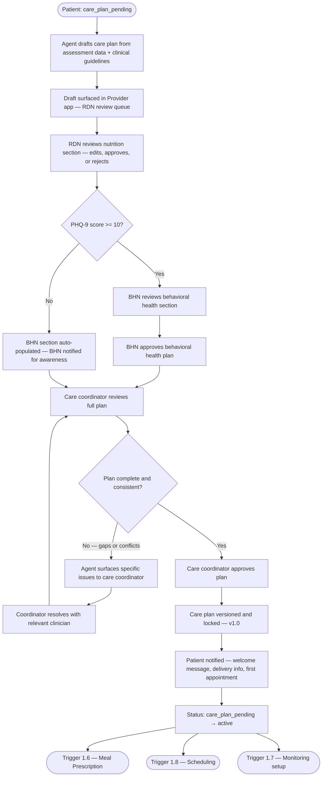

**Version control:** Every approved care plan is immutable. Changes create a new version (v1.1,
v2.0, etc.). The full history is preserved and queryable. The current approved version is always
the one driving active workflows.

**Outputs:**
- Versioned, approved care plan (v1.0)
- Patient status updated to `active`
- Meal prescription parameters available for Domain 3
- Visit and monitoring schedules created and sent to scheduling module
- Patient notified of program start

**Agent vs. human:**
- Agent drafts the full plan from structured data
- RDN must approve nutrition section (clinical sign-off)
- BHN must approve if PHQ-9 >= 10
- Care coordinator approves the integrated plan

**Compliance gate:** No meals are ordered and no visits are scheduled until care plan is approved.

---

## 1.6 — Meal Prescription

**Goal:** Translate the approved care plan nutrition section into a weekly meal prescription that
the meal operations domain can execute against.

**Trigger:** Care plan approved (status: `active`).

**Inputs:**
- Caloric target range
- Macro limits (protein, fat, carbohydrate)
- Allergen exclusions (absolute — never override)
- Dietary preferences (soft constraints — match where possible)
- Cultural food preferences
- Hot/cold preference
- Delivery frequency (meals per week)
- Budget per meal (from partner contract)

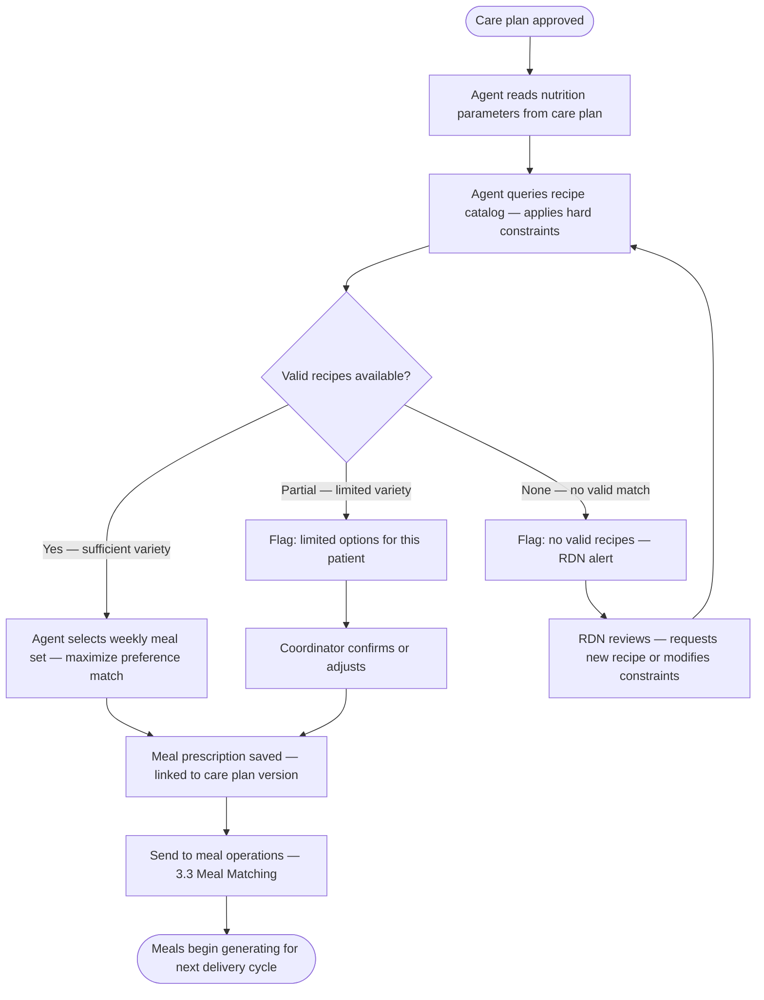

**Prescription object (data structure):**
```
meal_prescription {
  patient_id
  care_plan_version
  effective_date
  expiry_date (or until next care plan update)
  calories_min / calories_max
  macros { protein_min, fat_max, carb_max, sodium_max, potassium_max }
  allergen_exclusions [ ] — hard stop
  preference_tags [ ] — soft match
  cultural_preferences [ ]
  hot_cold_preference
  meals_per_week
  delivery_days [ ]
  max_meal_budget
}
```

**Outputs:**
- Meal prescription record linked to care plan version
- Flagged cases sent to coordinator or RDN queue

**Note:** Prescription updates automatically when care plan is updated (1.9). New prescription
is versioned and takes effect on the next delivery cycle, not retroactively.

---

## 1.7 — Ongoing Monitoring & Check-ins

**Goal:** Maintain continuous visibility into each active patient's health, engagement, and risk
status between clinical visits.

**Trigger:** Patient status is `active`. Monitoring schedule defined in care plan.

**Check-in types:**

| Type | Frequency | Channel | Collects |
|---|---|---|---|
| Weekly wellness | Weekly | AVA call | Mood, energy, pain, sleep |
| Meal feedback | Per delivery | AVA call or app | Satisfaction, issues |
| PHQ-9 follow-up | Monthly (or per care plan) | AVA call | Depression score |
| Medication adherence | Weekly | AVA call | Taking meds? side effects? |
| Weight / vitals | Per care plan cadence | Patient app self-report | Weight, BP |
| Lab results | Per lab draw schedule | Auto-imported from lab | Biomarkers |

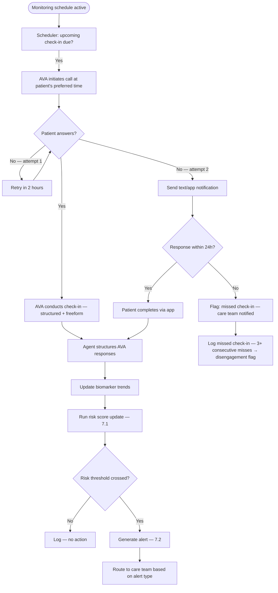

**Consecutive missed check-in logic:**
- 1 miss → log, no action
- 2 consecutive misses → coordinator soft outreach
- 3 consecutive misses → disengagement alert, coordinator direct outreach required
- 5 consecutive misses → escalate to partner, consider care plan review

**Outputs:**
- Structured check-in record per interaction
- Updated risk score
- Alerts triggered where thresholds crossed
- Missed check-in tracking feeding disengagement risk

---

## 1.8 — Appointment Scheduling

**Goal:** Schedule all clinical visits defined in the care plan, handle reminders, confirmations,
and rescheduling without coordinator involvement for routine cases.

**Trigger:** Care plan approved (initial schedule creation). Ongoing as appointments are completed
and new ones are due.

**Visit types and cadence (defaults — overridden by care plan):**

| Visit type | Default cadence | Urgency handling |
|---|---|---|
| RDN initial | Within 7 days of enrollment | Required before meal delivery begins |
| RDN follow-up | Monthly | Care plan defined |
| BHN initial | Within 14 days (within 3 if PHQ ≥ 10) | PHQ score drives urgency |
| BHN follow-up | Per care plan | Escalates on risk change |
| PCP coordination | Quarterly summary send | No scheduling required — FHIR send |
| Telehealth option | Any visit type | Patient preference |

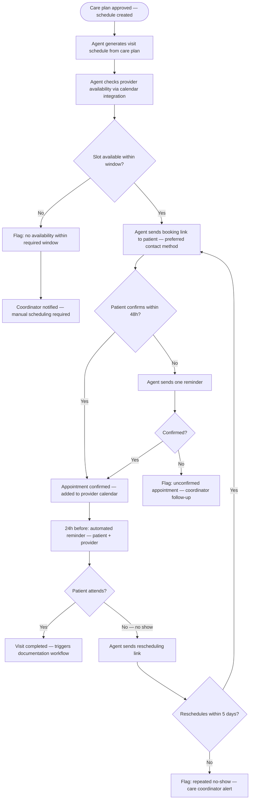

**Outputs:**
- Confirmed appointments in provider calendar
- Patient reminders sent automatically
- No-shows and unconfirmed appointments in coordinator queue
- Appointment completion events trigger clinical documentation workflow (2.5)

---

## 1.9 — Care Plan Updates

**Goal:** Revise the active care plan in response to clinical events, new data, or provider
recommendations. Maintain full version history and cascade changes to downstream workflows.

**Trigger sources:**
- Lab result outside acceptable range (auto-trigger from 2.6)
- Risk score crosses tier boundary (auto-trigger from 7.1)
- Provider request (manual trigger from provider app)
- Scheduled periodic review (per care plan cadence — default: quarterly)
- Significant life event (patient-reported via AVA or coordinator)

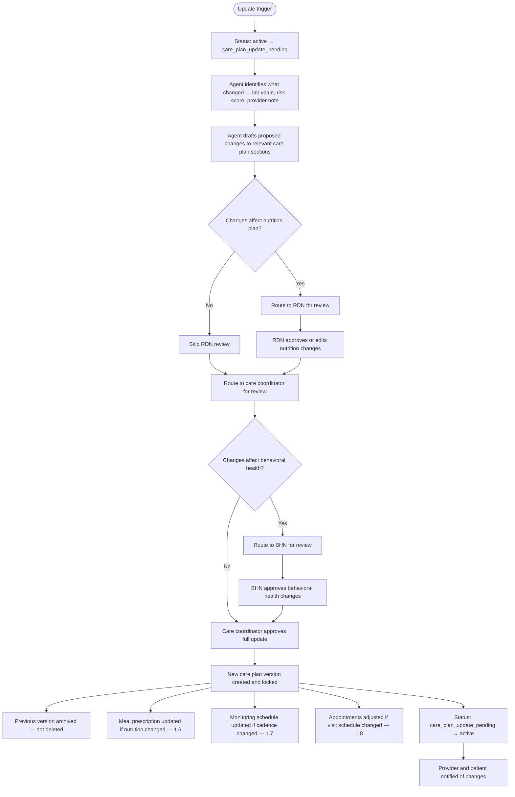

**Version semantics:**
- Minor update (single section, no structural change): v1.0 → v1.1
- Major update (goals changed, new condition, significant clinical event): v1.0 → v2.0
- Emergency update (triggered by crisis or critical lab): v1.0 → v1.0e (emergency flag) → coordinator review within 4 hours

**Outputs:**
- New versioned care plan
- Old version archived and queryable
- Downstream workflows (meals, monitoring, scheduling) updated atomically
- Change summary logged in audit trail with triggering event

---

## 1.10 — Patient Communication

**Goal:** Maintain appropriate, timely outreach to patients for non-clinical communications —
reminders, notifications, educational content, program updates.

**Trigger:** System events throughout the patient lifecycle.

**Communication types:**

| Type | Trigger | Channel | Agent-sent? |
|---|---|---|---|
| Enrollment invite | Referral received | SMS / email | Yes |
| Appointment reminder | 24h before appointment | SMS / email | Yes |
| Delivery notification | Order dispatched | SMS | Yes |
| Missed delivery follow-up | Delivery not confirmed | SMS + phone | Yes |
| Check-in reminder | Missed check-in | SMS | Yes |
| Educational content | Per care plan cadence | App / SMS | Yes |
| Care plan update notice | Plan updated | App | Yes |
| Ad hoc patient question | Patient-initiated | App chat | Yes → escalate to human if clinical |

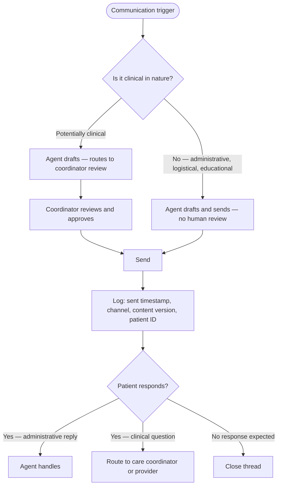

**Language handling:** All outbound communication is sent in the patient's preferred language.
Agent translates templated content. Non-templated content (e.g., clinical messages) is flagged
for human review before translation and send.

**Opt-out handling:** Patient can opt out of any non-required communication channel at any time.
Required communications (consent renewal, critical alerts) cannot be opted out of.

---

## 1.11 — Discharge & Care Transitions

**Goal:** Close the care episode cleanly, ensure continuity of care for the patient, settle all
billing, and report outcomes to the referring partner.

**Trigger sources:**
- Program term end (contract-defined episode length)
- Patient request
- Patient no longer meets eligibility
- Clinical determination: goals met, patient transitioning to different care setting
- Patient death

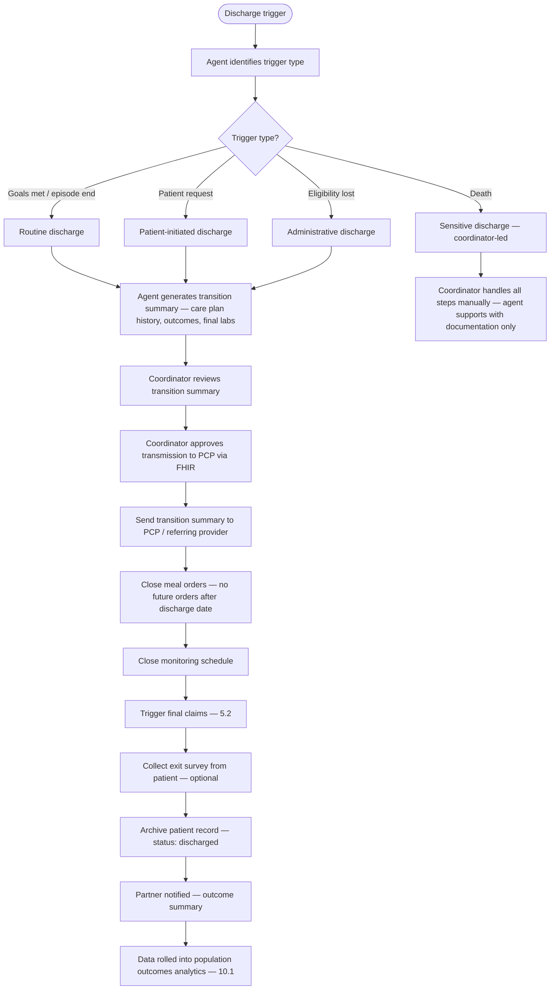

**Transition summary contents:**
- Episode dates (enrollment to discharge)
- Discharge reason
- Care plan version history
- Key clinical outcomes (HbA1c delta, weight delta, PHQ-9 delta)
- Meal delivery summary (meals delivered, completion rate, satisfaction)
- Outstanding referrals or follow-up actions for receiving provider
- Coordinator contact for questions

**Outputs:**
- Discharge record with reason, date, and outcome summary
- Transition summary transmitted to PCP via FHIR
- Partner notified with outcomes data (feeds shared savings calculation)
- Final claims submitted
- Patient record archived and retained per HIPAA retention requirements

**Compliance note:** HIPAA requires patient records retained for 6 years from date of service
or last activity. Discharged records are archived, not deleted.

---

## Cross-cutting concerns for Domain 1

### Audit trail requirements
Every state transition, agent action, human approval, and outbound communication in this domain
must be logged with:
- Timestamp
- Actor (agent ID or user ID)
- Action taken
- Patient ID
- Relevant data snapshot (e.g., previous status → new status)
- Triggering event

### HIPAA minimum necessary
Agents only access patient data fields required for the specific task being performed. Assessment
data is not accessible to kitchen staff. Delivery data is not accessible to clinical staff beyond
logistics confirmation.

### Failure handling
No workflow silently fails. Every exception either:
1. Auto-resolves (agent retries, finds alternative path), or
2. Lands in a named human review queue with the specific issue surfaced

There is no state where a patient is stuck with no one responsible for the next action.

### Human review queue structure
The Admin app and Provider app each maintain a prioritized queue of items requiring human action.
Queue items include:
- Patient name and ID
- What happened
- What the agent recommends
- What the human needs to decide
- Urgency level
- Time in queue (escalates if unactioned past SLA)
