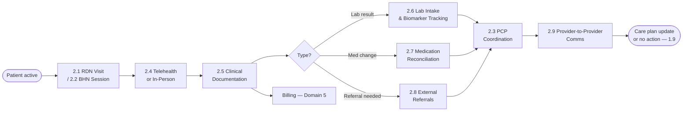
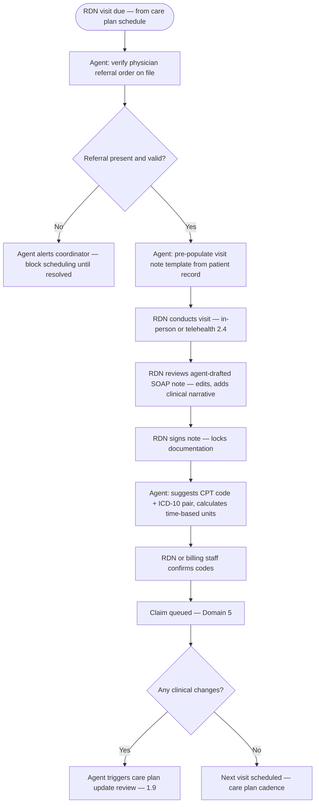
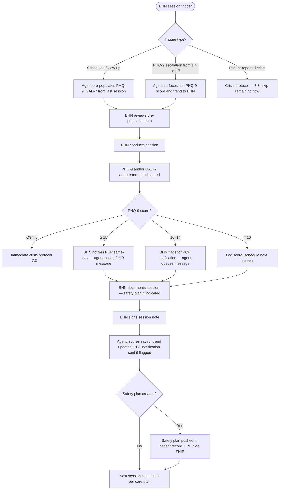
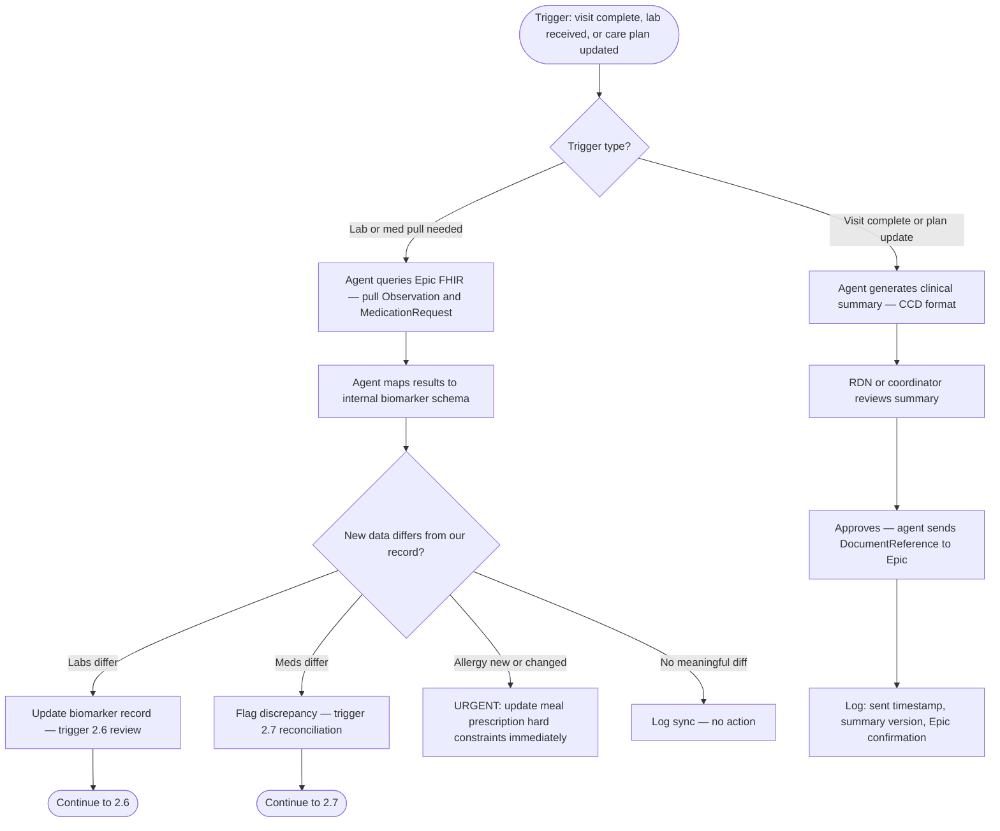
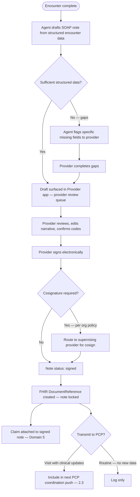
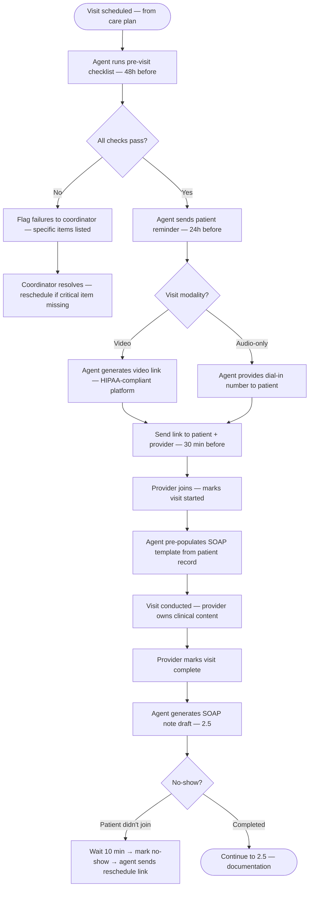
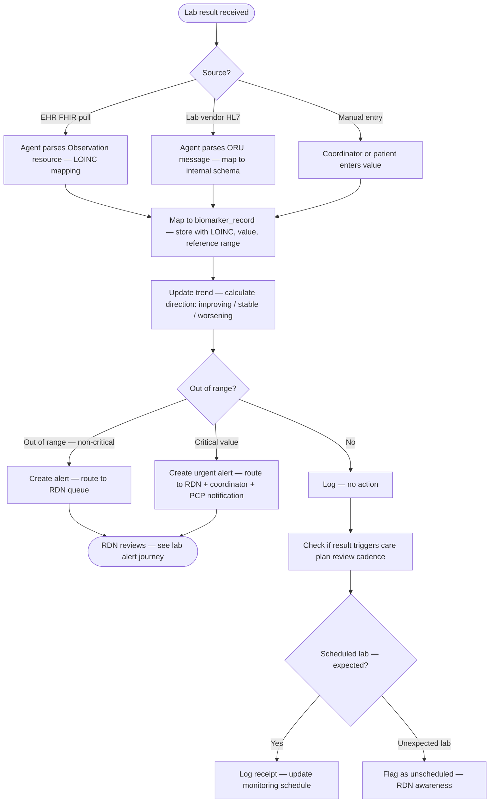
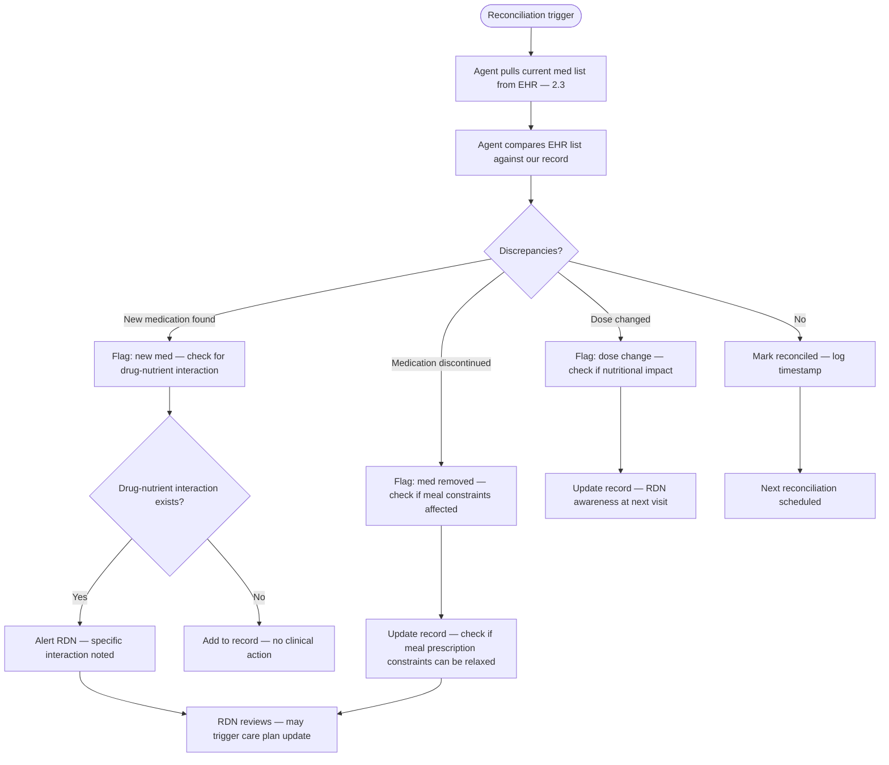
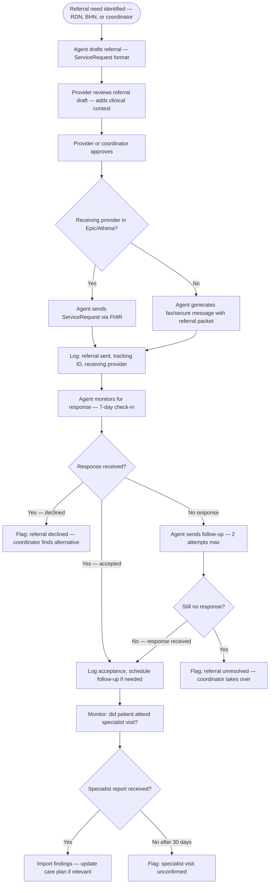
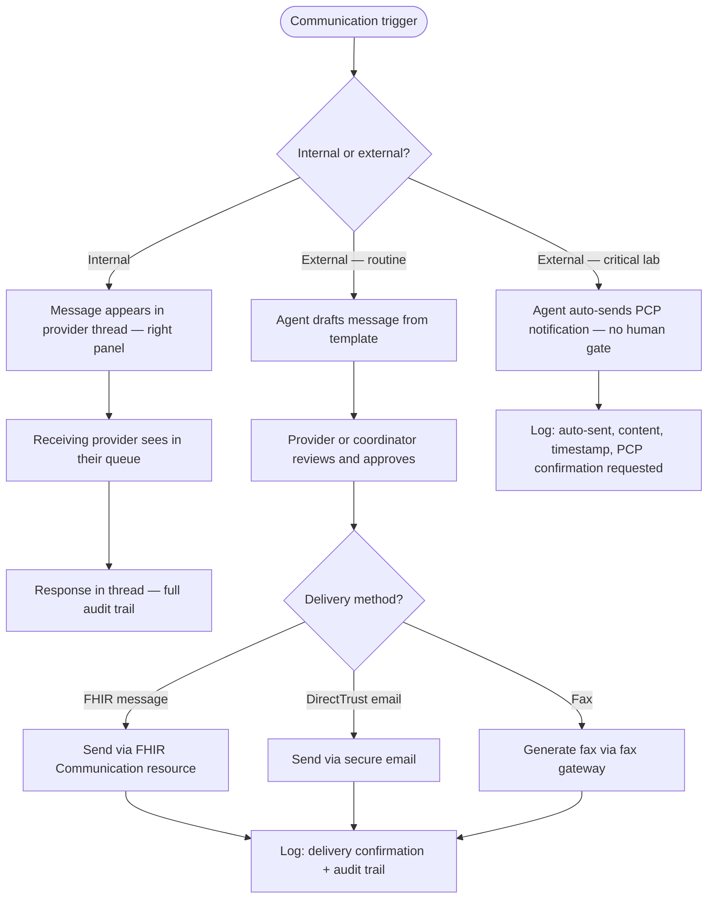

# Domain 2 — Clinical Care

> All clinical encounters, documentation, and care coordination events — from scheduled RDN visits through bidirectional EHR exchange — that constitute the medical record and drive billable activity.

---

## Domain flow



---

## Key workflows

| Workflow | Description | Automation |
|---|---|---|
| 2.1 RDN Visits | Schedule, conduct, document, and bill Medical Nutrition Therapy (MNT) visits | 🟡 Agent drafts note + code suggestions; RDN reviews and signs |
| 2.2 BHN Sessions | Behavioral health screening (PHQ-9, GAD-7), safety planning, session notes | 🔴 BHN must conduct and sign; agent pre-populates screeners and flags |
| 2.3 PCP Coordination | Bidirectional data exchange with partner EHRs (Epic, Athena, or direct) — push summaries, pull labs and meds | 🟢 Mostly automated; human gate on outbound summaries only |
| 2.4 Telehealth / Virtual Visits | Virtual visit facilitation, pre-visit checklist, session recording consent | 🟡 Agent handles logistics; provider owns clinical content |
| 2.5 Clinical Documentation | SOAP notes, progress notes, treatment plan generation and cosignature | 🟡 Agent drafts from structured data; provider must sign |
| 2.6 Lab Result Intake | Receive lab results (FHIR/HL7), map to biomarker trends, trigger care plan alerts | 🟢 Mostly automated; alert review by RDN or PCP |
| 2.7 Medication Reconciliation | Reconcile medication list at each visit against pharmacy and EHR records | 🟡 Agent identifies discrepancies; RDN or PCP resolves |
| 2.8 External Referrals | Generate, track, and close referrals to specialists outside Cena care team | 🟡 Agent drafts; coordinator or provider approves and sends |
| 2.9 Provider-to-Provider Comms | Secure async messaging between RDN, BHN, PCP, and care coordinator | 🔴 Human-to-human; agent summarizes and routes, does not draft clinical recommendations |

**Automation key:** 🟢 agent-led, human-notified | 🟡 agent drafts, human approves | 🔴 human-led, agent supports

---

## Workflow detail

### 2.1 — RDN Visits

**Goal:** Conduct and bill Medical Nutrition Therapy (MNT) encounters. Initial visit and follow-ups each have distinct CPT code requirements and documentation standards.

**CPT billing gotcha:** CMS requires a physician referral order on file before billing MNT CPT codes 97802 (initial, 15 min), 97803 (follow-up, 15 min), and G0270/G0271 (Medicare MNT reassessment). The referral must be for a qualifying diagnosis — typically diabetes (E11.x) or renal disease. Missing or expired referral = claim denial. Agent must verify referral present before scheduling and re-verify at billing.

**Documentation minimum for RDN visit:** nutrition-focused physical exam findings, 24-hour dietary recall or food frequency, anthropometrics, biochemical data review, nutrition diagnosis (NCP format — not ICD-10, though ICD-10 codes go on the claim), intervention, goals, plan.



**Visit types and CPT mapping:**

| Visit type | CPT | Time | Notes |
|---|---|---|---|
| MNT Initial | 97802 | First 15 min | Requires physician referral |
| MNT Initial add-on | 97802 ×N | Each additional 15 min | Bill multiple units |
| MNT Follow-up | 97803 | 15 min | Same referral requirement |
| Medicare MNT initial | G0270 | 3h in year 1 | Different from commercial |
| Medicare MNT follow-up | G0271 | 2h ongoing | Requires diabetes or renal diagnosis |

---

### 2.2 — BHN Sessions

**Goal:** Screen for behavioral health conditions, provide brief interventions, manage safety planning, and escalate appropriately. BHN scope of practice limits what can and cannot happen without PCP involvement.

**Scope of practice hard limits:** BHN (Behavioral Health Navigator) is typically a licensed social worker (LCSW), counselor (LPC/LPCC), or community health worker — not a prescriber. BHN cannot prescribe medications, modify psychiatric medications, or provide psychotherapy beyond their licensed scope. If PHQ-9 indicates severe depression or suicidal ideation, BHN must involve PCP or refer to licensed mental health clinician. Agent must enforce this routing — do not let BHN session be the last stop for PHQ-9 ≥ 15 or Q9 > 0.

**PHQ-9 action thresholds (mandatory — not discretionary):**

| Score | Classification | Required action |
|---|---|---|
| 0–4 | Minimal | Log, no escalation |
| 5–9 | Mild | BHN awareness flag, rescreen in 4 weeks |
| 10–14 | Moderate | BHN session within 7 days, PCP notified |
| 15–19 | Moderately severe | BHN session within 48h, PCP co-management required |
| 20–27 | Severe | Same-day BHN contact, PCP same-day notification, consider crisis referral |
| Q9 > 0 (any score) | Suicidal ideation | Crisis protocol — immediate (see 7.3), do not pass to queue |

**Safety planning note:** If BHN completes a safety plan, it must be: (1) co-signed by BHN and patient, (2) shared with PCP via FHIR, (3) flagged in patient record so all care team members can see it, (4) reviewed at every subsequent visit until resolved.



---

### 2.3 — PCP Coordination

**Goal:** Keep the PCP informed of Cena clinical activity and pull current labs, meds, and diagnoses from the PCP's EHR (Epic-first). This is bidirectional — push clinical summaries out, pull current data in.

**FHIR resource mapping (Epic integration):**

| Data | Direction | FHIR resource | Notes |
|---|---|---|---|
| Clinical summary | Push → Epic | `DocumentReference` (CCD/C-CDA) | Requires Epic App Orchard or Care Everywhere config |
| Lab results | Pull ← Epic | `Observation` (LOINC coded) | Filter by relevant LOINC codes — see 2.6 |
| Medications | Pull ← Epic | `MedicationRequest` | Reconcile against our list — 2.7 |
| Problem list / diagnoses | Pull ← Epic | `Condition` (ICD-10) | Confirms eligibility, updates care plan |
| Allergies | Pull ← Epic | `AllergyIntolerance` | Hard constraint on meal prescription |
| Vital signs | Pull ← Epic | `Observation` (LOINC) | BP, weight, BMI |
| Care team | Pull ← Epic | `CareTeam` | Identify PCP and specialists |
| Referrals (outbound) | Push → Epic | `ServiceRequest` | For external referrals we initiate |

**Integration gotcha:** Epic's FHIR R4 API requires patient-level consent for third-party app access in most configurations. Cena's HIPAA authorization at enrollment must explicitly cover EHR data exchange. Validate consent scope covers "sharing health information with care team applications" before first pull.



**Sync frequency:** Pull triggered on visit completion, on lab receipt, and on care plan update. Not a continuous poll. Full reconciliation pull quarterly or on provider request.

---

### 2.5 — Clinical Documentation

**Goal:** Produce legally defensible, HIPAA-compliant clinical notes for every encounter. Agent drafts; licensed provider signs. Unsigned notes are not billable and must not be transmitted.

**FHIR resource for clinical notes:** `DocumentReference` with `type.coding` from LOINC (e.g., 11488-4 for consultation note, 34117-2 for progress note). Do not store notes as free-text blobs outside FHIR structure — this breaks Epic interoperability and audit trails.

**SOAP note structure (required fields per visit type):**

```
clinical_note {
  patient_id
  encounter_id
  note_type: [soap_note | progress_note | treatment_plan | safety_plan | transition_summary]
  author_id (provider)
  cosigner_id (if required by org policy)
  status: [draft | pending_signature | signed | amended | voided]
  signed_at (timestamp — required before billing)
  fhir_document_reference_id

  soap {
    subjective: string   // patient-reported symptoms, dietary adherence, psychosocial context
    objective: string    // vitals, anthropometrics, labs, physical exam findings
    assessment: string   // clinical reasoning, nutrition diagnosis (NCP format for RDN)
    plan: string         // intervention, goals, follow-up, referrals, prescription changes
  }

  icd10_codes: []        // for claim attachment
  cpt_codes: []          // billed procedure codes
  time_spent_minutes     // required for time-based CPT billing
  encounter_date
  encounter_type: [in_person | telehealth]
}
```

**Amendment rules:** Signed notes are immutable. Corrections create an amended note linked to the original, with amendment reason and timestamp. The original is never deleted. This is a legal requirement.



---

### 2.4 — Telehealth / Virtual Visits

**Goal:** Facilitate video or audio-only clinical visits with consistent pre-visit preparation, consent, and post-visit documentation. Telehealth is the default modality for most patients — many lack transportation or live in food deserts.

**Modality support (per OQ-15):** Both video and audio-only from day one. Many patients lack video capability. Audio-only billing is supported under current Medicare and Medicaid rules for MNT and BHN sessions.

**Pre-visit checklist (agent-driven):**

| Check | When | Action if failed |
|---|---|---|
| Physician referral order on file | 48h before visit | Alert coordinator — block scheduling |
| Patient insurance active | 24h before visit | Alert coordinator |
| RDN/BHN credentialed with patient's payer | At scheduling | Block booking if not enrolled |
| RDN/BHN licensed in patient's state | At scheduling | Warn coordinator (OQ-29: warn, don't hard block) |
| Patient consent for telehealth on file | 24h before visit | Send consent via patient app or AVA call |
| Prior visit notes available | 24h before visit | Pre-populate note template |
| Recent lab results pulled | 24h before visit | EHR pull via 2.3 if available |



**Telehealth consent:** Separate from program consent. Covers: (1) risks of telehealth, (2) limitations compared to in-person, (3) recording policy (no recording without explicit consent), (4) emergency procedure if patient has a medical event during call. Consent stored as a versioned document — re-consent required if consent form changes.

**Billing modifiers:**

| Payer | Video modifier | Audio-only modifier | Notes |
|---|---|---|---|
| Medicare | Place of service 02 | 93 + GT modifier | Audio-only for established patients only |
| Medicaid (CT) | GT modifier | GT + 95 modifier | Varies by state — agent must check state rules |
| Commercial | Per contract | Per contract | Agent checks payer-specific modifier rules |

---

### 2.6 — Lab Result Intake & Biomarker Tracking

**Goal:** Receive lab results from multiple sources, map them to the patient's biomarker history, detect out-of-range values, and trigger appropriate clinical responses.

**Sources of lab data:**
1. EHR pull via FHIR (Epic or Athena per partner — OQ-01)
2. Direct lab vendor feed (HL7 v2 ORM/ORU messages or FHIR)
3. Manual entry by coordinator or patient (self-reported weight, BP)

**Key biomarkers tracked:**

| Biomarker | LOINC | Frequency | Alert thresholds |
|---|---|---|---|
| HbA1c | 4548-4 | Every 3 months | > 9.0% or reversal from improving trend |
| Fasting glucose | 1558-6 | Per provider order | > 180 mg/dL or < 70 mg/dL |
| LDL cholesterol | 13457-7 | Every 6 months | > 160 mg/dL |
| HDL cholesterol | 2085-9 | Every 6 months | < 40 mg/dL |
| Triglycerides | 2571-8 | Every 6 months | > 200 mg/dL |
| Creatinine / eGFR | 2160-0 / 33914-3 | Every 6 months | eGFR < 60 (renal concern) |
| Weight | 29463-7 | Weekly (self-report) | > 5% gain in 30 days |
| Blood pressure | 85354-9 | Per visit or self-report | > 140/90 or < 90/60 |
| PHQ-9 | 44249-1 | Monthly | See 2.2 thresholds |
| GAD-7 | 70274-6 | Monthly | Score ≥ 10 |



**Trend calculation logic:**
- Improving: value moved toward goal compared to previous measurement
- Stable: value within 5% of previous measurement, still in range
- Worsening: value moved away from goal compared to previous measurement
- Reversal: was improving for 2+ readings, now worsened — this is the highest-priority alert

**Lab result matching:** Match incoming results to patients by: MRN (if EHR source), patient name + DOB (if lab vendor), or direct patient ID (if manual entry). Unmatched results → coordinator queue for manual matching.

---

### 2.7 — Medication Reconciliation

**Goal:** Maintain an accurate, current medication list for each patient by reconciling against EHR data, patient self-reports, and pharmacy feeds. Medication changes affect meal prescription (drug-nutrient interactions) and risk scoring.

**When reconciliation occurs:**
- At every RDN visit (mandatory)
- When EHR pull detects a medication change
- When patient reports a change via AVA or app
- At care plan update review
- At discharge

**Drug-nutrient interactions tracked:**

| Drug class | Nutritional implication | Meal prescription impact |
|---|---|---|
| ACE inhibitors (Lisinopril) | Potassium elevation risk | Monitor potassium, flag high-K meals |
| Metformin | B12 depletion risk | Monitor B12 levels |
| Warfarin | Vitamin K interaction | Consistent vitamin K intake, flag variable-K meals |
| Statins | Grapefruit interaction | Exclude grapefruit from meal rotation |
| Diuretics | Electrolyte depletion | Monitor sodium, potassium, magnesium |
| Insulin | Hypoglycemia risk with meal changes | Coordinate meal timing with insulin schedule |



**Data quality rule:** Patient-reported medications always create a `discrepant` status until confirmed against EHR or pharmacy data. The medication list is never auto-updated from patient self-report alone — a provider must confirm.

---

### 2.8 — External Referrals

**Goal:** Generate, track, and close referrals from Cena to external specialists (endocrinology, nephrology, podiatry, ophthalmology, mental health) when the patient's needs exceed Cena's scope.

**Common referral targets for food-as-medicine patients:**
- Endocrinologist — uncontrolled diabetes despite MNT
- Nephrologist — declining eGFR, CKD progression
- Ophthalmologist — diabetic retinopathy screening
- Podiatrist — diabetic foot exam
- Psychiatrist — PHQ-9 ≥ 15 with need for medication evaluation
- Social worker — SDOH barriers beyond BHN scope



**Referral packet contents:**
- Patient demographics (name, DOB, insurance)
- Reason for referral (clinical summary)
- Current medications
- Relevant lab results
- Current care plan summary
- Preferred appointment location/modality

**Tracking:** Every referral has a status: `draft → sent → accepted → scheduled → completed → report_received`. Open referrals older than 30 days surface in the coordinator's queue.

---

### 2.9 — Provider-to-Provider Communications

**Goal:** Enable secure async messaging between Cena clinical team members (RDN, BHN, coordinator) and external providers (PCP, specialists). Agent routes and summarizes but does NOT draft clinical recommendations.

**Communication types:**

| Type | Between | Agent role | HIPAA handling |
|---|---|---|---|
| Internal clinical discussion | RDN ↔ BHN ↔ Coordinator | Routes by topic, summarizes thread | Internal — standard thread encryption |
| PCP notification | Cena → PCP | Drafts notification template, provider approves | FHIR message or secure email via DirectTrust |
| Specialist consultation request | RDN → Specialist | Formats referral context (2.8) | FHIR ServiceRequest or fax |
| Patient status update to PCP | Coordinator → PCP | Drafts summary | Requires coordinator approval before send |
| Lab result alert to PCP | Agent → PCP | Auto-sends FHIR notification (no human gate for critical values) | Exception to human-gate rule — critical lab values require immediate PCP notification |



**Critical exception:** Critical lab values (defined in 2.6 threshold table) trigger automatic PCP notification without waiting for human approval. This is the only exception to the "agents propose, humans dispose" principle, and it is medically justified — delayed notification of critical values creates clinical liability. The auto-notification is logged in the thread with full content for audit.

**Internal messaging behavior:** All internal messages between care team members are thread messages in the right panel, scoped to the patient record. There is no separate "chat" — the thread IS the communication channel. This ensures all clinical discussion is part of the audit trail and linked to the patient record.

---

## Key data objects

### ClinicalEncounter

```
clinical_encounter {
  encounter_id
  patient_id
  provider_id
  encounter_type: [rdn_visit | bhn_session | pcp_coordination | telehealth]
  status: [scheduled | in_progress | completed | no_show | cancelled]
  scheduled_at
  started_at
  ended_at
  duration_minutes
  modality: [in_person | video | phone]
  visit_note_id (→ clinical_note)
  cpt_codes: []
  icd10_codes: []
  referral_order_id (required for MNT billing)
  care_plan_version (plan active at time of visit)
  audit_log: []
}
```

### BiomarkerRecord

```
biomarker_record {
  patient_id
  biomarker_type: [hba1c | fasting_glucose | ldl | hdl | triglycerides | creatinine |
                   egfr | bmi | weight | systolic_bp | diastolic_bp | phq9_score | gad7_score]
  value
  unit
  reference_range { low, high }
  status: [normal | borderline | abnormal | critical]
  source: [lab_import | ehr_pull | patient_self_report | clinical_measurement]
  loinc_code
  collected_at
  received_at
  ordering_provider_id
  fhir_observation_id
  trend_direction: [improving | stable | worsening]
  alert_triggered: boolean
}
```

### MedicationRecord

```
medication_record {
  patient_id
  medication_name
  rxnorm_code
  dose
  frequency
  route
  prescribing_provider_id
  status: [active | discontinued | on_hold | unknown]
  start_date
  end_date
  source: [ehr_import | patient_reported | pharmacy_feed | coordinator_entry]
  last_reconciled_at
  reconciliation_status: [confirmed | discrepant | unverified]
  fhir_medication_request_id
  notes
}
```

---

## Dependencies

- **Upstream from:** Domain 1 (patient active, care plan approved, visit scheduled), Domain 3 (meal delivery data informs RDN visit context)
- **Downstream to:** Domain 5 (billing — signed notes unlock claims), Domain 7 (risk scoring updates on lab results and PHQ-9 changes), Domain 10 (outcomes analytics consume biomarker trends and clinical notes), Domain 1.9 (care plan updates triggered by clinical findings)
- **External systems:** Epic (FHIR R4, Cedars) and Athena Health (Vanderbilt + billing platform per OQ-03), lab vendors (HL7 2.x or FHIR), telehealth platform (HIPAA-compliant, BAA-covered), pharmacy networks (SureScripts or state-level)

---

## Open questions (updated with Vanessa's answers)

1. ~~**RDN supervision model:**~~ **Resolved (OQ-12).** Cena Health credentialing only — covers all telehealth and on-site visits. No dual credentialing at partner facilities. RDNs bill under Cena's organizational NPI (~4 week credentialing turnaround per OQ-37).

2. **BHN licensure by state:** Still pending (OQ-33). Depends on BHN licensure level — needs Shenira's guidance on scope of practice for the specific BHN roles Cena will hire.

3. ~~**Telehealth audio-only Medicare policy:**~~ **Resolved (OQ-15).** Support audio-only telehealth billing from day one. Many patients lack video capability. Modifier logic built into 2.4 workflow.

4. ~~**Epic integration tier per partner:**~~ **Resolved (OQ-01).** Partners vary: UConn does not want integration for phase 1. Cedars will want Epic integration. Vanderbilt uses Athena, not Epic. EHR integration layer (Feature 7.7) must support both Epic FHIR and Athena API. PCP coordination (2.3) updated to reference multi-EHR.

5. **Nutrition diagnosis vocabulary:** Partially resolved (OQ-16). RDN documentation format pending — clinical ops director will decide between NCP/eNCPT and SOAP. Aaron leans toward SOAP. Regardless of format, the data model maintains NCP terminology in clinical notes and ICD-10 codes on claims as separate fields.

6. ~~**PHQ-9 and GAD-7 billing:**~~ **Resolved (OQ-13).** BHN bills independently for PHQ-9/GAD-7 screenings. Not bundled into RDN visits or billed under PCP NPI.
