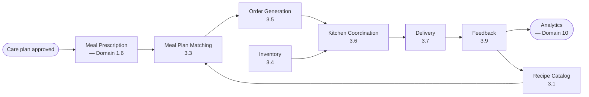
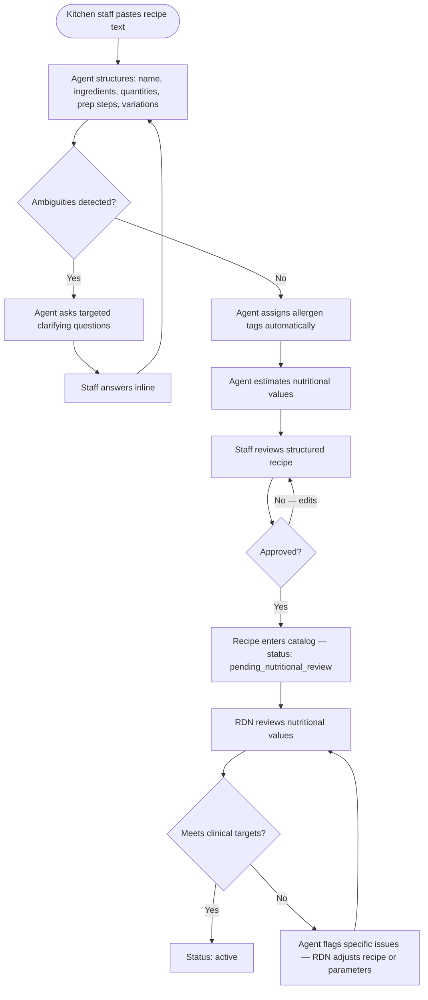
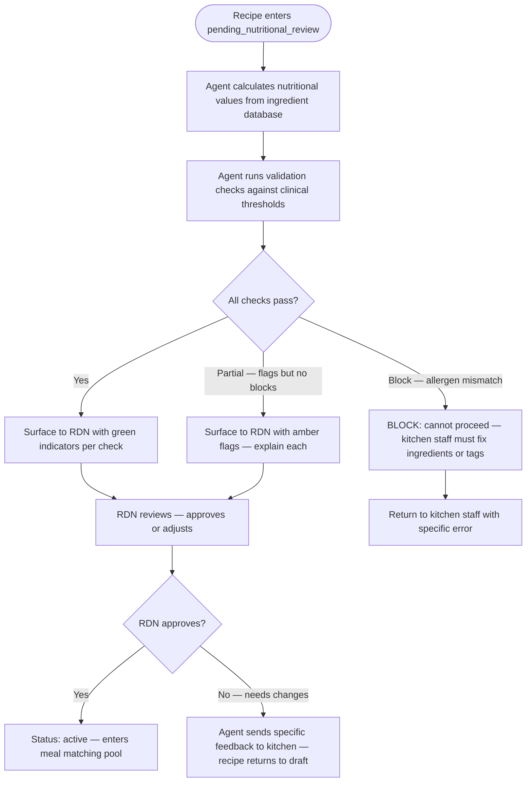
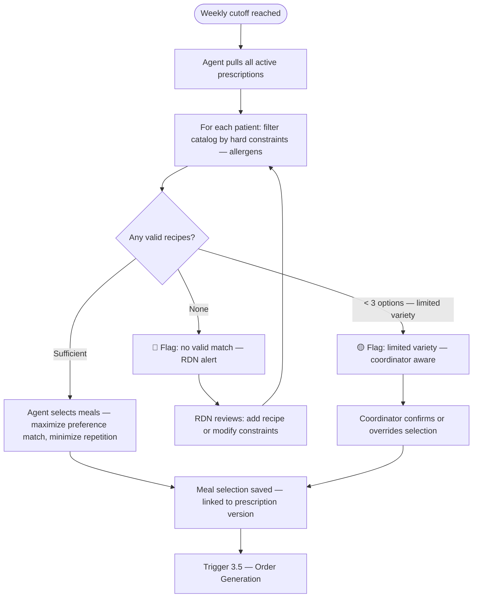
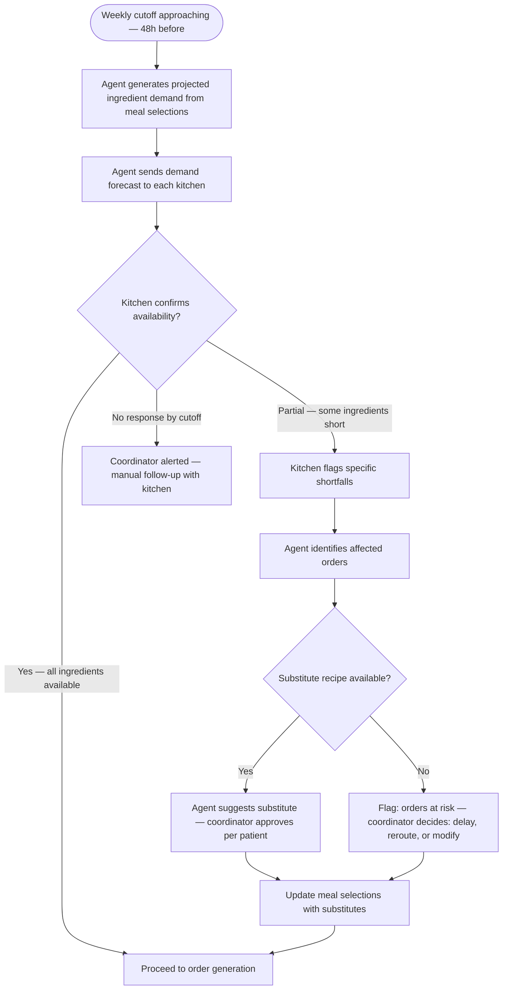
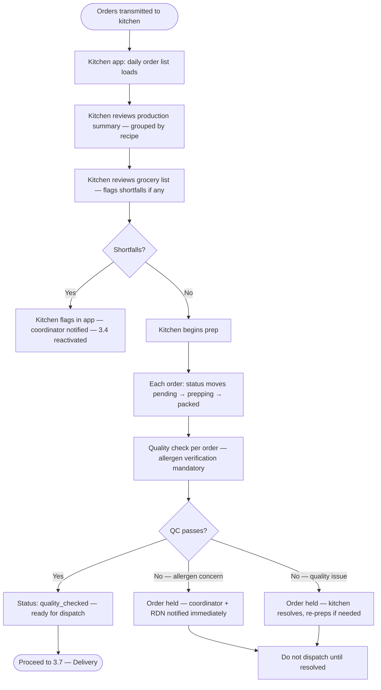
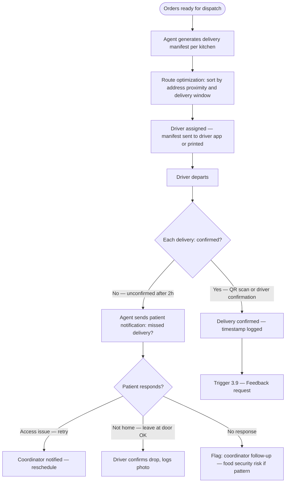
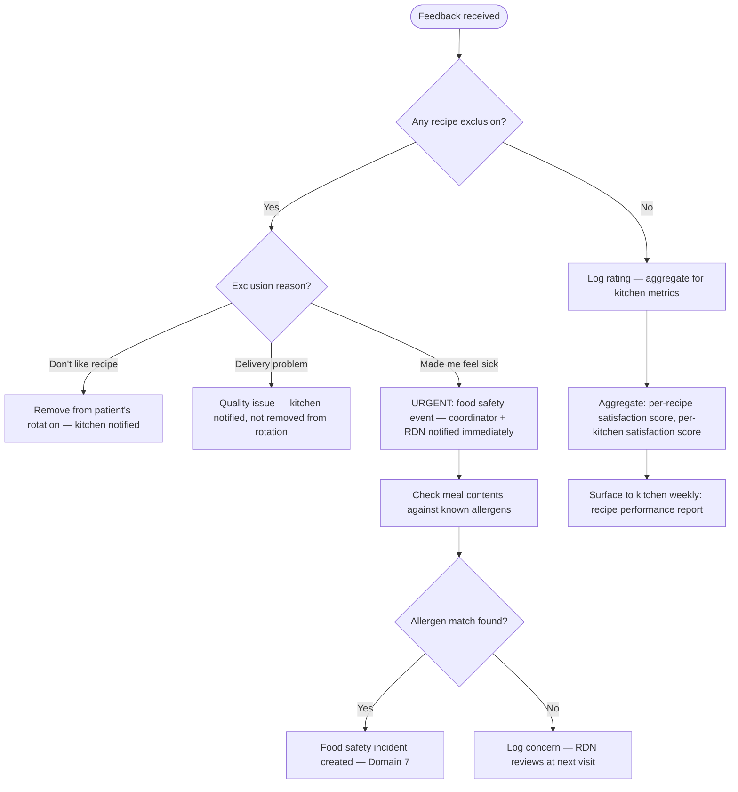
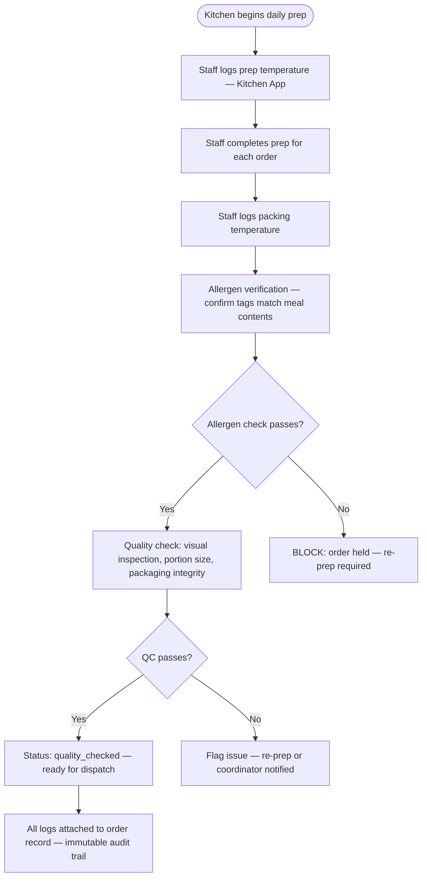

# Domain 3 — Meal Operations

> Everything from recipe catalog to delivered meal: the production system that makes
> Food-as-Medicine tangible. Clinical prescriptions are the input; food in a patient's
> hands is the output.

---

## Domain flow



---

## Key workflows

| Workflow | Description | Automation |
|---|---|---|
| 3.1 Recipe Management | Freeform text → structured recipe with allergen tags and nutritional values | 🟡 Medium |
| 3.2 Nutritional Analysis | Validate recipes meet clinical targets | 🟢 High |
| 3.3 Meal Plan Matching | Match patient prescription to available recipes each week | 🟢 High |
| 3.4 Inventory Management | Track ingredient availability, forecast demand, flag shortfalls | 🟡 Medium |
| 3.5 Order Generation | Convert meal selections to kitchen orders, packing slips, grocery list | 🟢 High |
| 3.6 Kitchen Coordination | Transmit orders, track prep/pack/QC status | 🟡 Medium |
| 3.7 Delivery Logistics | Schedule routes, dispatch, confirm delivery | 🟡 Medium |
| 3.8 Missed Delivery Management | Detect, contact patient, reroute, escalate if clinically relevant | 🟡 Medium |
| 3.9 Patient Feedback | Collect meal ratings per delivery, surface patterns | 🟢 High |
| 3.10 Food Safety & Compliance | Temperature logs, quality checks, inspection records | 🟡 Medium |

---

## Workflow detail

### 3.1 — Recipe Management

Kitchen staff or RDN pastes freeform text (existing recipe, handwritten notes, screenshot OCR).
Agent parses into structured recipe, identifies ambiguities, asks clarifying questions inline
(e.g., "Is the listed garlic raw or roasted? Does this variation apply to the nut-free version?").
Staff reviews the structured output, edits, and approves. Approved recipes enter the catalog
in `draft` state until RDN validates nutritional compliance.



**Catalog states:** `draft` → `pending_nutritional_review` → `active` → `inactive`

Inactive recipes are never deleted — they remain queryable for historical orders.

---

### 3.2 — Nutritional Analysis

**Goal:** Validate that every recipe in the catalog meets clinical nutritional standards and can be safely served to patients with specific medical conditions.

**When analysis runs:**
- On every new recipe entering `pending_nutritional_review`
- When a recipe is modified (ingredient change, portion change)
- When clinical guidelines update (e.g., ADA sodium recommendation changes)

**Validation checks (automated, RDN reviews):**

| Check | Threshold | Action if failed |
|---|---|---|
| Caloric range | 400-700 cal per meal (configurable per program) | Flag: meal too high/low for prescription matching |
| Sodium | < 800mg per meal (for low-sodium prescriptions) | Flag: exceeds sodium limit |
| Allergen tag accuracy | Ingredient list matches allergen tags | Block: allergen mismatch is a safety event |
| Macro balance | Protein ≥ 15g, fat ≤ 30% cal, carb within diabetic range | Flag: out of range for target population |
| Potassium | Flag high-K meals for patients on ACE inhibitors (from 2.7) | Tag: high-potassium (soft constraint, not block) |
| Vitamin K consistency | Flag variable-K meals for warfarin patients (from 2.7) | Tag: variable-vitamin-K |



**Nutritional database:** Agent estimates nutritional values from a standard food composition database (USDA FoodData Central or equivalent). These are estimates — RDN review is the clinical validation step. If a kitchen provides their own lab-tested nutritional data, that takes precedence.

---

### 3.3 — Meal Plan Matching

Runs every week on a defined cutoff schedule (e.g., Thursday noon for Monday delivery).
Agent applies patient prescription as a constraint satisfaction problem: hard constraints
(allergens) are never violated; soft constraints (preferences, variety) are optimized.



**Repetition logic:** Agent tracks the last 4 weeks of meals per patient. Recipes served within
the last 2 weeks are deprioritized (soft constraint) unless the patient has a strong preference
match and the catalog is limited.

**Multi-kitchen routing (OQ-20):** If the primary kitchen can't fulfill an order (ingredient shortage, capacity issue), the system suggests an alternative kitchen. Coordinator must approve before rerouting — this is not automatic. Patient is notified if the delivering kitchen changes.

**Fresh and frozen handling (OQ-17):** Both formats are supported. The matching algorithm considers:
- Patient preference (captured at enrollment)
- Kitchen capability (some kitchens do fresh only, some frozen only, some both)
- Delivery logistics (fresh requires tighter delivery windows)
- Shelf life (fresh: 3-5 days; frozen: 30+ days)

Frozen meals can be batched into larger delivery cycles (weekly). Fresh meals require more frequent delivery (2-3x per week). The order generation step handles the format-specific logistics.

---

### 3.4 — Inventory Management

**Goal:** Track ingredient availability across kitchen partners, forecast demand, and flag shortfalls before they affect patient meal delivery.

**Ownership model (per Vanessa's answers):** Kitchens procure independently. Cena does not aggregate purchasing centrally. Inventory management is a kitchen-side responsibility, but the platform needs visibility into shortfalls that affect order fulfillment.



**Demand forecasting:** Agent calculates total ingredient quantities needed per kitchen per delivery cycle by aggregating all meal selections. This is a grocery list projection, not a procurement order — kitchens use it to plan their own purchasing.

---

### 3.5 — Order Generation

Once meal selections are confirmed, agent generates all downstream artifacts automatically.

**Artifacts generated per delivery cycle:**
- Per-patient order record (meals, delivery address, dietary notes for packing)
- Per-kitchen aggregated grocery list (total quantities by ingredient)
- Per-patient packing slip (patient name, meal list, allergen notes, delivery address)
- Kitchen order summary (total orders, any special accommodation flags)

All artifacts are generated from structured data — no human input required unless exceptions
exist. Print-optimized for kitchen use.

---

### 3.6 — Kitchen Coordination

**Goal:** Transmit orders to kitchen partners, track preparation and packing status, and ensure quality checks are completed before dispatch.

**Delivery model (OQ-18):** Varies by kitchen — some deliver with their own staff, others use third-party logistics. The platform interface is the same regardless; PHI exposure on packing slips is scoped to minimum necessary.

**Kitchen app workflow (daily):**



**Packing slip PHI boundary (OQ-18):** Packing slips show: patient first name + last initial, delivery address, meal contents, allergen flags, delivery window. Packing slips do NOT show: full last name, diagnosis, insurance, clinical notes, or contact phone number. If the delivery partner is a third party without a BAA, allergen flags use generic tags ("nut-free") rather than diagnosis-linked language ("diabetes diet").

**Food safety documentation:** Kitchen staff log temperature checks at prep and packing via the Kitchen App. These logs are timestamped and linked to the order record for compliance auditing (Domain 6).

---

### 3.7 — Delivery Logistics



**Delivery window:** Patient preferred delivery window captured at enrollment. Agent schedules
within window; coordinator notified if no route slot is available in that window.

---

### 3.8 — Missed Delivery Management

**Goal:** Detect undelivered meals, contact the patient, determine cause, resolve or reschedule, and escalate if the missed delivery indicates a food security or safety concern.

```mermaid
flowchart TD
    A([Delivery not confirmed within 2h of window]) --> B[Agent sends patient SMS: "We tried to deliver your meals today"]
    B --> C{Patient responds?}
    C --> |Not home — reschedule| D[Agent offers next available delivery slot]
    C --> |Access issue| E[Coordinator notified — address or building access problem]
    C --> |Didn't receive but was home| F[Discrepancy — driver reported delivered but patient didn't get it]
    C --> |No response within 24h| G[Coordinator direct outreach — phone call]
    D --> H[Reschedule delivery — kitchen notified]
    E --> I[Coordinator resolves — updates address or access instructions]
    F --> J[Log both records — coordinator investigates]
    G --> K{Coordinator reaches patient?}
    K --> |Yes| L[Resolve per patient response]
    K --> |No| M[Flag: potential disengagement or safety concern]
    M --> N{Pattern detected?}
    N --> |3+ missed deliveries| O[Food insecurity risk flag — care plan review triggered]
    N --> |Single occurrence| P[Log — monitor]
```

**Replacement logic:** If meals are perishable (fresh) and undelivered, they cannot be re-sent the next day. A new order must be generated. Frozen meals can be rescheduled within the shelf-life window.

**Clinical escalation:** Repeated missed deliveries may indicate:
- Patient is hospitalized (check with coordinator)
- Patient has moved (address update needed)
- Patient is disengaging from program (Domain 1.7 disengagement tracking)
- Food insecurity — patient may need more meals, not fewer

---

### 3.9 — Patient Feedback

**Goal:** Collect meal ratings per delivery, distinguish recipe preference from delivery quality, surface patterns to kitchen and clinical teams.

**Collection channels:**
- AVA call (during weekly wellness check-in — low friction)
- Patient app (push notification after delivery confirmation)
- Coordinator-collected (during phone interactions)

**Feedback data model:**

| Field | Type | Purpose |
|---|---|---|
| delivery_id | reference | Links to specific delivery |
| overall_rating | enum: good / ok / bad | 3-point emoji scale |
| comment | string (optional) | Freeform text |
| recipe_exclusions | [recipe_id] | "Don't send this again" |
| exclusion_reason | enum: dont_like / delivery_problem / made_sick | Per OQ-21 |
| collected_via | enum: ava_call / app / coordinator | Channel tracking |

**Feedback routing (OQ-21):**



**Pattern detection:** Agent monitors aggregate feedback per recipe and per kitchen:
- Recipe with < 3.0 avg rating across 10+ patients → flag for kitchen review
- Kitchen with declining satisfaction trend → flag for coordinator
- Patient with consistently low ratings → coordinator outreach (may indicate unmet dietary needs)

---

### 3.10 — Food Safety & Compliance

**Goal:** Maintain food safety documentation, temperature logs, quality check records, and inspection readiness for regulatory compliance.

**Required documentation per delivery cycle:**

| Document | Who creates | When | Retention |
|---|---|---|---|
| Temperature log (prep) | Kitchen staff | During meal prep | 2 years |
| Temperature log (packing) | Kitchen staff | At packing | 2 years |
| Quality check record | Kitchen staff | Per order before dispatch | 2 years |
| Delivery temperature log | Driver (if required) | At delivery (cold chain) | 2 years |
| Allergen verification | Kitchen staff | Per order at packing | 2 years |
| Kitchen inspection report | External inspector | Per schedule (monthly/quarterly) | 5 years |

**Kitchen partner BAA status (OQ-28):** Sent to Vanessa — pending. Kitchen partners handling diagnosis-linked dietary orders need BAAs if they receive any PHI beyond minimum necessary. Current packing slip design minimizes PHI exposure, but the BAA question determines whether kitchens can receive any patient-identifying information beyond first name + last initial.



**Inspection readiness:** Agent generates a compliance dashboard showing:
- % of orders with complete temperature logs (target: 100%)
- % of orders with allergen verification (target: 100%)
- Outstanding inspection dates
- Any quality incidents in the past 30 days

This dashboard is visible to the Admin role and can be exported for regulatory inspections.

---

## Key data objects

**Recipe**
```
recipe {
  id, name, description
  ingredients: [{ item, quantity, unit }]
  variations: [{ name, ingredient_deltas }]
  allergen_tags: []            // hard — must match allergen_exclusions
  preference_tags: []          // soft — hot/cold, spicy, vegetarian, etc.
  cultural_tags: []
  nutritional_values: { calories, protein_g, fat_g, carb_g, sodium_mg, potassium_mg, ... }
  status: draft | pending_nutritional_review | active | inactive
  created_by, approved_by, version_history
}
```

**Order**
```
order {
  id
  patient_id
  kitchen_id
  delivery_date
  delivery_address
  delivery_window         // patient preferred time window
  format: fresh | frozen  // per OQ-17 — determines logistics and shelf life
  meals: [{ recipe_id, variation_id, quantity }]
  dietary_notes           // rendered from allergen + preference tags for packing slip
  allergen_flags: []      // hard constraints — prominent on packing slip
  status: pending | prepping | packed | quality_checked | dispatched | delivered | delivery_failed
  driver_id
  confirmation_timestamp
  confirmation_photo_url  // optional — driver photo at delivery
  feedback_id             // linked after delivery
  temp_log: { prep_temp, pack_temp, delivery_temp }  // food safety — 3.10
}
```

**KitchenOrderSummary**
```
kitchen_order_summary {
  kitchen_id
  delivery_date
  orders: [order_id]
  grocery_list: [{ ingredient, total_quantity, unit }]
  special_flags: []       // patients with complex allergen situations
  generated_at
}
```

---

## Dependencies

- **Upstream from:** Domain 1 (meal prescription parameters), Domain 6 (food safety compliance docs)
- **Downstream to:** Domain 1 (missed delivery → food insecurity risk flag), Domain 5 (delivery confirmation triggers billing event), Domain 7 (missed deliveries feed risk score), Domain 10 (delivery and feedback data feed analytics)

---

## Open questions (updated with Vanessa's answers)

1. ~~**Recipe catalog ownership:**~~ **Resolved (OQ-19).** Kitchens own their recipe catalogs. RDNs validate recipes for nutritional/clinical appropriateness. Kitchens can add, modify, and deactivate their own recipes. RDN approval is required before a recipe enters the active matching pool.

2. ~~**Multi-kitchen routing:**~~ **Resolved (OQ-20).** System suggests alternative kitchen, coordinator approves before rerouting. Not fully automatic. Patient is notified if the delivering kitchen changes.

3. ~~**Fresh vs. frozen:**~~ **Resolved (OQ-17).** Both fresh and frozen. Logistics architecture must support both formats. Patient preference captured at enrollment. Kitchen capability determines which formats are available per kitchen.

4. **Grocery list ownership:** Resolved implicitly — kitchens procure independently. Platform provides demand forecasts (3.4) but does not manage procurement.

5. ~~**Delivery partner:**~~ **Resolved (OQ-18).** Varies by kitchen — delivery method is kitchen-dependent. Some kitchens deliver with own staff, others use third-party. PHI exposure on packing slips scoped to minimum necessary regardless of delivery model.

6. ~~**Feedback loop latency:**~~ **Resolved (OQ-21).** Ask the patient: distinguish "don't like the recipe" from "problem with this delivery." Only remove from rotation if the patient confirms they don't want it again. Single bad rating does not auto-remove.

7. **Kitchen partner BAAs (OQ-28):** Still with Vanessa. Determines whether kitchens can receive any patient-identifying information beyond first name + last initial.
