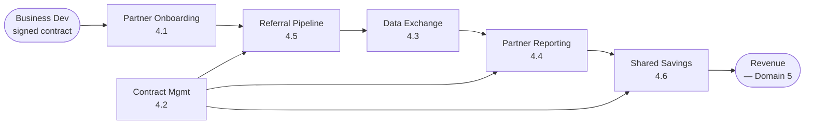
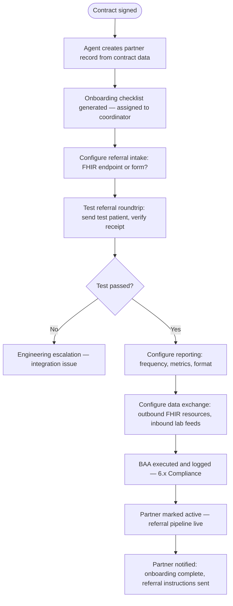
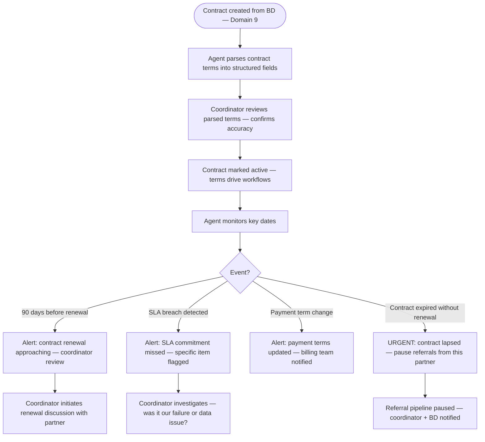
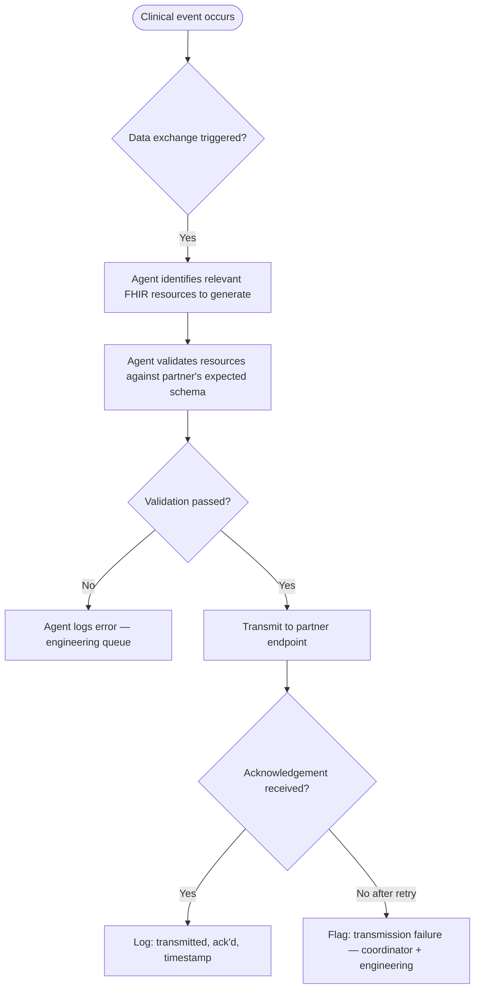
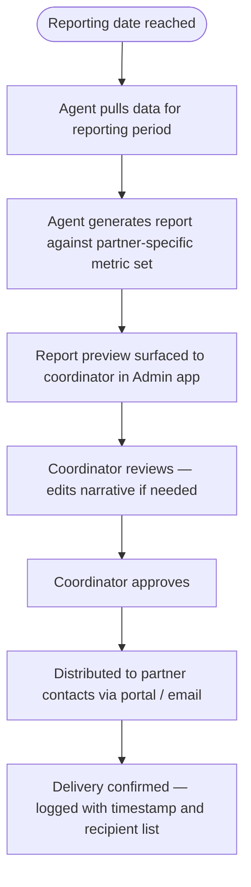
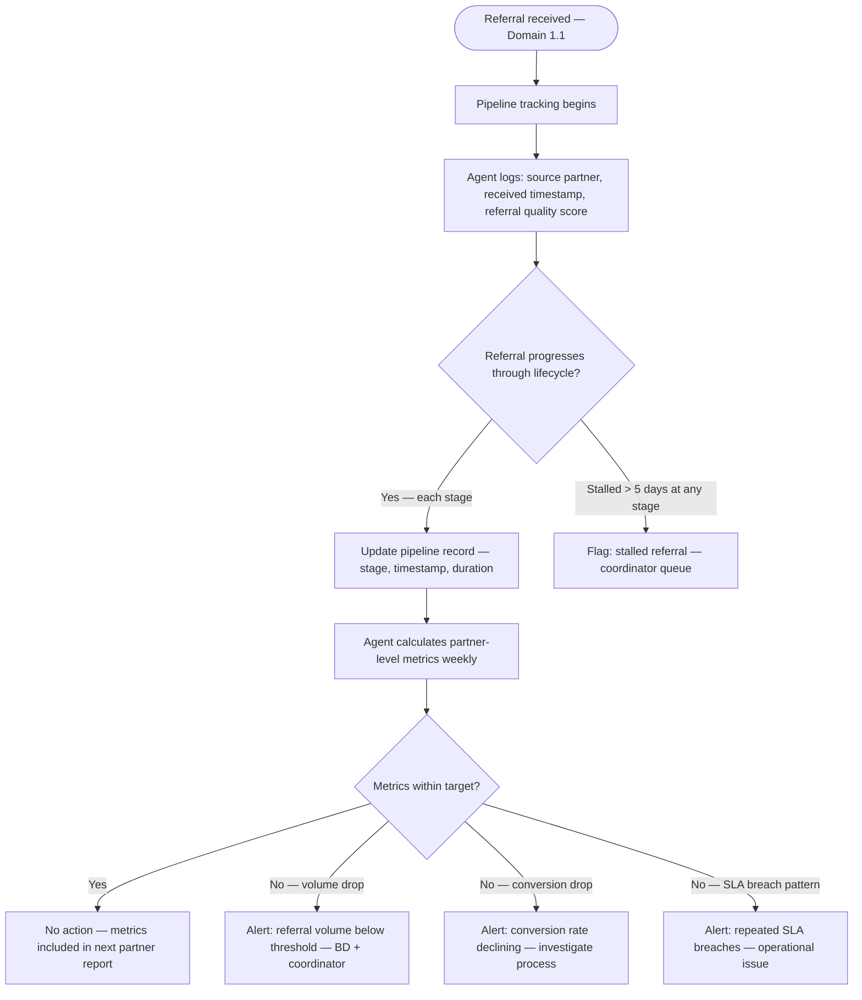
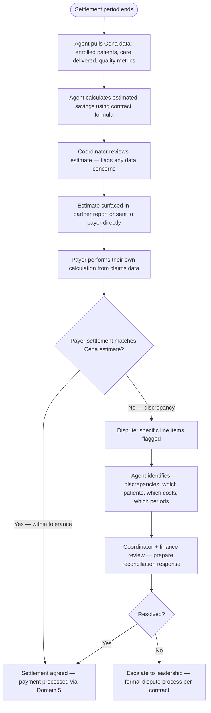

# Domain 4 — Partner & Payer Relations

> How Cena Health works with the organizations that refer patients, fund care, and measure
> outcomes. Partners are the source of patients and revenue; payers control what gets paid
> and at what rate. This domain is the bridge between clinical operations and business viability.

---

## Domain flow



---

## Key workflows

| Workflow | Description | Automation |
|---|---|---|
| 4.1 Partner Onboarding | Configure new partner: contract, FHIR endpoints, referral workflow, reporting schedule | 🟡 Medium |
| 4.2 Contract Management | Track terms, renewals, obligations, SLA commitments | 🟡 Medium |
| 4.3 Payer Data Exchange | Bidirectional FHIR/HL7/EDI exchange of clinical data, encounters, claims, quality metrics | 🟢 High |
| 4.4 Partner Reporting | Generate and distribute regular performance reports per partner | 🟡 Medium |
| 4.5 Referral Pipeline Management | Track referral volume, source, conversion, and outcome by partner | 🟡 Medium |
| 4.6 Shared Savings Calculation & Reporting | Calculate shared savings against contract benchmarks, prepare settlement docs | 🟡 Medium |

---

## Workflow detail

### 4.1 — Partner Onboarding

New partner onboarding is a configuration task, not a blank-slate build. The platform has a
partner configuration template; onboarding is the process of filling it out correctly and
validating each integration point before the referral pipeline goes live.



**Partner configuration object (key fields):**
- Referral intake method (FHIR API / HL7 / web form / manual)
- Outbound data: which FHIR resources we send (DocumentReference, Observation, etc.)
- Inbound data: lab feeds, EHR events
- Reporting: cadence, recipients, metric set, format (PDF / data export / portal)
- Contract type: FFS / PMPM / shared savings / research grant
- BAA status and execution date

---

### 4.2 — Contract Management

**Goal:** Track every active partner contract's terms, obligations, SLA commitments, renewal dates, and financial parameters. The contract is the source of truth for how every other workflow in this domain behaves — billing method, report cadence, shared savings formula, data exchange scope.

**Why this matters operationally:** A wrong PMPM rate in the system means every claim for that partner is under/overbilled. A missed renewal date means the contract lapses and referrals stop. The agent monitors these automatically — the coordinator approves renewals and resolves issues.



**Contract terms the system enforces:**

| Term | Where it drives behavior |
|---|---|
| Billing type (FFS / PMPM / shared savings) | Domain 5 — how claims are generated |
| PMPM rate | Domain 5 — monthly billing amount per enrolled patient |
| Shared savings split % | 4.6 — settlement calculation |
| Quality gates | 4.6 — must meet thresholds to earn savings |
| Reporting cadence | 4.4 — when reports are generated and distributed |
| Referral response SLA | 4.5 — time to acknowledge referral |
| Report delivery SLA | 4.4 — time to deliver partner report |
| Data exchange scope | 4.3 — which FHIR resources flow in each direction |
| BAA requirement | Domain 6 — must be executed before go-live |

**Contract versioning:** When terms change (amendment, renewal with new rates), a new contract version is created. The old version is retained for historical billing accuracy — claims generated during the old term reference the old version.

---

### 4.3 — Payer Data Exchange

The data highway between Cena Health and each partner. Per OQ-01, integration method varies: Cedars uses Epic (FHIR R4), Vanderbilt uses Athena, UConn skips integration for phase 1. The exchange layer must be EHR-agnostic — partner configuration determines which API client is used.

Three primary flows:

**Inbound (partner → Cena Health):**
- Referrals (patient demographics, insurance, reason for referral)
- Lab results (if not coming directly from lab)
- Claims/eligibility responses (from payer)
- EHR events (discharge notifications, care transitions)

**Outbound (Cena Health → partner):**
- Encounter records (clinical visits, AVA interactions as qualified encounters)
- Clinical notes (DocumentReference via FHIR)
- Outcome data (HbA1c deltas, PHQ-9 changes, meal delivery completion)
- Quality metrics (for HEDIS/VBC reporting)
- Claims (EDI 837 to payer)



---

### 4.4 — Partner Reporting

Each active partner receives a regular performance report. Report contents are defined in
the contract; the agent assembles from live data and surfaces a preview before distribution.

**Standard report sections:**
- Enrollment: patients active, enrolled this period, discharged
- Care delivery: visits completed vs. scheduled, AVA check-in completion rate
- Meal operations: orders delivered, missed delivery rate, patient satisfaction
- Clinical outcomes: biomarker trends (HbA1c, BP, weight), PHQ-9 trends
- Risk: high-risk patient count, alerts generated, response time
- Financial: PMPM reconciliation, shared savings YTD estimate



---

### 4.5 — Referral Pipeline Management

**Goal:** Track referral volume, conversion rates, and outcomes by partner to understand pipeline health and identify issues before they affect patient enrollment.

**Why this matters:** Referral volume is the leading indicator of Cena Health's growth. A drop in referrals from a partner may signal relationship issues, process friction, or a change in the partner's program priorities. Tracking conversion (referral → enrolled → active) identifies where patients are lost.

**Pipeline stages and metrics:**

| Stage | Metric | Target | Alert if |
|---|---|---|---|
| Referral received | Volume per partner per week | Per contract | < 50% of contracted volume for 2+ weeks |
| Eligibility confirmed | Eligibility pass rate | > 80% | < 60% (may indicate wrong patient population) |
| Enrolled | Conversion: received → enrolled | > 70% | < 50% |
| Active (care plan approved) | Conversion: enrolled → active | > 90% | < 75% |
| Referral response time | Time from receipt to acknowledgment | < 24h (per SLA) | SLA breach |
| Time to first visit | Days from enrollment to RDN initial | < 14 days | > 21 days |



**Referral quality scoring:** Agent scores each incoming referral on completeness (0-100):
- All required fields present: +50
- Clinical documents attached: +20
- Insurance verified at source: +15
- Diagnosis codes included: +15

Low-quality referrals (< 50) correlate with longer processing times and higher coordinator burden. The quality score is tracked per partner — a pattern of low-quality referrals is a partner relationship conversation topic, not a reject-at-the-door policy.

**Partner dashboard (Admin App):** Per-partner view showing:
- Referral volume trend (weekly, monthly)
- Pipeline funnel (received → eligible → enrolled → active → discharged)
- Average time at each pipeline stage
- SLA compliance rate
- Referral quality score trend

---

### 4.6 — Shared Savings Calculation

Shared savings settlements happen on a contract-defined cycle (typically annual or semi-annual).
The agent calculates Cena Health's performance against baseline benchmarks; the result determines
whether a payment is owed from the payer.

**Calculation inputs:**
- Baseline cost per patient (defined in contract — usually historical claims data)
- Actual cost per patient during performance period (from payer claims data)
- Quality gate performance (must meet minimum quality thresholds to earn savings)
- Savings split percentage (defined in contract)

**Key complexity:** Payer provides actual cost data, not Cena Health. Reconciliation of Cena
Health's calculated estimate against payer's settlement calculation is where disputes arise.
OQ-08 (who owns disputes) is still with Vanessa.



**Quality gate enforcement:** Most shared savings contracts require meeting quality thresholds (e.g., HbA1c screening rate > 80%, patient satisfaction > 4.0/5) before any savings are shared. If quality gates are not met, savings revert to the payer regardless of cost reduction. Agent tracks quality gate progress throughout the performance period — not just at settlement.

**Attribution model (OQ-35):** Attribution rules are contract-dependent. Each payer contract defines how patients are attributed to Cena Health's panel. The agent must apply the correct attribution logic per contract when calculating savings.

---

## Key data objects

**Partner**
```
partner {
  id, name, type: health_system | mco | payer | research
  contract_ids: []
  referral_config: { method, endpoint, test_status }
  data_exchange_config: { inbound_resources[], outbound_resources[], fhir_version }
  reporting_config: { cadence, recipients[], metric_set, format }
  baa_status: pending | executed | expired
  status: onboarding | active | paused | terminated
}
```

**Contract**
```
contract {
  id, partner_id
  type: ffs | pmpm | shared_savings | research_grant
  effective_date, end_date, renewal_date
  payment_terms: { pmpm_rate, savings_split_pct, quality_gates[] }
  reporting_obligations: []
  sla_commitments: { referral_response_hours, report_delivery_days }
  baa_document_id
  status: draft | active | up_for_renewal | terminated
}
```

---

## Dependencies

- **Upstream from:** Domain 9 (Business Development — signed contract triggers onboarding), Domain 1 (patient events generate data exchange triggers), Domain 2 (clinical documentation feeds outbound FHIR), Domain 10 (analytics feed partner reports)
- **Downstream to:** Domain 1 (referrals are the patient source), Domain 5 (contract terms define billing method), Domain 6 (BAA required before any data exchange)

---

## Open questions (updated with Vanessa's answers)

1. ~~**Epic integration tier per partner:**~~ **Resolved (OQ-01).** Partners vary: UConn no integration for phase 1, Cedars will want Epic, Vanderbilt uses Athena. Multi-EHR support required. Integration tier per partner determined during onboarding (4.1).

2. **Who owns data reconciliation disputes? (OQ-08):** Still with Vanessa. Platform should support a dispute workflow regardless — flagging line-item discrepancies and tracking resolution.

3. ~~**Research data agreement:**~~ **Resolved (OQ-23).** Separate research data use agreement — distinct from the BAA. UConn IRB determines when protocol changes require re-consent (OQ-31).

4. ~~**Partner portal scope:**~~ **Resolved (OQ-22).** Referral submission surface at minimum. UConn starts with push model; Cedars will likely want self-service portal. Build the referral surface first, portal features later. See Partner Portal module in product-structure.md.

5. ~~**TriCare / military data:**~~ **Resolved (OQ-06).** Not assessed — TriCare is early stage. Defer until TriCare engagement matures. No near-term action needed.
