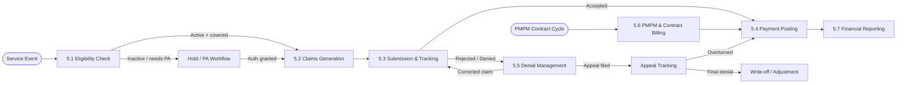
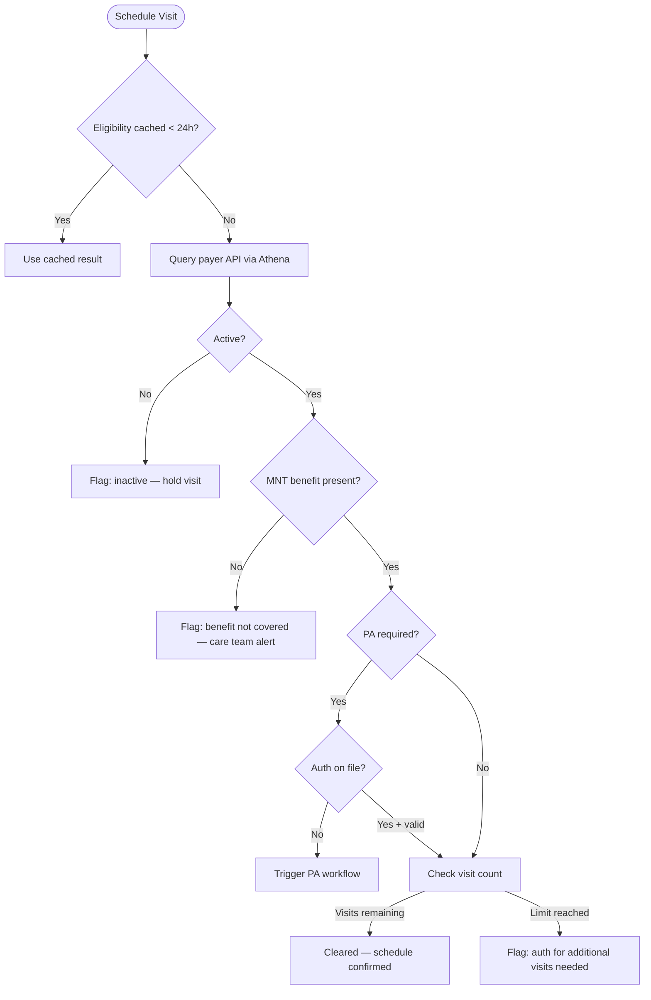
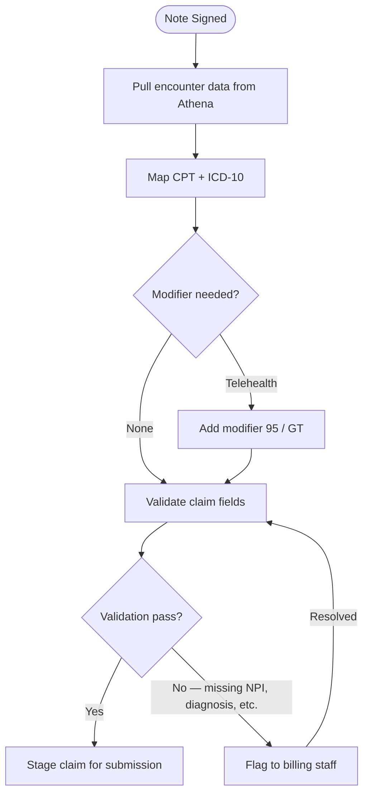
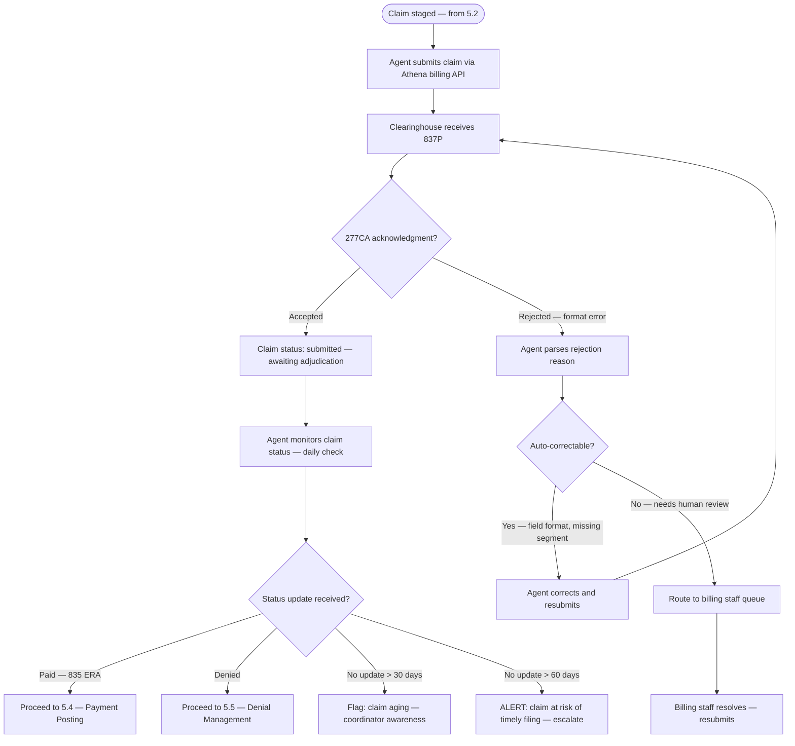
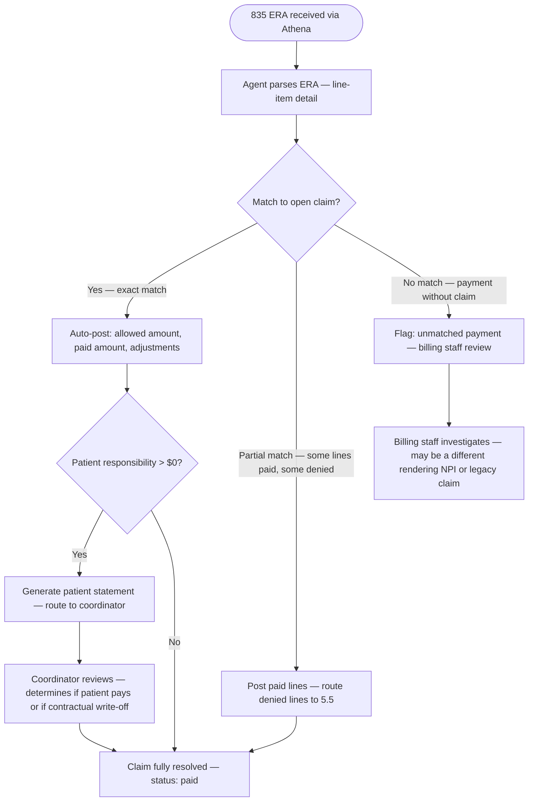
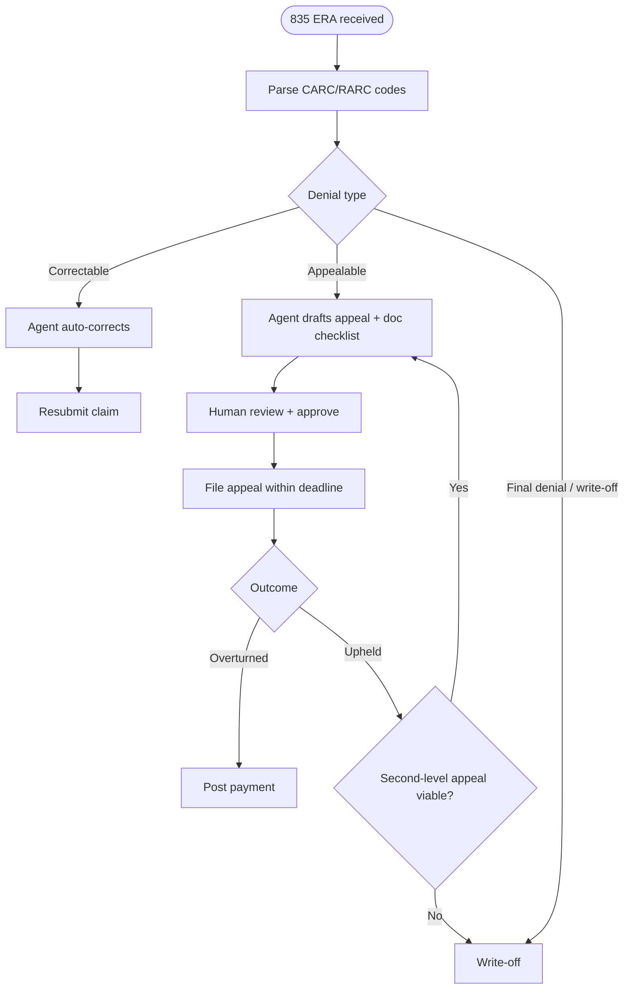
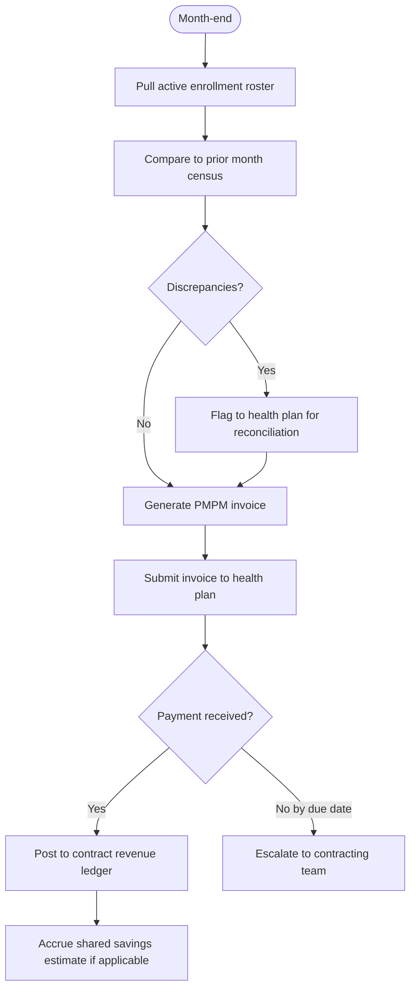

# Domain 5 — Revenue Cycle & Billing

> The money layer: from verified eligibility to collected payment, across FFS claims, PMPM contracts, and shared savings settlements.

## Domain flow



## Key workflows

| Workflow | Description | Automation |
|---|---|---|
| 5.1 Eligibility Verification | Check payer coverage, benefit limits, and PA requirements before each visit | Auto on scheduling; agent queries Athena/payer API; human reviews edge cases |
| 5.2 Claims Generation | Build 837P claim from encounter data (CPT, ICD-10, NPI, modifiers, place of service) | Agent generates; human reviews flagged claims (new payer, high value, modifier needed) |
| 5.3 Submission & Tracking | Submit via clearinghouse; monitor 277CA acknowledgments and claim status | Auto submission; agent monitors; human resolves rejections |
| 5.4 Payment Posting | Post ERAs (835) to patient accounts; auto-apply allowed amounts, adjustments, patient responsibility | Agent posts matched ERAs; human reviews unmatched/partial payments |
| 5.5 Denial Management | Triage denial codes, route correctable claims, draft appeals | Agent triages and drafts; human approves appeals before filing |
| 5.6 PMPM & Contract Billing | Invoice health plan for per-member monthly capitation; track enrollment census; reconcile | Agent generates invoices; human reviews enrollment diffs and reconciles |
| 5.7 Financial Reporting | AR aging, collection rate, denial rate by code/payer, PMPM revenue, shared savings accrual | Fully automated dashboards; human reviews at month-end close |

## Workflow detail

### 5.1 Eligibility Verification

Run at scheduling (T-2 days) and again on day-of-service. Check: (1) active Medicaid/Medicare enrollment, (2) MNT benefit availability, (3) remaining visit count (Medicare caps MNT at 3 initial + 2 follow-up per year; additional visits require diabetes or pre-diabetes diagnosis with physician referral), (4) prior auth status, (5) correct plan type (HMO vs PPO affects billing path).

**Gotchas:** Medicare MNT (97802/97803) requires a physician referral — the referring NPI must be on the claim. G0270/G0271 (MNT reassessment) require a separate auth cycle from initial visits. Medicaid MNT coverage varies by state; many state plans do not cover RDN visits at all and some cover only in specific waiver programs. Confirm coverage at the benefit-line level, not just plan enrollment.



### 5.2 Claims Generation

Claims are built from the encounter record in Athena after a provider signs the note. The agent assembles the 837P segment by segment: billing NPI, rendering provider NPI, referring provider NPI, facility (place of service 02 for telehealth / 11 for office), primary ICD-10 (must map to covered condition), CPT with units, and any required modifiers (e.g., modifier 95 for telehealth, GT for Medicare telehealth).

**Gotchas:** RDN must bill under their own NPI for MNT codes — these cannot be incident-to billed under a physician. The ICD-10 primary diagnosis drives coverage: E11.x (T2DM), E66.x (obesity), I10 (HTN) are the most common qualifiers. Meal delivery has no national CPT — it is either bundled into PMPM or billed under state Medicaid waiver codes that vary by state; do not generate an FFS claim for meals without confirming the payer's billing mechanism first.



### 5.3 — Submission & Tracking

**Goal:** Submit validated claims through the clearinghouse, monitor acceptance/rejection, and maintain a complete audit trail from submission to adjudication.

**Submission flow via Athena (OQ-03 confirmed):** Athena is the billing platform. Claims generated in 5.2 are submitted through Athena's integrated clearinghouse connection. Agent monitors Athena for claim status updates rather than running a separate clearinghouse integration.



**Timely filing monitoring:** Agent tracks days since date of service for every open claim. Thresholds:
- 60 days: warning for 90-day payers (most Medicaid)
- 180 days: warning for 365-day payers (Medicare)
- At 75% of the payer's filing deadline: escalation to billing staff and coordinator

**Batch submission:** Claims can be submitted individually (as encounters are completed) or in daily batches. Athena handles batching natively. Agent defaults to same-day submission for completed encounters.

---

### 5.4 — Payment Posting

**Goal:** Receive and post ERA (835) payments, match to claims, apply contractual adjustments, and identify patient responsibility amounts.



**Contractual adjustment handling:**
- **CO (Contractual Obligation):** Expected write-down per contracted rate. Auto-applied, no action needed.
- **PR (Patient Responsibility):** Copay, deductible, coinsurance. Routes to coordinator — Cena's patient population often qualifies for financial assistance.
- **OA (Other Adjustment):** Requires review — may indicate a payer error or policy change.
- **PI (Payor Initiated Reduction):** Flag — possible recoupment or retroactive rate change.

**Month-end reconciliation:** Agent generates a receivables summary showing:
- Total billed vs. total collected
- Outstanding claims by aging bucket (0-30, 31-60, 61-90, 90+ days)
- Denial rate by payer and by denial code
- PMPM invoices: billed vs. received

---

### 5.5 — Denial Management

Denials arrive as CARC/RARC codes on the 835 ERA. The agent classifies them into three buckets: (1) **Correctable** — wrong modifier, missing NPI, incorrect date of service → agent corrects and resubmits automatically; (2) **Appealable** — medical necessity, non-covered service, timely filing if within appeal window → agent drafts appeal letter with clinical documentation checklist, human approves; (3) **Write-off** — final denial, no appeal path, or balance below threshold.

**Gotchas:** Timely filing limits range from 90 days (some Medicaid) to 365 days (Medicare) from date of service — the clock starts at DOS, not claim submission. Denials for "service not covered" on RDN visits often mean the benefit exists but the claim hit the wrong benefit category; resubmitting with the correct place of service or provider taxonomy code frequently overturns these. Track denial rate by CARC code weekly — a spike in a single code usually signals a payer policy change or a systematic billing error.



### 5.6 PMPM & Contract Billing

PMPM contracts require a monthly invoice to the health plan based on an enrollment census — the count of attributed members active in the contract period. This is not a claims workflow; it is a contract fulfillment workflow. The agent generates the invoice from the enrollment roster, the health plan pays a lump sum, and any FFS claims run in parallel (depending on whether the contract is pure capitation, partial capitation, or PMPM + FFS).

**Gotchas:** Enrollment census discrepancies are the primary source of PMPM revenue leakage — health plans and Cena's roster will not match exactly. Reconciliation must happen monthly, and retroactive adjustments (adds/terms) are common. Under shared savings contracts, the settlement period is typically 12–18 months post-performance year; revenue cannot be recognized until settlement — this creates a significant gap between care delivery and cash receipt that must be reflected in accruals. PMPM and FFS revenue for the same member must not double-count; the contract terms define which services are carved in vs. out of the cap rate.



### 5.7 — Financial Reporting

**Goal:** Provide real-time visibility into revenue cycle health — AR aging, collection rates, denial patterns, PMPM revenue, and shared savings accruals. This is the Admin role's financial dashboard.

**Report types and cadence:**

| Report | Cadence | Audience | Automation |
|---|---|---|---|
| AR Aging Summary | Real-time dashboard + weekly snapshot | Admin, Finance | Fully automated |
| Collection Rate by Payer | Monthly | Admin, Finance | Fully automated |
| Denial Rate by CARC Code | Weekly | Billing staff, Admin | Fully automated |
| Denial Rate by Payer | Monthly | Admin, BD (contract renegotiation data) | Fully automated |
| PMPM Revenue Summary | Monthly | Admin, Finance | Agent generates, human reviews |
| Shared Savings Accrual | Quarterly | Admin, Finance, Leadership | Agent estimates, human approves |
| Timely Filing Risk | Daily | Billing staff | Agent generates alerts |
| Revenue per Patient | Monthly | Admin | Fully automated |
| Payer Mix Analysis | Quarterly | Admin, BD | Fully automated |

**Dashboard components (Admin App — Feature 1.9):**

```
Financial Dashboard
──────────────────────────────────────────────
Total AR:        $142,300
  0-30 days:     $89,200  (63%)
  31-60 days:    $31,400  (22%)
  61-90 days:    $14,700  (10%)
  90+ days:      $7,000   (5%)

Collection Rate (90-day):  94.2%
Denial Rate:               8.1%  (↓ improving)
  Top denial:  CO-4 (modifier) — 3.2%
  #2 denial:   PR-1 (deductible) — 2.1%

PMPM Revenue (this month):  $48,600
  Enrolled:  324 members
  Rate:      $150.00 avg

Claims at Filing Risk:  2
  • Claim #4821 — Medicaid CT — 72 of 90 days
  • Claim #4903 — Medicaid CT — 68 of 90 days
──────────────────────────────────────────────
```

**Denial pattern detection:** Agent monitors denial rates weekly. Alerts trigger when:
- Overall denial rate exceeds 10%
- A single CARC code spikes > 2x its 30-day average
- A single payer's denial rate exceeds 15%
- Correctable denials exceed 50% of total denials (indicates systematic billing errors)

These alerts route to billing staff with specific data — not generic warnings.

---

## Key data objects

### Claim

```
claim_id          string
patient_id        string
encounter_id      string
payer_id          string
billing_npi       string
rendering_npi     string
referring_npi     string (required for MNT)
place_of_service  code    (02 telehealth, 11 office)
service_date      date
cpt_codes         [{ code, units, modifiers }]
icd10_codes       [{ code, sequence }]
billed_amount     decimal
status            enum: draft | submitted | accepted | denied | paid | appealed | written_off
submission_date   date
payer_claim_id    string  (from 277CA)
era_reference     string  (from 835)
```

### PMPM Contract Record

```
contract_id         string
health_plan_id      string
contract_type       enum: pmpm | pmpm_ffs | shared_savings
pmpm_rate           decimal
performance_period  { start: date, end: date }
settlement_date     date    (shared savings only)
attributed_members  [{ member_id, enrollment_start, enrollment_end }]
monthly_invoices    [{ month, headcount, amount, status }]
ffs_carve_outs      [cpt_code]   (codes excluded from cap, billed FFS)
```

### ERA Payment Line

```
era_id            string
claim_id          string
payer_id          string
check_date        date
allowed_amount    decimal
paid_amount       decimal
patient_resp      decimal
adjustments       [{ carc_code, rarc_code, amount }]
posted            boolean
posted_date       date
```

## Dependencies

- **Upstream from:** Domain 1 (patient enrollment, insurance on file), Domain 2 (signed encounter notes, service codes), Domain 3 (prior auth status), Athena EHR (encounters, provider NPIs), clearinghouse (277CA, 835 ERAs)
- **Downstream to:** Domain 7 (financial reporting, AR dashboards), Domain 1 (coverage flags block scheduling), health plan contracts (PMPM invoices, shared savings settlement data)

## Open questions (updated with Vanessa's answers)

1. **Clearinghouse selection:** Unanswered. Athena supports Change Healthcare and Availity natively. This drives ERA format handling and real-time eligibility. Likely an Andrey/engineering decision.

2. ~~**Meal delivery billing mechanism:**~~ **Resolved (OQ-26).** Contract-dependent — each payer contract defines how meals are billed. No universal CPT strategy. Agent must check the contract terms (4.2) before generating any meal-related claim.

3. **PMPM + FFS carve-out logic:** Unanswered. Carve-out list must live in the contract record (4.2) and be enforced at claim generation. Critical for BHN independent billing (OQ-13 — BHN bills separately).

4. **Shared savings accrual policy:** Unanswered. Accounting policy decision for Vanessa/Finance. Platform supports both conservative and estimated accrual — the choice is configuration.

5. **Timely filing monitoring:** Resolved in 5.3 workflow. Agent monitors days since DOS, alerts at 75% of payer deadline, escalates automatically. No open question — implementation is defined.

6. **Multi-payer COB:** Unanswered. Athena likely handles primary/secondary sequencing natively, but needs verification for MNT codes under Medicare Advantage. Per-plan coverage matrix needed before launch.

7. **Medicare MNT visit cap (OQ-25):** Still with Vanessa. Does care plan cadence account for the 3 initial + 2 follow-up annual limit? Agent tracks visit count and warns (built into 5.1 and 2.1), but clinical team needs to confirm the scheduling approach.

8. **Timely filing mapping (OQ-27):** Still with Vanessa. Has the per-payer filing deadline been mapped? Agent needs a lookup table of payer → filing deadline for the monitoring in 5.3.
