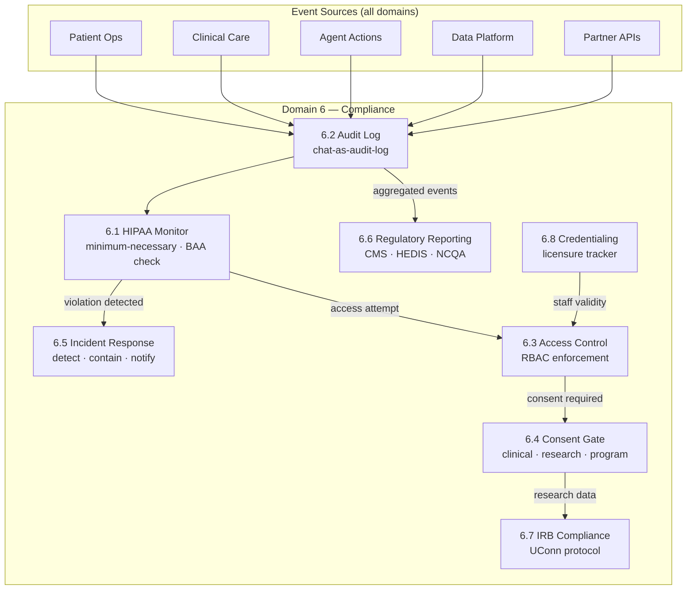
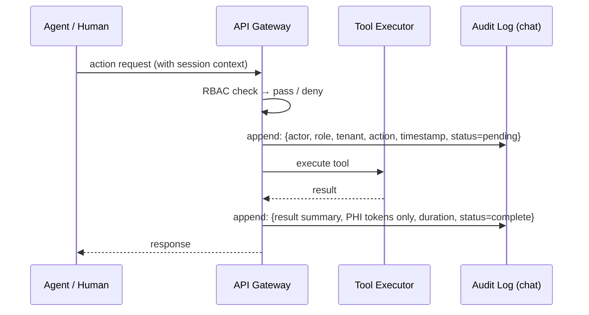
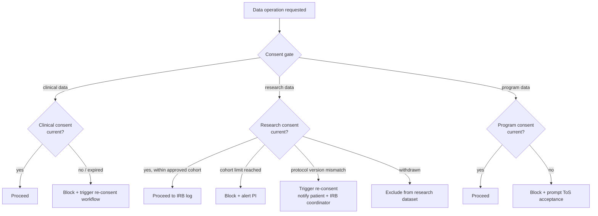
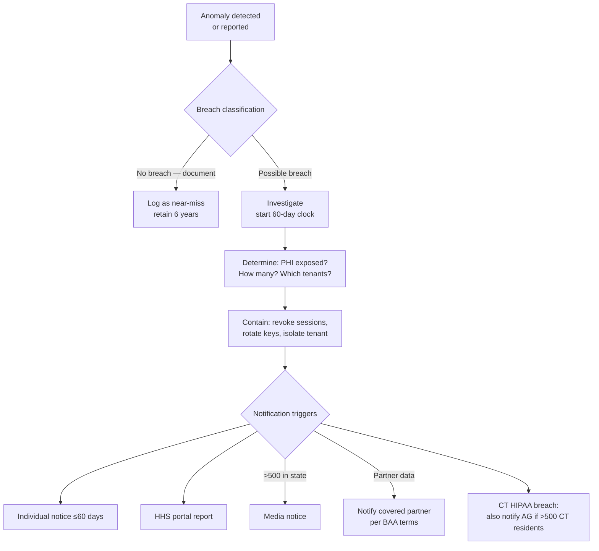
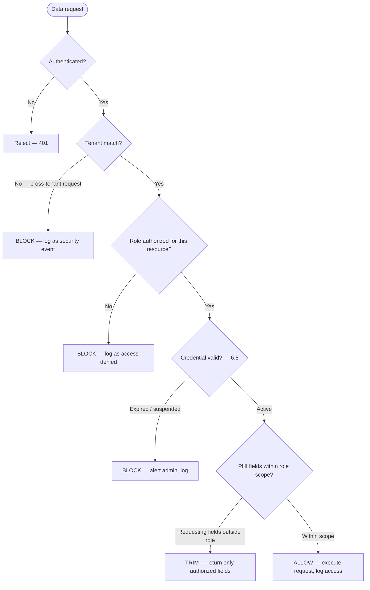
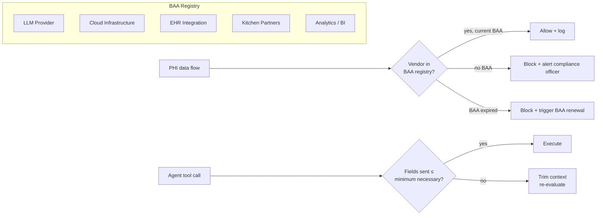
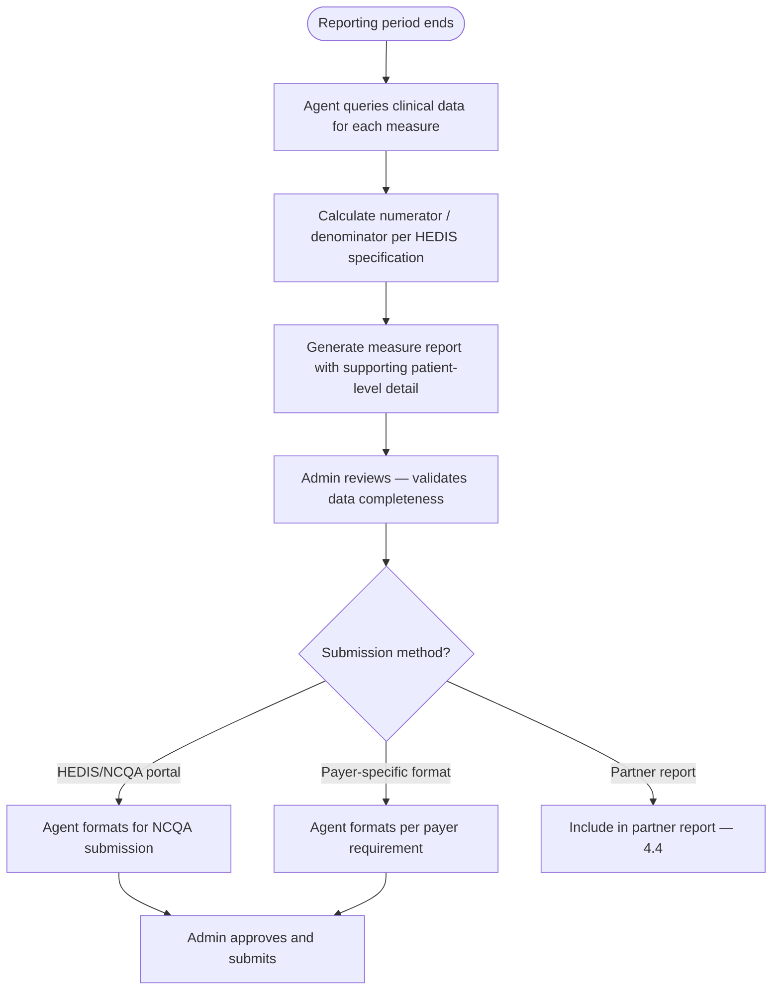
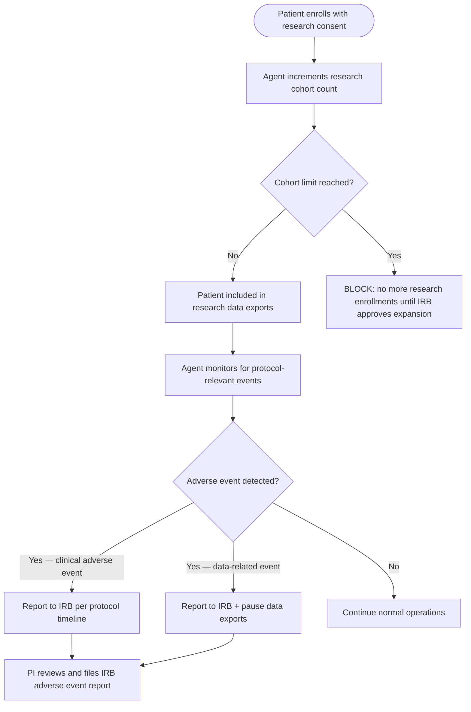
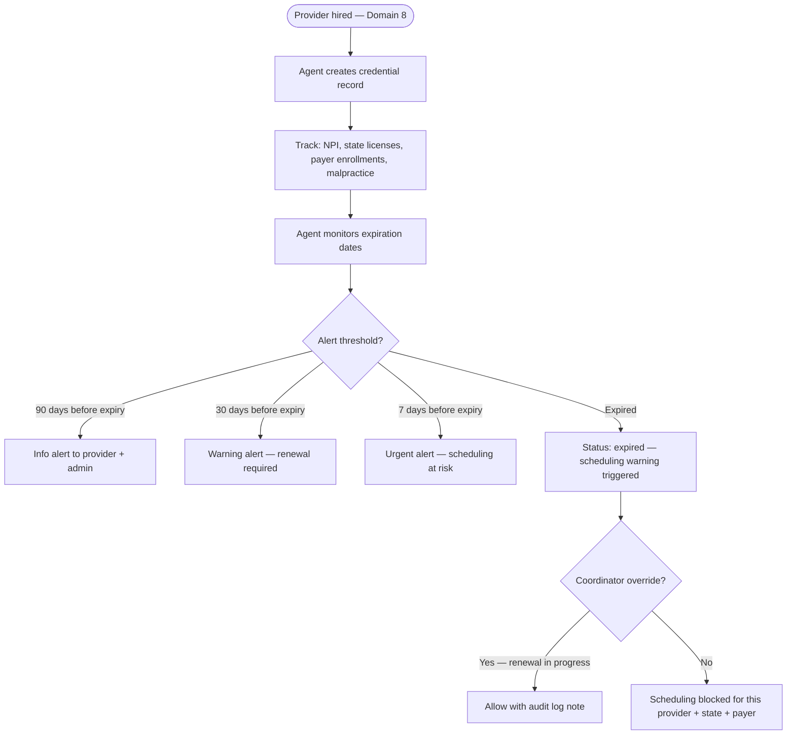

# Domain 6 — Compliance & Regulatory

> Cross-cutting governance layer: every domain generates compliance events; this domain validates, logs, and reports them.

---

## Domain flow



---

## Key workflows

| Workflow | Description | Automation |
|---|---|---|
| 6.1 HIPAA Compliance Monitoring | Continuous review of data access patterns; flags minimum-necessary violations, unBAA'd vendor touches, cross-tenant leakage | Automated scan on every PHI access event; human review for flagged anomalies |
| 6.2 Audit Logging | Every agent tool call, human action, and data read/write appended to the chat-as-audit-log with actor, timestamp, patient, tenant context | Fully automated; immutable append-only store |
| 6.3 Access Control Management | RBAC enforcement at API layer; role assignments, permission grants, tenant isolation validated at runtime | Automated enforcement; human approval for role changes above threshold |
| 6.4 Consent Management | Capture, version, and gate on three consent types: clinical (treatment), research (IRB), program (app ToS/data sharing) | Consent check automated on every data operation; re-consent workflow triggered on protocol change |
| 6.5 Security Incident Response | Detect anomalies, classify breach vs. near-miss, contain, notify per HIPAA 60-day window and state law | Detection automated; response plan human-executed; 60-day countdown triggered on classification |
| 6.6 Regulatory Reporting | HEDIS measure extraction, CMS quality reporting, NCQA credentialing submissions | Automated measure calculation; human sign-off before submission |
| 6.7 IRB Compliance | Track UConn protocol version, patient enrollment against approved cohort size, data use limits, adverse event reporting | Enrollment count automated; protocol-change re-consent workflow triggered manually |
| 6.8 Staff Credentialing & Licensure | Track RDN, BHN, care coordinator licenses by state; alert on expiry; block scheduling for lapsed credentials | Automated expiry alerts at 90/30/7 days; scheduling block automated |

---

## Workflow detail

### 6.2 Audit Logging (chat-as-audit-log)

Every agent action is a tool call. The chat thread is the audit trail — actor identity, tool name, parameters (with PHI masked to token references), response, and outcome are appended atomically. No separate audit database; the log IS the chat. This only works if the log is immutable and append-only. Deletion or edit of a chat message must be architecturally impossible, not just policy-prohibited.



**Gotchas:**
- LLM provider (OpenAI / Anthropic) must have a signed BAA before any PHI flows into prompt context — even in system prompts. No BAA = every request is a potential breach.
- Log must store PHI token references (e.g., `patient_id: uuid`), not raw PHI values. Reconstructing the record requires a secondary lookup with its own access control.
- TriCare / military patients: log access events are subject to additional scrutiny under TRICARE Operations Manual — consider a separate log partition or flag.

---

### 6.4 Consent Management

Three distinct consent types operate in parallel per patient. Clinical consent covers treatment and data sharing with care team. Research consent covers IRB-governed data collection under the UConn protocol. Program consent covers platform data use (app ToS, meal delivery data sharing with kitchens). Each has independent versioning. A patient can withdraw research consent while remaining in clinical care — the system must not conflate them.



**Gotchas:**
- IRB re-consent is mandatory when the UConn protocol changes in a way that affects data use, risk, or patient population — not just when Cena decides to. PI must make that determination; a software trigger is not sufficient.
- Research consent withdrawal does not erase already-collected data from IRB records (data was lawfully collected), but must exclude the patient from future data exports.
- Minors / guardians: Cena's military (TriCare) population may include dependents. Consent logic must route to guardian consent for patients under 18.

---

### 6.5 Security Incident Response

HIPAA Breach Notification Rule requires notification to affected individuals within 60 days of discovery, HHS annually (or immediately if >500 individuals in a state), and media if >500 in a state. "Discovery" is the date Cena knew or should have known — not the date of investigation completion.



**Gotchas:**
- Multi-tenant breach: if one health system partner's data is exposed, Cena must notify that partner per the BAA, and that partner may have independent notification obligations to their patients. Cena's 60-day clock runs in parallel with the partner's.
- Connecticut: CT General Statutes §36a-701b requires AG notification for breaches affecting >500 CT residents — separate from HHS filing.
- TriCare: DoD health data breaches may require notification to the Defense Health Agency in addition to standard HIPAA paths. Verify current TRICARE Operations Manual requirements.

---

### 6.3 — Access Control Management

**Goal:** Enforce role-based access control at the API layer. Every data request is checked against the actor's role, tenant scope, and credential status before execution.

**RBAC model (from roles/README.md):** Permissions are additive across roles. Data is scoped by tenant. PHI minimum-necessary is enforced by role — even within a tenant, roles see only the PHI fields relevant to their function.



**Access control enforcement layers:**
1. **API gateway:** Authentication, tenant validation, rate limiting
2. **Query layer:** Role-based field filtering (coordinator sees different patient fields than kitchen staff)
3. **Agent tool registry:** Each agent specialist has a registered tool set — EligibilityAgent cannot access clinical notes, DocumentationAgent cannot submit claims
4. **Postgres RLS (AD-04):** Database-level tenant isolation as defense-in-depth

**Role change workflow:**
- Self-service for adding roles within the same permission tier (e.g., coordinator adds "reporter" role)
- Admin approval required for elevation (e.g., granting admin access to a coordinator)
- All role changes logged in audit trail with approver and timestamp
- Immediate effect — no cache delay on permission changes

---

### 6.3a — Agent Access Control

Agents operate under system roles with tightly scoped tool access. The agent framework (architecture/agent-framework.md) defines three layers: meta, orchestrator, and specialist. Each specialist agent has a registered tool set that enforces minimum-necessary at the action level.

| Agent | Can access | Cannot access |
|---|---|---|
| EligibilityAgent | Insurance, demographics | Clinical notes, billing |
| DocumentationAgent | Clinical notes, visit data | Billing, insurance detail |
| MealMatchingAgent | Dietary restrictions, preferences, recipe catalog | Full clinical notes, insurance |
| AVA (voice) | Narrow read-only: patient name, schedule, check-in questions | Billing, full medical history, other patients |
| BillingAgent | Claims, encounter codes, insurance | Clinical note narrative, behavioral health |
| RiskScoringAgent | Assessment scores, biomarkers, SDOH | Raw clinical notes, billing |

**Enforcement:** Tool registry is the source of truth. An agent requesting a tool outside its registry receives a hard deny — this is not a soft warning.

---

### 6.1 HIPAA Compliance Monitoring — Minimum Necessary & BAA Tracking

The minimum-necessary standard applies to AI agents: agents must only receive the PHI fields required to complete the specific tool call. Sending a full patient record to an LLM to answer "what is this patient's last HbA1c?" is a violation. Every agent prompt template should be auditable against the minimum-necessary standard.



**Gotchas:**
- BAAs with LLM providers (Anthropic, OpenAI, etc.) are not automatic — they require enterprise agreements. The standard consumer API has no BAA and cannot touch PHI.
- Kitchen partners receive meal order data; if that data includes diagnosis codes or dietary restrictions tied to a condition, the kitchen is handling PHI and requires a BAA.
- Multi-tenant: a BAA with a health system partner covers their patients' data in their tenant — Cena still needs its own BAAs with all downstream vendors.

---

### 6.6 — Regulatory Reporting

**Goal:** Calculate and submit quality measures required by payer contracts (HEDIS, CMS quality reporting, NCQA). These measures determine whether Cena meets quality gates for shared savings (Domain 4.6) and payer contract compliance.

**Key measures for a Food-as-Medicine program:**

| Measure | Source | Relevance |
|---|---|---|
| HbA1c testing rate | Lab intake (2.6) | HEDIS CDC — Comprehensive Diabetes Care |
| HbA1c control (< 8.0%) | Lab results | HEDIS CDC — directly drives shared savings |
| Blood pressure control (< 140/90) | Visit data, self-reports | HEDIS CBP |
| Depression screening rate (PHQ-9) | BHN sessions (2.2) | HEDIS DSF — Screening for Depression |
| Depression remission or response | PHQ-9 trends | HEDIS DRR — Depression Remission or Response |
| BMI screening and follow-up | Visit data | HEDIS — Adult BMI Assessment |
| Medication adherence | Med reconciliation (2.7) | HEDIS — various by drug class |
| Patient satisfaction | Feedback (3.9) | CAHPS-aligned (not strictly HEDIS) |



**HEDIS data model decision (OQ-07):** Still with Vanessa — design now or wait for first VBC contract. The workflow above works regardless — the question is whether the data model includes HEDIS-specific fields from day one or adds them later.

---

### 6.7 — IRB Compliance

**Goal:** Track UConn's research protocol, manage patient enrollment against approved cohort size, enforce data use limits, and handle adverse event reporting.

**IRB compliance scope:** UConn is a research partner. Patients enrolled in the research arm have a separate research consent (6.4). Data collected under the research protocol is subject to IRB oversight — the protocol defines what data can be collected, how it's used, and how adverse events are reported.



**Protocol version tracking:**
- Current protocol version stored in system
- When UConn IRB updates the protocol (OQ-31: UConn IRB makes the call), Cena receives notification
- Agent checks: does the update require re-consent?
- If re-consent required: trigger re-consent workflow for all research-consented patients
- Research data exports pause until re-consent is complete for each patient

**De-identification for research (AD-05):** Research data flows to BigQuery via the de-identification ETL pipeline. UConn accesses BigQuery, never the clinical database. De-identification uses Safe Harbor method unless the protocol specifies Expert Determination.

---

### 6.8 — Staff Credentialing & Licensure Tracking

**Goal:** Ensure every provider is properly credentialed before they see patients or bill for services. Block scheduling for lapsed credentials. Track multi-state licensure for telehealth.

**Credentialing under Cena NPI (OQ-37):** Providers work under Cena Health's organizational NPI. Credentialing turnaround is ~4 weeks. No provider sees patients until enrolled with the patient's payer.

**Multi-state telehealth (OQ-29):** Warn, don't hard block. Show a warning for lapsed/missing state licensure but allow coordinator override. This is a soft gate — the coordinator may know the provider's renewal is in progress.



**What the system tracks per provider:**

| Credential | Tracked per | Alert schedule | Blocks |
|---|---|---|---|
| State license (RDN/BHN) | State | 90 / 30 / 7 days | Scheduling in that state |
| Payer enrollment | Payer | 90 / 30 / 7 days | Billing for that payer |
| Malpractice insurance | — | 90 / 30 / 7 days | All scheduling |
| NPI (individual) | — | N/A (no expiry) | — |
| Organizational NPI (Cena) | — | N/A (no expiry) | — |
| DEA (if applicable) | — | 90 / 30 / 7 days | Prescribing (not applicable for RDN/BHN) |

---

## Key data objects

### `AuditEvent`

```
id: uuid
tenant_id: uuid                  // hard partition key — never cross
session_id: uuid                 // links to chat thread
actor_id: uuid                   // user or agent id
actor_role: string               // RBAC role at time of action
action_type: enum                // tool_call | data_read | data_write | login | consent_check
resource_type: string            // Patient | CarePlan | LabResult | ...
resource_id: uuid                // token reference — not raw PHI
phi_accessed: string[]           // field names accessed, not values
outcome: enum                    // success | denied | error
timestamp: datetime (UTC)
immutable: true                  // enforced at storage layer
```

### `ConsentRecord`

```
id: uuid
patient_id: uuid
tenant_id: uuid
consent_type: enum               // clinical | research | program
version: string                  // ties to document version in consent library
status: enum                     // active | withdrawn | expired | pending_re_consent
signed_at: datetime
signed_by: uuid                  // patient or authorized guardian
witnessed_by: uuid               // care coordinator or system (for electronic)
irb_protocol_version: string     // only for research type — must match current UConn protocol
withdrawal_at: datetime | null
```

### `CredentialRecord`

```
id: uuid
staff_id: uuid
credential_type: enum            // RDN | BHN | LCSW | MD | care_coordinator_cert | ...
license_number: string
issuing_state: string            // multi-state tracking required
issue_date: date
expiry_date: date
status: enum                     // active | expiring_soon | expired | suspended
alert_sent_at: date[]            // [90-day, 30-day, 7-day]
scheduling_blocked: boolean      // auto-set when status = expired | suspended
```

---

## Dependencies

- **Upstream from:** Domain 1 (Patient Ops — enrollment, consent triggers), Domain 2 (Clinical Care — care plan actions, lab results access), Domain 3 (Agent Framework — every tool call), Domain 4 (Data Platform — query execution, exports), Domain 5 (Partner Integrations — EHR data pulls, research data transfers)
- **Downstream to:** Domain 1 (blocks enrollment if consent missing), Domain 2 (blocks clinical actions if staff credential lapsed), Domain 3 (blocks agent tool calls if RBAC denied or BAA missing), Domain 8 (billing — HEDIS/CMS reporting feeds quality-based payment calculations), all domains (incident response triggers cross-domain containment)

---

## Open questions (updated with Vanessa's answers)

1. ~~**LLM BAA status:**~~ **Partially resolved (OQ-02).** BAA not yet executed — in progress. Andrey is aware. Anthropic via Vertex AI (AD-02) will be covered under Google's BAA. Standalone Anthropic BAA also being pursued. This remains a blocker for production PHI processing.

2. ~~**TriCare / DoD data classification:**~~ **Resolved (OQ-06).** Not assessed — TriCare is early stage. Defer until TriCare engagement matures. No near-term action.

3. **Minimum-necessary enforcement mechanism:** Addressed in 6.3 and 6.3a above. Enforcement at both layers: agent tool registry limits what each agent can request, and the query layer filters fields by role. Defense-in-depth — neither layer alone is sufficient.

4. ~~**IRB protocol change process:**~~ **Resolved (OQ-31).** UConn IRB determines when protocol changes require re-consent. Internal workflow defined in 6.7.

5. ~~**Multi-state telehealth licensure:**~~ **Resolved (OQ-29).** Warn, don't hard block. Show warning for lapsed/missing state licensure, allow coordinator override. Defined in 6.8.

6. **Audit log retention and deletion conflicts (OQ-30):** Deferred. Not blocking current phase. Likely resolution: de-identify audit records rather than delete them, preserving the compliance trail while honoring deletion rights. Needs legal review before Cedars (CA — CCPA) or CT PDPA compliance is required.
