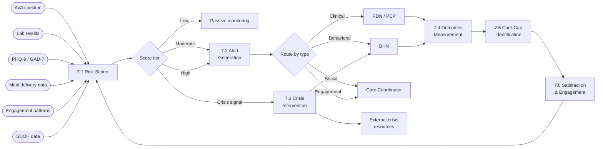
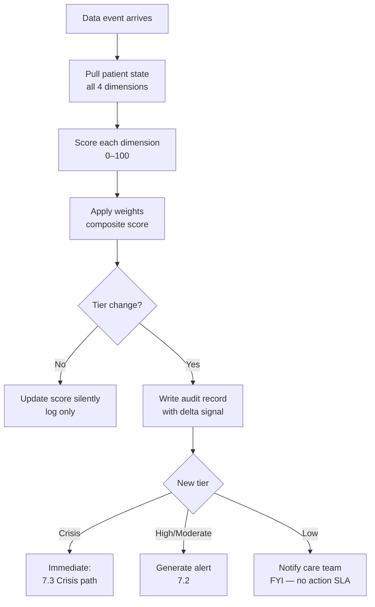
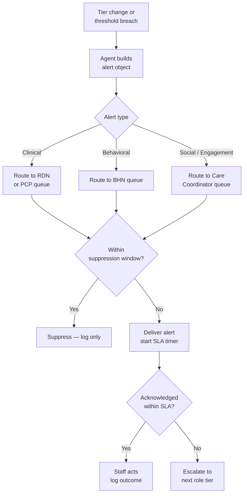
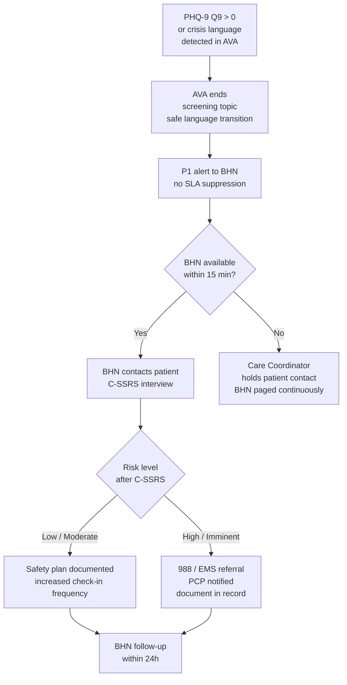
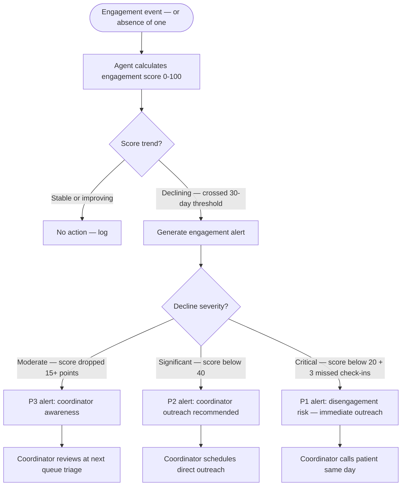

# Domain 7 — Risk Management & Quality

> Continuous multi-signal risk scoring, automated alert generation, crisis intervention protocols, and outcomes measurement — the safety net and quality engine for the platform.

---

## Domain flow

---

## Key workflows

| Workflow | Description | Automation |
|---|---|---|
| 7.1 Real-Time Risk Scoring | Multi-dimensional score (clinical, behavioral, social, engagement) computed after every data event | 🟢 Fully automated; score + rationale logged; human reviews on tier change |
| 7.2 Clinical Alert Generation & Routing | Structured alerts with severity, recommended action, and SLA — routed to correct staff role | 🟡 Agent generates and routes; staff member must acknowledge and act |
| 7.3 Crisis Intervention | PHQ-9 Q9 > 0 or explicit crisis language triggers immediate BHN escalation and safety protocol | 🔴 Human-owned from detection forward; agent provides script and resources only |
| 7.4 Outcomes Measurement | HbA1c, weight, BP, PHQ-9/GAD-7 trend tracking against baseline and HEDIS benchmarks | 🟢 Automated aggregation and trend scoring; RDN reviews trend reports |
| 7.5 Care Gap Identification | HEDIS/CMS Star denominator tracking — flag patients missing required services within measurement windows | 🟡 Agent flags and drafts outreach; care coordinator executes |
| 7.6 Patient Satisfaction & Engagement Monitoring | Post-check-in sentiment, meal feedback, no-show patterns, inbound contact rates | 🟢 Automated scoring and trend; human reviews engagement drops |

---

## Workflow detail

### 7.1 Real-Time Risk Scoring

The risk scorer runs after every data event (check-in completion, lab ingestion, missed delivery, screener submission). It produces a composite score across four dimensions: clinical (labs, vitals, diagnosis burden), behavioral (PHQ-9/GAD-7 scores, BHN session notes), social (SDOH flags, food insecurity indicators, housing instability), and engagement (missed check-ins, meal refusals, no-show rate). Dimensions are weighted but the weights are not fixed — they must be tunable by clinical staff without a deploy. A tier change (Low → Moderate → High → Crisis) always writes an audit record with the delta signal and the score rationale. SDOH dimensions are the hardest to score reliably: data is self-reported, episodic, and often stale — treat SDOH scores as decay-weighted signals, not live readings.

---

### 7.2 Clinical Alert Generation & Routing

Alerts are structured objects, not free text. Every alert carries: patient ID, trigger signal, alert type (clinical / behavioral / social / engagement), severity (P1–P3), recommended action, and SLA deadline. Routing is deterministic by alert type — not by whoever happens to be online. P1 alerts require acknowledgment within 1 hour; P2 within 4 hours; P3 within 24 hours. Unacknowledged alerts escalate automatically to the next role tier. A critical design constraint: alert fatigue is a patient safety risk. The scorer must suppress redundant alerts for the same signal within a configurable suppression window (default: 24h for P3, 4h for P2, no suppression for P1).

---

### 7.3 Crisis Intervention

**PHQ-9 Q9 > 0 is a mandatory hard trigger regardless of total score.** A patient scoring 9/27 on items 1–8 but endorsing Q9 at all must enter the crisis path immediately. Do not suppress this with the alert suppression logic from 7.2. The BHN must be notified in real time; if BHN is unavailable, the care coordinator holds until BHN responds — there is no automated substitute. AVA must follow safe messaging guidelines during any check-in where suicidal ideation is detected: do not ask "Are you thinking of hurting yourself?" as an open probe — use validated language and transition immediately to human handoff. PHQ-9 Q9 is a poor solo crisis tool; the C-SSRS (Columbia Suicide Severity Rating Scale) is the clinical standard for risk stratification once crisis is detected. Design the system so that the BHN's crisis workflow opens a C-SSRS structured interview form, not a free-text note. Safety planning (Stanley-Brown model) must be documentable as a structured object, not narrative, so it can be reviewed and versioned.

---

### 7.4 Outcomes Measurement

Outcomes tracking must be built against HEDIS measure specifications from the start — retro-fitting denominator logic onto a non-conformant data model is expensive. Key measures: HbA1c control (<8%) for diabetes patients, Controlling High Blood Pressure (CBP) for hypertension patients, depression remission at 12 months (DRR) for PHQ-9 ≥10 at intake. Each measure has a strict denominator definition (age band, diagnosis code set, continuous enrollment period) and a numerator (specific lab value within a specific look-back window). The data collection design must capture the measurement date, the ordering provider NPI, and the result value in a queryable structure — a PDF lab result is not HEDIS-compliant without extraction. PHQ-9 trend visualization should display score over time against the MDC (minimum detectable change) threshold of 5 points, not raw score alone.

---

### 7.5 Care Gap Identification

CMS Star Ratings and HEDIS both have defined measurement periods (calendar year for most HEDIS, contract year for Stars) and close dates. The system must know which measurement window is open, which patients are in the denominator, and how many days remain to close each gap. SLA expectations from CMS are real: missed HbA1c testing in the measurement year cannot be retroactively captured after the window closes. The agent should run gap sweeps weekly, generate a worklist for care coordinators ordered by days-remaining, and auto-generate outreach messages (appointment scheduling, lab order reminders). Note: gaps are patient-level, not measure-level — a patient may have 3 simultaneous open gaps requiring coordinated outreach, not 3 separate campaigns.

---

### 7.6 — Patient Satisfaction & Engagement Monitoring

**Goal:** Track engagement signals across all patient touchpoints to detect disengagement early and identify satisfaction patterns that affect retention and outcomes.

**Engagement signals (weighted by predictive value):**

| Signal | Source | Weight | Decay |
|---|---|---|---|
| AVA check-in completion rate | 1.7 monitoring | High | Rolling 4-week window |
| Meal delivery acceptance rate | 3.7 delivery | High | Rolling 4-week window |
| Meal feedback submission rate | 3.9 feedback | Medium | Rolling 4-week window |
| Appointment attendance rate | 1.8 scheduling | High | Rolling 8-week window |
| Patient app login frequency | App analytics | Low | Rolling 2-week window |
| Inbound patient messages | 1.10 communication | Medium | Any recent = positive signal |
| Self-reported vitals submission | 1.7 monitoring | Medium | Per care plan cadence |

**Engagement score calculation:**

**Satisfaction tracking:**

| Metric | Source | Aggregation | Alert threshold |
|---|---|---|---|
| Meal satisfaction avg | 3.9 feedback (emoji rating) | Per patient, rolling 4 weeks | Avg < 2.0 (on 1-3 scale) |
| Visit satisfaction | Post-visit survey (optional) | Per patient, per visit | Rating < 3/5 |
| AVA call sentiment | AVA mood/energy ratings | Per patient, rolling 4 weeks | Declining trend for 3+ weeks |
| NPS (program-level) | Quarterly survey | Population-level | NPS < 30 |

**Engagement-to-risk connection:** Engagement score feeds into the risk scorer (7.1) as the engagement dimension. A patient with excellent labs but declining engagement is at risk of dropping out — and dropout is the most common failure mode in food-as-medicine programs. The system should treat declining engagement as seriously as declining labs.

**Pattern detection across population:**
- Cohort-level engagement drops may signal systemic issues (kitchen quality problem, delivery logistics failure, AVA call fatigue)
- Agent monitors population-level engagement weekly and flags drops > 10% from baseline
- These alerts route to Admin, not individual coordinators — they indicate operational problems, not patient-level issues

---

## Key data objects

**RiskScoreRecord**
- `patient_id`, `score_timestamp`, `composite_score` (0–100), `tier` (low/moderate/high/crisis)
- `dimension_scores`: `{ clinical, behavioral, social, engagement }` each 0–100 with `contributing_signals[]`
- `tier_changed: bool`, `previous_tier`, `suppressed: bool`

**ClinicalAlert**
- `alert_id`, `patient_id`, `trigger_signal`, `alert_type` (clinical/behavioral/social/engagement)
- `severity` (P1/P2/P3), `recommended_action`, `sla_deadline`, `assigned_to_role`
- `acknowledged_at`, `acknowledged_by`, `outcome_note`, `escalation_count`

**OutcomeMeasureRecord**
- `patient_id`, `measure_code` (HEDIS ID), `measurement_period_start/end`
- `denominator_eligible: bool`, `numerator_met: bool`, `result_value`, `result_date`, `ordering_provider_npi`
- `gap_open: bool`, `gap_close_deadline`

---

## Dependencies

- **Upstream from:** Domain 1 (patient state, enrollment status), Domain 2 (lab results, clinical documentation, PHQ-9/GAD-7 scores), Domain 3 (AVA check-in transcripts and structured responses), Domain 4 (meal delivery and engagement data), SDOH data sources (screeners, EHR social history)
- **Downstream to:** Domain 2 (triggers care plan updates, BHN escalations), Domain 5 (quality measure data supports value-based contract reporting), Domain 6 (care gap outreach drives appointment scheduling), Domain 8 (satisfaction and engagement data feeds retention/churn models)

---

## Open questions (updated with Vanessa's answers)

1. ~~**Risk score weights:**~~ **Resolved (OQ-32).** Clinical team owns risk score weight configuration. Engineering implements. Change process defined in AD-06: clinical team proposes, system shows impact on historical data, clinical team confirms, engineering deploys.

2. ~~**SDOH data freshness:**~~ **Resolved (OQ-34).** Configurable per SDOH domain — clinical team sets the decay threshold for each domain. Food insecurity may decay slower than transportation barriers, for example. Agent applies the configured decay curve when calculating the social dimension score.

3. **C-SSRS operationalization (OQ-33):** Pending — depends on BHN licensure level. Needs Shenira's guidance on whether the specific BHN roles Cena hires can administer full C-SSRS or need a simplified triage version.

4. **HEDIS denominator source of truth:** Unanswered. Recommend using payer data feed as primary source (payer determines attribution), with Cena's enrollment records as reconciliation check. Discrepancies flagged for coordinator review.

5. **Alert routing when staff are OOO:** Unanswered. Recommend coverage assignment model: each provider designates a backup in the system. Agent routes to backup when primary is OOO-flagged. If no backup designated, escalate to coordinator.

6. ~~**Outcomes attribution:**~~ **Resolved (OQ-35).** Attribution model is contract-dependent — each payer contract defines its own attribution rules. Platform must support per-contract attribution configuration, not a single global model.
