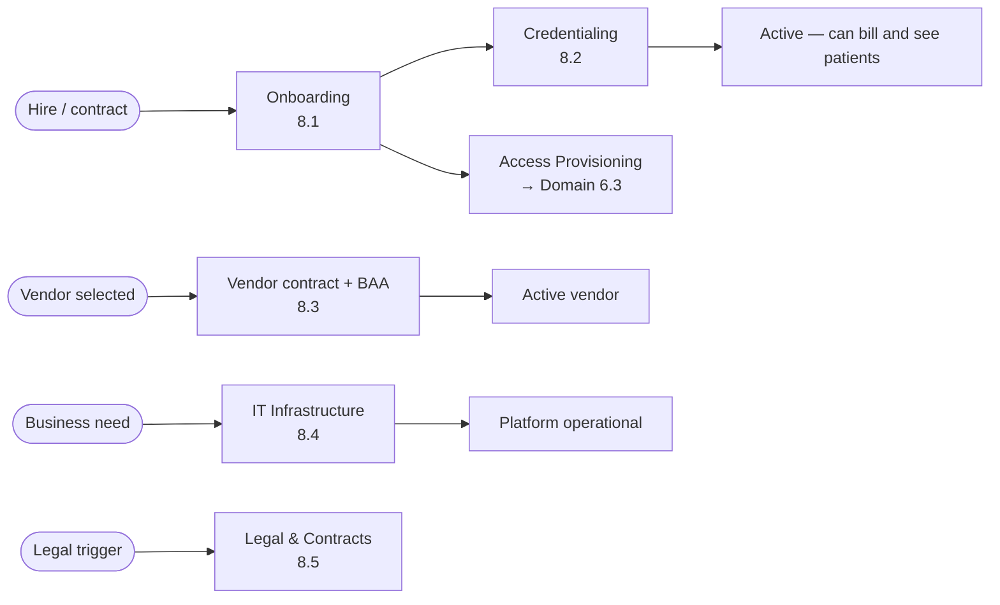
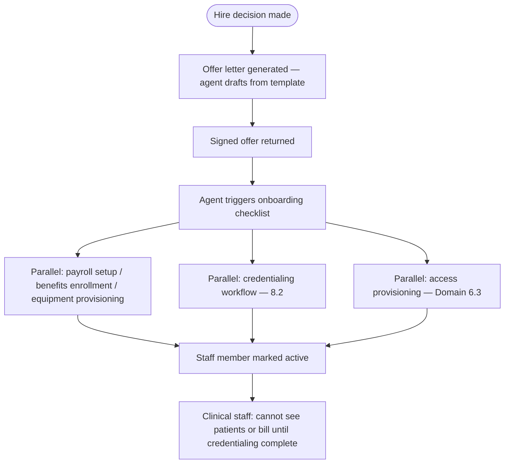
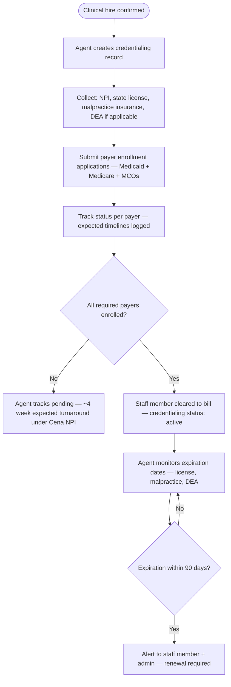
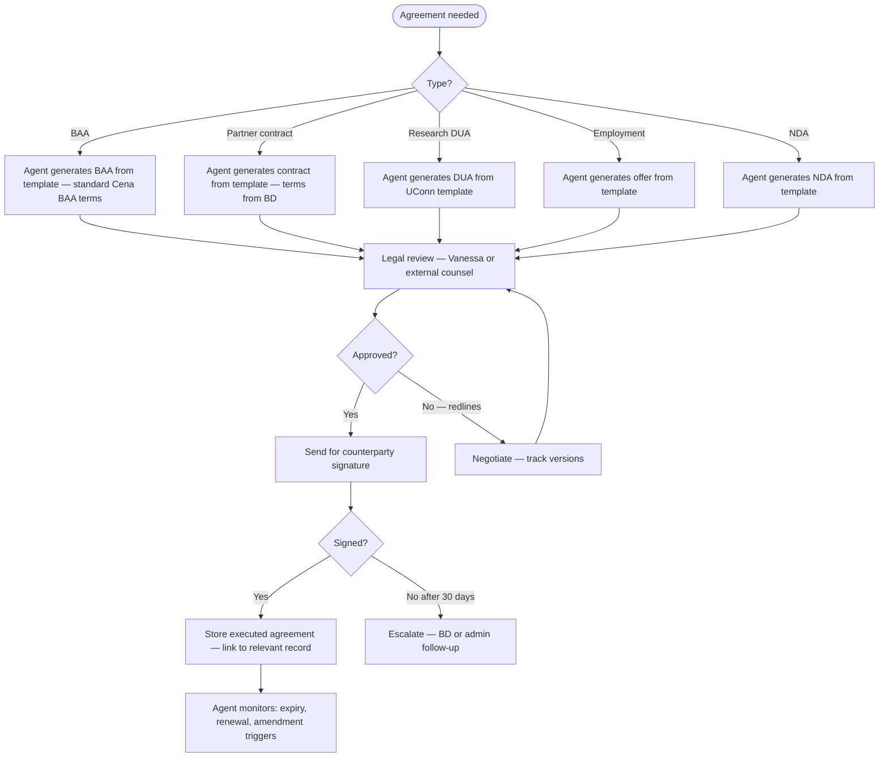

# Domain 8 — Internal Operations

> How the company itself runs: people, infrastructure, legal, and facilities. Less glamorous
> than clinical operations, but every domain depends on this one being functional. Staff must
> be credentialed before they can bill. Systems must be HIPAA-compliant before any PHI enters.
> Contracts must be executed before any partner goes live.

---

## Domain flow



---

## Key workflows

| Workflow | Description | Automation |
|---|---|---|
| 8.1 HR & People Operations | Hiring, onboarding checklist, offboarding, payroll, benefits | 🟡 Medium |
| 8.2 Provider Credentialing | NPI registry, payer enrollment, licensure, malpractice tracking | 🟡 Medium |
| 8.3 Vendor Management | Contracts, BAAs, renewals, performance tracking | 🟡 Medium |
| 8.4 IT Infrastructure | Cloud infra, HIPAA-compliant hosting, backups, monitoring | 🟡 Medium |
| 8.5 Legal & Contracts | Agreements, NDAs, BAAs, regulatory filings | 🟡 Medium |
| 8.6 Facility Management | Clinic lease, equipment, inspections, supplies | 🔴 Low |

---

## Workflow detail

### 8.1 — HR & People Operations

Cena Health runs lean — Aaron, Vanessa, Andrey plus contractors and clinical staff.
HR operations are largely managed via an external platform (Gusto / Rippling), but the
platform must be aware of hire/terminate events to provision or revoke access (Domain 6.3)
and trigger credentialing workflows (8.2).



**Offboarding trigger:**
- Terminate event → immediate access revocation (Domain 6.3) — same day, no exceptions
- Credentials deactivated in payer systems — timeline per payer (2–4 weeks typical)
- Exit documentation and equipment return tracked

---

### 8.2 — Provider Credentialing

Cena Health is becoming a fully licensed clinic. Providers contract under the **Cena Health
organizational NPI**, which significantly simplifies credentialing — individual provider payer
enrollment takes ~4 weeks under the organizational NPI instead of the 60–180 day timeline
for independent enrollment (OQ-37).

Clinical billing requires valid credentials at multiple levels:
1. **NPI** — Organizational NPI (Cena Health) plus individual provider NPIs.
2. **State licensure** — RDN and BHN must be licensed in every state where they see patients.
3. **Payer enrollment** — Providers enroll under the Cena Health organizational NPI. ~4 week
   turnaround. No provider sees patients until enrolled.
4. **DEA** — Not required for RDN/BHN, required if prescribing providers join.
5. **Malpractice insurance** — Required for all clinical staff; proof filed with payers.



**Note:** A staff member can be onboarded and scheduled for visits before credentialing is
complete, but claims cannot be submitted until payer enrollment is active. The scheduling
system must display credentialing status so coordinators don't schedule billable visits with
un-enrolled providers.

---

### 8.3 — Vendor Management

Every vendor who touches PHI needs a Business Associate Agreement (BAA) before they go live.
Known vendors requiring BAAs:
- **GCP** (AD-01) — cloud infrastructure, BAA via Google Cloud
- **Anthropic via Vertex AI** (AD-02) — LLM provider, covered under Google's BAA. Standalone Anthropic BAA in progress per OQ-02.
- **Twilio** (AD-03) — voice telephony for AVA
- **Athena Health** (OQ-03) — billing and practice management
- **Deepgram** — speech-to-text (BAA available)
- Any contractor with system access

**Vendor registry fields:**
- Vendor name, service description
- PHI exposure: yes / no / indirect
- BAA status: not required / pending / executed (with date and document) / expired
- Contract term, renewal date
- Primary contact
- Performance SLAs and last review date

Agent monitors BAA expiration and contract renewal dates; surfaces to admin 90 days before.
Any new vendor request must go through a PHI exposure assessment before procurement.

---

### 8.4 — IT Infrastructure

Cena Health's infrastructure runs on AWS or GCP in a HIPAA-eligible environment. Key
operational concerns:

- **HIPAA-eligible services only:** Not all GCP services are HIPAA-eligible even on a signed
  BAA. A whitelist of approved services must be maintained (AD-01: GCP confirmed).
- **Multi-tenant isolation:** Shared DB with tenant_id + Postgres RLS (AD-04).
  Tenant ID must be present on every PHI record.
- **Audit log storage:** Immutable, append-only. Cannot be modified by application layer.
  Separate from application database.
- **Backup and DR:** RPO ≤ 4 hours, RTO ≤ 8 hours for clinical data. Tested quarterly.
- **Monitoring:** Application health, error rates, latency, and security events all monitored.
  On-call rotation for P1 incidents.

---

### 8.5 — Legal & Contracts

**Goal:** Manage all legal agreements — BAAs, partner contracts, research data use agreements, employment agreements, NDAs — with version tracking, renewal monitoring, and compliance linkage.

**Agreement types in the system:**

| Type | Parties | Triggers | Tracked by |
|---|---|---|---|
| BAA | Cena ↔ vendor/partner | Vendor touches PHI | 8.3 vendor management |
| Partner contract | Cena ↔ health system/payer | BD close (Domain 9) | 4.2 contract management |
| Research data use agreement | Cena ↔ UConn | Research protocol active | 6.7 IRB compliance |
| Employment agreement | Cena ↔ staff | Hire event | 8.1 HR |
| NDA | Cena ↔ contractor/consultant | Contractor engagement | 8.3 vendor management |
| Telehealth consent template | Cena (internal) | Consent form update | 6.4 consent management |



**Version control:** Every agreement is versioned. Amendments create a new version linked to the original. The system stores: version number, effective date, signatories, and a reference to the document (stored outside the platform — likely SharePoint/Google Drive, linked by URL).

**Compliance linkage:** When a BAA expires, the compliance monitor (6.1) automatically blocks PHI flow to that vendor. When a partner contract expires, the referral pipeline (4.5) pauses. These gates are structural — not dependent on someone noticing the expiry.

---

### 8.6 — Facility Management

**Goal:** Manage the physical Connecticut clinic — lease, equipment, inspections, supplies, and staffing schedules for in-person visits.

**Scope note:** Cena Health is becoming a fully licensed clinic (OQ-37). Most clinical services are telehealth, but some patients receive in-person visits at the CT facility. Facility management is low-automation — the platform tracks what's needed for compliance, not the day-to-day operations.

**What the platform tracks:**

| Item | Purpose | Cadence |
|---|---|---|
| Clinic license/registration | State of CT clinic registration | Annual renewal |
| Fire/safety inspection | Required for licensure | Per state schedule |
| ADA compliance | Physical accessibility | At setup + changes |
| Equipment calibration | Scales, BP monitors | Per manufacturer spec |
| Supply inventory | Clinical supplies (PPE, testing materials) | Monthly check |
| Cleaning/sanitation log | Infection control | Daily (staff responsibility) |

**Agent role:** Minimal. Agent monitors renewal dates for clinic license and inspection schedules (same 90/30/7-day alert pattern used in credentialing). Everything else is manual and tracked outside the platform.

**Future consideration:** If Cena opens additional clinic locations (other states as the program scales), this workflow becomes more significant. For now, it's a single-site tracking checklist.

---

## Key data objects

**StaffRecord**
```
staff_record {
  id, name, role: rdn | bhn | care_coordinator | admin | engineer | contractor
  status: onboarding | active | on_leave | terminated
  credentialing_status: pending | partial | active | lapsed
  credentials: {
    npi, state_licenses: [{ state, license_number, expiry }],
    malpractice: { carrier, policy_number, expiry },
    payer_enrollments: [{ payer_id, status, effective_date }]
  }
  access_level         // drives Domain 6.3 RBAC
  hire_date, termination_date
}
```

**VendorRecord**
```
vendor_record {
  id, name, service_type
  phi_exposure: none | indirect | direct
  baa: { status, executed_date, expiry_date, document_id }
  contract: { term_start, term_end, renewal_date, value }
  status: active | paused | terminated
}
```

---

## Dependencies

- **Upstream from:** Domain 9 (Business Development decisions drive hiring and vendor needs)
- **Downstream to:** Domain 6 (access provisioning, BAA compliance), Domain 5 (valid credentials required for billing), Domain 2 (credentialed providers required for clinical visits), all domains (infrastructure underpins everything)

---

## Open questions (updated with Vanessa's answers)

1. ~~**HR platform integration:**~~ **Resolved (OQ-36).** No HR platform at launch. Handle onboarding/offboarding manually. Platform receives hire/terminate events from coordinator manual entry, not system integration.

2. ~~**Credentialing timeline:**~~ **Resolved (OQ-37).** Cena Health is becoming a fully licensed clinic. Providers contract under the Cena organizational NPI — ~4 week credentialing turnaround instead of 60–180 days. No provider sees patients until enrolled.

3. **Multi-state licensure cost:** Partially addressed. CDR interstate compact exists but not all states participate. As Cena scales to CA (Cedars) and TN (Vanderbilt), licensure costs and timelines will increase. Track per-state licensure status in credentialing (6.8).

4. **Facility scope:** Unanswered. Determines 8.6 depth. Most visits are telehealth — the CT clinic likely handles initial in-person visits and patients who can't do telehealth.

5. ~~**Engineering on-call:**~~ **Routed to Andrey (OQ-38, AD-07).** Proposed framework in decisions.md — Andrey to finalize before go-live.
