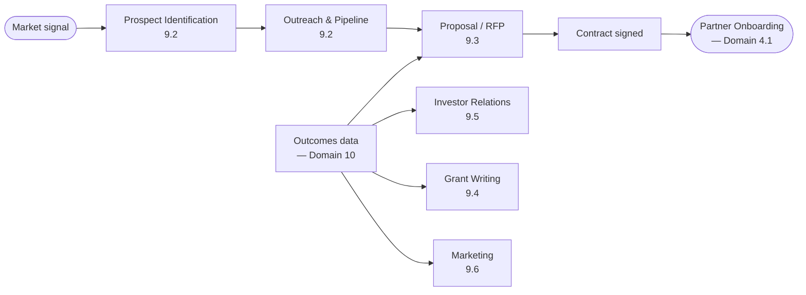
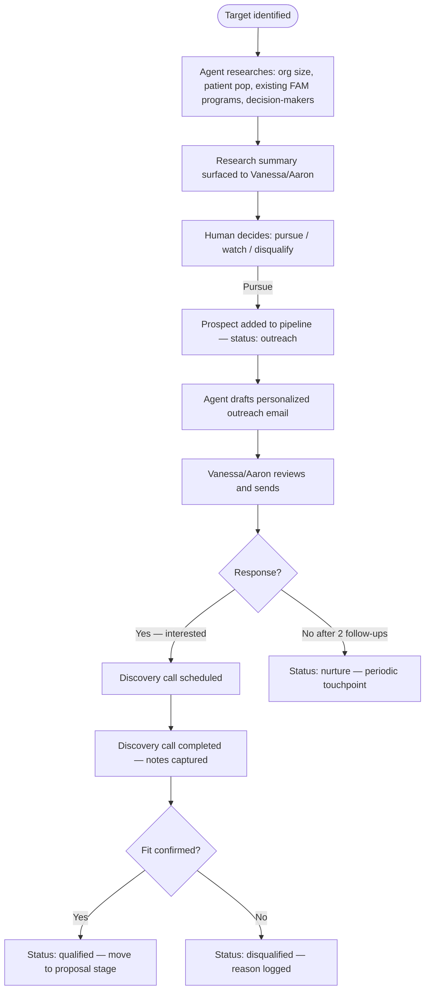
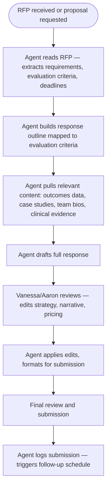

# Domain 9 — Business Development

> How Cena Health grows: finding partners, winning contracts, securing grants, and telling
> the story well enough that the right organizations want to work with us. Business development
> is the top of the funnel for everything downstream — no partners, no referrals, no patients,
> no revenue.

---

## Domain flow



---

## Key workflows

| Workflow | Description | Automation |
|---|---|---|
| 9.1 Market Research | Monitor FAM landscape, payer programs, competitor moves, regulatory changes | 🟡 Medium |
| 9.2 Prospect Management | Identify targets, research decision-makers, manage outreach pipeline | 🟡 Medium |
| 9.3 Proposal & RFP Response | Draft, customize, and submit responses to RFPs | 🟡 Medium |
| 9.4 Grant Writing & Management | Identify opportunities, write applications, manage reporting | 🟡 Medium |
| 9.5 Investor Relations | Board materials, investor updates, data room, cap table | 🟡 Medium |
| 9.6 Marketing & Brand | Thought leadership content, website, conference presence | 🟡 Medium |

---

## Workflow detail

### 9.1 — Market Research

The FAM space is moving fast — new CMS waivers, state Medicaid programs adding nutrition
benefits, health systems launching programs, and VC-backed competitors raising capital.
Staying current is not optional.

**Agent monitoring scope:**
- CMS rule changes and proposed rules affecting nutrition services reimbursement
- State Medicaid plan amendments for FAM/nutrition benefits (50 states × ongoing)
- Competitor activity: funding rounds, partnership announcements, published outcomes
- Published clinical evidence supporting FAM outcomes (feeds proposal content)
- RFP publication portals (SAM.gov for federal, state procurement portals)

Agent surfaces weekly digest to Vanessa and Aaron. Items flagged as actionable (new RFP,
competitor win at a target account, new payer program) are promoted to active tasks.

---

### 9.2 — Prospect Management

Target profile: health systems with Medicaid ACO programs, MCOs with shared savings contracts,
employer groups with high chronic disease burden, and federal/state research programs.



**Pipeline stages:** `identified` → `outreach` → `discovery` → `qualified` → `proposal` →
`negotiation` → `closed_won` / `closed_lost`

---

### 9.3 — Proposal & RFP Response

Proposals are the primary conversion tool. Most health system and payer partnerships require
a formal proposal or RFP response. The agent's role is to handle the research, draft scaffolding,
and content assembly — freeing Vanessa and Aaron to focus on strategy and relationship.



**Content library:** The agent maintains a structured library of reusable content:
- Outcome statistics (kept current from Domain 10)
- Team bios and credentials
- Clinical evidence citations
- Program descriptions per service line
- Pricing templates per contract type

Content library must be kept current — stale outcome data in a proposal is a liability.

---

### 9.4 — Grant Writing & Management

Grants are non-dilutive capital and research validation. Key targets: NIH SBIR/STTR,
AHRQ healthcare innovation grants, USDA food and nutrition programs, state health foundation
grants, and partner-specific research funding (UConn).

**Agent role:**
- Monitor grant opportunity databases (NIH Reporter, Grants.gov, foundation websites)
- Match opportunities to Cena Health's current program and research capabilities
- Draft specific aims, background sections, and budget justifications
- Track submission deadlines and reporting obligations for active grants

**Human role:**
- Evaluate strategic fit of each opportunity
- Write or heavily edit sections requiring clinical voice
- PI (Principal Investigator) on NIH grants must be a credentialed researcher —
  Cena Health likely needs a university partner (UConn) for PI eligibility on federal grants

---

### 9.5 — Investor Relations

**Goal:** Maintain investor confidence through regular updates, board materials, and data room management. Cena Health's ability to raise future capital depends on demonstrating traction — patient outcomes, partner growth, and revenue trajectory.

**Agent role:**
- Generate monthly investor update drafts from operational data (patient count, outcomes trends, revenue, pipeline)
- Maintain data room with current financials, contracts, compliance documents
- Track board meeting schedule and generate board deck scaffold from templates
- Pull key metrics from Domain 10 analytics for investor-facing dashboards

**Human role:**
- Vanessa and Aaron own the narrative — the agent provides data, not strategy
- Board communication is Vanessa-led
- Cap table management is external (Carta or equivalent)

**Update cadence:**

| Deliverable | Cadence | Owner | Agent role |
|---|---|---|---|
| Investor update email | Monthly | Vanessa | Drafts from data, Vanessa edits narrative |
| Board deck | Quarterly | Vanessa + Aaron | Scaffold + data population, humans finalize |
| Data room update | Continuous | Admin | Agent flags stale documents |
| Fundraise materials | As needed | Vanessa | Agent assembles, humans position |

---

### 9.6 — Marketing & Brand

**Goal:** Build Cena Health's reputation in the FAM space through thought leadership, conference presence, and digital content. Marketing at this stage is credibility-building, not lead generation — partners come through relationships and proposals, not inbound marketing.

**Content types and agent role:**

| Content | Purpose | Agent role | Human role |
|---|---|---|---|
| Case studies | Demonstrate outcomes | Drafts from patient data (de-identified) | Vanessa/Aaron review, approve |
| Blog posts / articles | Thought leadership | Research + draft | Aaron reviews, publishes |
| Conference presentations | Industry visibility | Scaffold deck, pull data | Aaron designs, Vanessa presents |
| Social media | Awareness | Draft posts from content library | Aaron reviews, schedules |
| Website content | Credibility for prospects | Maintain, update outcomes metrics | Aaron manages |

**Brand guidelines:** All marketing content follows the Cena Health brand system (Lab/cena-health-brand/). Visual assets, tone, and design principles are defined there — the agent references the brand brief when generating content.

**Conference strategy:** Unanswered as an open question. Key conferences for FAM:
- FNCE (Food & Nutrition Conference & Expo) — RDN community
- ADA Scientific Sessions — diabetes outcomes
- NACHC (National Association of Community Health Centers) — safety net providers
- HIMSS — health IT / interoperability
- State-level Medicaid managed care conferences

---

## Key data objects

**Prospect**
```
prospect {
  id, org_name, org_type: health_system | mco | employer | government
  target_population_size
  existing_fam_program: yes | no | unknown
  decision_makers: [{ name, title, contact, relationship_owner }]
  pipeline_stage
  fit_score            // agent-generated from research
  last_activity_date
  notes_thread         // all interactions logged here
}
```

**Proposal**
```
proposal {
  id, prospect_id
  type: rfp_response | unsolicited | grant_application
  rfp_deadline, submission_date
  status: drafting | review | submitted | won | lost
  evaluation_criteria: []
  content_sections: [{ title, content, owner }]
  outcome_data_snapshot  // version of outcomes used — must be current at submission
  contract_type_proposed
  win_loss_notes         // filled on close
}
```

---

## Dependencies

- **Upstream from:** Domain 10 (outcomes data is the primary proof point in every proposal and investor update), Domain 2 and 7 (clinical credibility comes from documented outcomes)
- **Downstream to:** Domain 4 (closed deals trigger partner onboarding), Domain 8 (new partners drive hiring and vendor needs), Domain 5 (new contracts define billing models)

---

## Open questions (updated with Vanessa's answers)

1. **Relationship ownership (OQ-24):** Deferred. Vanessa owns clinical relationships, Aaron owns product. BD hire timing TBD.

2. **Grant PI strategy (OQ-40):** Still with Vanessa. Is UConn structured to serve as PI on federal grants?

3. ~~**Outcomes data readiness:**~~ **Resolved (OQ-39).** Combination of pilot data and published literature. Clinical validation summary in CenaShare drive. Sufficient for current proposals — statistical significance grows with patient volume.

4. **Pricing model (OQ-41):** Still with Vanessa. Standard PMPM rates and shared savings splits, or case-by-case?

5. **Conference strategy:** Unanswered. Low priority for platform design — this is a business planning question, not a workflow question.
