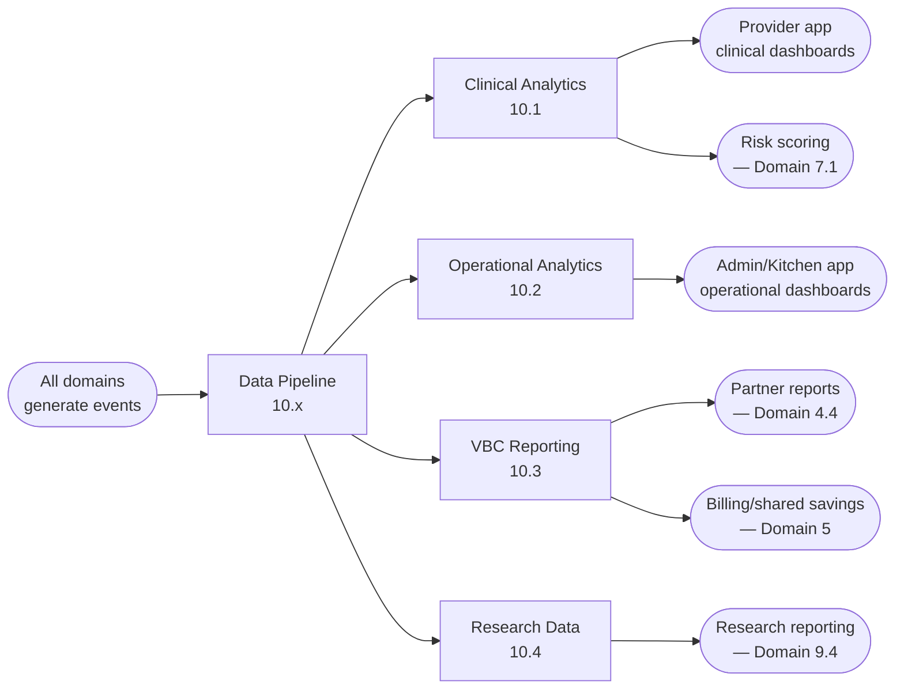
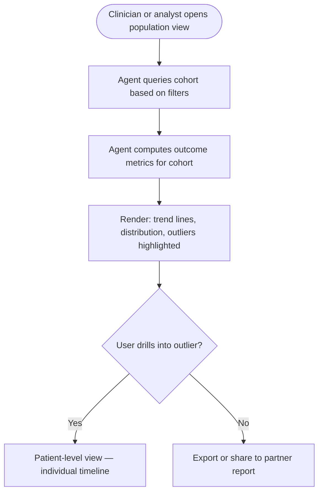
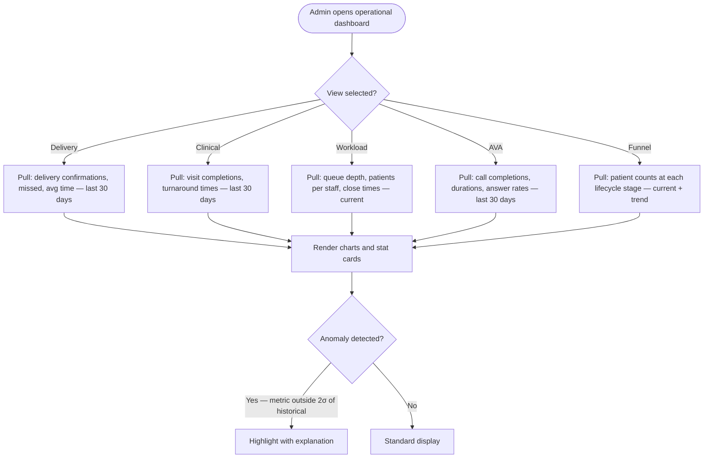
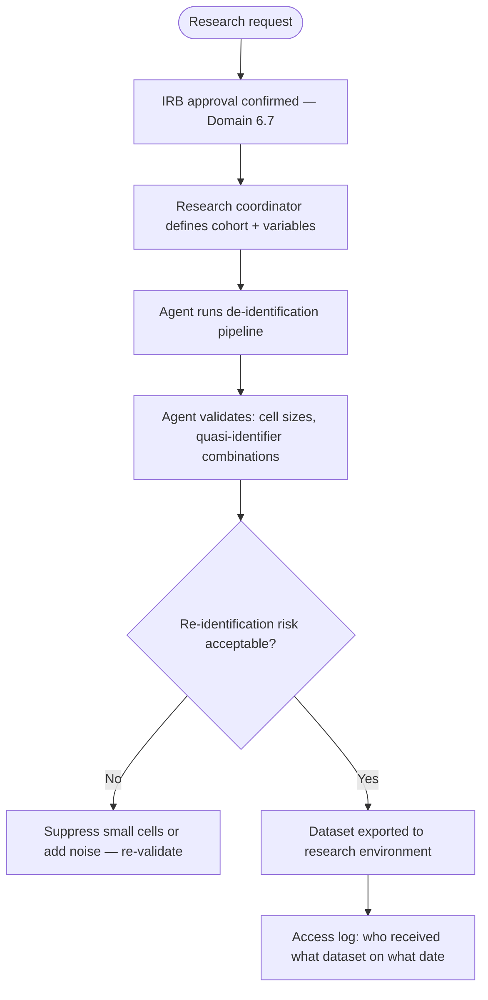

# Domain 10 — Data, Analytics & Research

> The intelligence layer of the platform. Every clinical event, meal delivery, check-in
> response, and billing transaction generates data. This domain turns that data into decisions:
> for clinicians (who needs attention?), for operators (what's not working?), for partners
> (are we delivering value?), and for the business (are we growing?).

---

## Domain flow



---

## Key workflows

| Workflow | Description | Automation |
|---|---|---|
| 10.1 Population Health Analytics | Outcomes across patient cohorts — what's working, for whom, by how much | 🟡 Medium |
| 10.2 Operational Analytics | Delivery rates, visit completion, check-in completion, care team workload | 🟢 High |
| 10.3 Value-Based Care Reporting | HEDIS measures, CMS quality indicators, shared savings calculation inputs | 🟡 Medium |
| 10.4 Research Data Management | De-identification pipeline, IRB-compliant datasets, academic reporting | 🟡 Medium |
| 10.5 Predictive Modeling | Risk prediction, shared savings estimation, meal matching optimization | 🟡 Medium |
| 10.6 Board & Investor Reporting | Business metrics aggregation for board and investor audiences | 🟡 Medium |

---

## Workflow detail

### Data pipeline (foundation for all of 10.x)

Before any analytics workflow is possible, there must be a reliable, structured data pipeline.
Every event in the platform — clinical, operational, financial — must land in a queryable store
with consistent schemas and timestamps.

**Event types the pipeline must handle:**

| Source | Events |
|---|---|
| Patient Operations | Status transitions, enrollment, discharge |
| Clinical Care | Visit completed, note signed, lab result received, medication change |
| Meal Operations | Order generated, delivered, missed, feedback received |
| AVA | Check-in completed, PHQ-9 score, missed check-in |
| Billing | Claim submitted, paid, denied |
| Risk | Risk score updated, alert generated, alert resolved |

**Pipeline requirements:**
- All events timestamped and attributed (which agent or user performed the action)
- Tenant-isolated at the data layer
- Audit log is append-only and separate from the analytics store
- HIPAA minimum necessary applied to analytics views — de-identified where possible
- Data available for query within minutes of event (near real-time), not batch overnight

---

### 10.1 — Population Health Analytics

The clinical team needs to answer: across all our active patients, who is improving, who is
stuck, and what predicts the difference?

**Standard cohort views:**
- By condition (diabetes vs. hypertension vs. both)
- By risk tier (low / medium / high)
- By partner (UConn patients vs. Cedars patients)
- By demographics (age band, SDOH score bucket)
- By program duration (0–3 months, 3–6 months, 6–12 months)

**Standard outcome metrics per cohort:**
- HbA1c: baseline, current, delta, % reaching target (<8%)
- Weight: baseline, current, delta
- BP: baseline, current, % achieving control (<140/90)
- PHQ-9: baseline, current, delta, % improving
- Meal delivery completion rate
- Visit completion rate
- Engagement score (composite of check-in response rate, app activity, visit attendance)



---

### 10.2 — Operational Analytics

**Goal:** Give administrators and coordinators real-time visibility into how the operation is performing — delivery rates, visit completion, care team workload, and process bottlenecks.

**Dashboard views:**

| View | Audience | Key metrics |
|---|---|---|
| Delivery operations | Admin, Kitchen | Delivery completion %, missed delivery rate, avg delivery time, orders per kitchen per day |
| Clinical operations | Admin, Coordinator | Visit completion rate, avg days referral-to-enrollment, avg days enrollment-to-first-visit, care plan approval turnaround |
| Care team workload | Admin | Patients per coordinator, queue depth per role, avg time-to-close per queue item, alert acknowledgment rate |
| AVA performance | Admin | Check-in completion rate, avg call duration, patient answer rate, crisis detection rate |
| Engagement funnel | Admin | Referral → eligible → enrolled → active → discharged (with drop-off at each stage) |



**Anomaly detection:** Agent tracks a rolling 90-day baseline for each metric. When a current value falls outside 2 standard deviations, it's highlighted with context: "Missed delivery rate is 12% this week (avg: 4%). 8 of 14 misses were from Kitchen #2." This turns data into actionable intelligence.

**Workload balancing:** When one coordinator's queue depth exceeds 2x the team average, the system flags it for Admin review. Rebalancing is a manual decision — the system identifies the imbalance, the Admin redistributes patients.

---

### 10.3 — Value-Based Care Reporting

HEDIS and CMS quality measures are the currency of value-based contracts. The measures that
matter most for Cena Health's patient population:

| Measure | Metric | Data required |
|---|---|---|
| HbA1c control | % patients with HbA1c <8% | Lab result + diagnosis |
| Hypertension control | % patients with BP <140/90 | BP measurement + diagnosis |
| Depression screening | % patients screened with PHQ-9 | PHQ-9 completion log |
| Depression follow-up | % patients with positive screen who had follow-up | BHN visit log |
| Care plan documented | % patients with active care plan | Care plan records |
| Meal delivery completion | Program-specific — defined per contract | Delivery confirmation |

**Critical design constraint:** HEDIS measures have specific denominator and numerator
definitions. The data model must capture the right fields in the right format from day one.
Retrofitting HEDIS compliance into an existing data model is expensive.

For each measure, the data pipeline must know:
- The eligible population (denominator): which patients qualify and during what period
- The qualifying event (numerator): what constitutes a "pass" for the measure
- The measurement period: calendar year, rolling 12 months, or contract-defined

---

### 10.4 — Research Data Management

The UConn research program (and future IRB-governed studies) requires a research data tier
that is separate from the clinical operations data.

**De-identification pipeline:**
1. Extract: pull patient records matching the research cohort definition
2. De-identify: remove direct identifiers per HIPAA Safe Harbor (18 identifier types)
   or Expert Determination method
3. Validate: confirm de-identification — no small cell sizes that enable re-identification
4. Export: deliver to research team in agreed format (CSV, FHIR, REDCap)

**Note:** De-identification is not deletion. The original PHI record is unchanged. The research
dataset is a derived, separate artifact. Access controls on research datasets are managed
independently from clinical data access.



---

### 10.5 — Predictive Modeling

**Goal:** Use historical data to predict outcomes, optimize interventions, and estimate financial performance before it's measured.

**Models in scope:**

| Model | Input | Output | Used by |
|---|---|---|---|
| Disengagement risk | Engagement signals (7.6), demographics, SDOH | Probability of dropout in next 30 days | Coordinator — proactive outreach |
| Clinical trajectory | Baseline labs, visit adherence, meal adherence | Predicted HbA1c at 6 months | RDN — care plan adjustment |
| Shared savings estimator | Current cohort performance, contract benchmarks | Estimated savings at settlement | Admin — financial planning |
| Meal satisfaction predictor | Patient preferences, recipe history, feedback | Predicted satisfaction score for a meal selection | Meal matching (3.3) — optimize selections |
| Readmission risk | Clinical data, SDOH, engagement | 30-day readmission probability | Partner reporting — value demonstration |

**Model governance (AD-06, OQ-44):**
- Clinical team proposes weight/parameter changes
- System runs new parameters against historical data and shows impact
- Clinical team reviews and confirms
- Engineering deploys
- Change logged in audit trail with before/after and approver
- Emergency overrides require two approvers

**Model limitations and safeguards:**
- All predictions are advisory — they surface in the thread as agent recommendations, never as autonomous actions
- Model outputs include a confidence score — low-confidence predictions are flagged
- Models are retrained quarterly (or when the clinical team requests it)
- No model operates on data it wasn't trained for (e.g., a diabetes-trained model should not predict outcomes for a hypertension-only cohort without revalidation)

---

### 10.6 — Board & Investor Reporting

**Goal:** Aggregate business metrics for board and investor audiences. Distinct from partner reporting (4.4) — this is Cena Health's internal view of company performance.

**Standard board metrics:**

| Category | Metrics |
|---|---|
| Growth | Active patients, new enrollments/month, partner count, pipeline value |
| Clinical outcomes | HbA1c improvement rate, PHQ-9 improvement rate, engagement score avg |
| Financial | Revenue (FFS + PMPM), AR aging, collection rate, burn rate, runway |
| Operations | Meals delivered/month, visit completion rate, coordinator-to-patient ratio |
| Product | Agent automation rate (% of actions agent-completed without human intervention), queue throughput |

**Agent role:** Pulls data from all domains, generates a board deck scaffold with current metrics populated. Vanessa and Aaron add narrative, strategy, and positioning. The agent never writes the strategic narrative — it provides the numbers.

**Cadence:** Board deck quarterly, investor update monthly, data room maintained continuously.

---

## Key data objects

**AnalyticsEvent** (the atomic unit of the data pipeline)
```
analytics_event {
  id
  event_type        // e.g., visit_completed, lab_received, delivery_confirmed
  tenant_id
  patient_id        // nullable for non-patient events
  actor_id          // agent ID or user ID
  timestamp
  payload           // event-specific structured data
  source_domain     // 1–10
}
```

**CohortDefinition**
```
cohort_definition {
  id, name, description
  filters: [{ field, operator, value }]  // e.g., condition = diabetes AND enrollment_months >= 3
  created_by, created_at
  last_computed_at
  patient_ids: []  // resolved at query time
}
```

**QualityMeasure**
```
quality_measure {
  id, name, source: hedis | cms | contract_specific
  measurement_period: { start, end }
  denominator_definition   // who qualifies
  numerator_definition     // what counts as passing
  current_rate             // computed
  target_rate              // from contract or benchmark
  patient_breakdown: [{ patient_id, in_denominator, in_numerator }]
}
```

---

## Dependencies

- **Upstream from:** All domains — every event in every domain is a data input
- **Downstream to:** Domain 4 (partner reports), Domain 5 (shared savings inputs), Domain 7 (risk scoring model inputs), Domain 9 (outcomes data for proposals and grants), internal decision-making

---

## Open questions (updated with decisions and Vanessa's answers)

1. ~~**Data warehouse vs. operational DB:**~~ **Resolved (OQ-42).** Engineering's call — Andrey and team decide. Recommendation: operational Postgres DB for real-time data (risk scoring, clinical operations) + BigQuery for analytics and research (AD-05).

2. **HEDIS denominator timing (OQ-07):** Still with Vanessa. Design now or when first VBC contract requires it? Recommendation: design the data model for HEDIS compliance from day one — it's field-level decisions (capture date, ordering provider NPI, result value in queryable format), not a separate system. Retrofitting is more expensive than getting it right initially.

3. ~~**Research vs. clinical data tier:**~~ **Resolved (OQ-43, AD-05).** Hybrid — clinical Postgres DB is the source of truth. Scheduled ETL exports de-identified data to BigQuery for research. Physical separation for compliance, minimal operational overhead. UConn accesses BigQuery, never the clinical DB.

4. ~~**Attribution model:**~~ **Resolved (OQ-35).** Attribution is contract-dependent — each payer contract defines its own attribution rules. Platform supports per-contract attribution configuration.

5. ~~**Model governance:**~~ **Resolved (OQ-44, AD-06).** Clinical team proposes weight changes, system shows impact on historical data, clinical team confirms, engineering deploys. Change logged with before/after and approver. Emergency overrides require two approvers.
