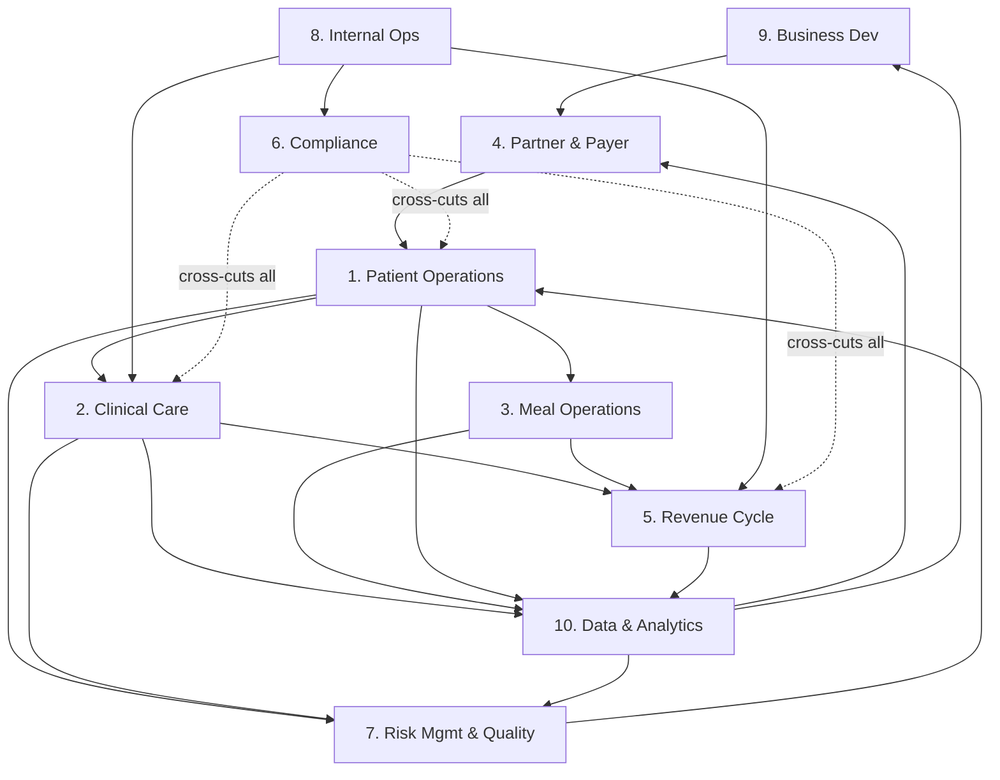

# Workflows Index

All 10 business domains. Each doc covers: domain flow diagram, key workflows with automation
potential, workflow detail for the 3–4 most critical flows, key data objects, cross-domain
dependencies, and open questions.

**Status legend:** ✅ Wide sketch complete | 🔲 Deep detail pending

---

| File | Domain | Status | Specialist input |
|---|---|---|---|
| [01-patient-operations.md](01-patient-operations.md) | Patient Operations | ✅ Deep (11 workflows) | — |
| [02-clinical-care.md](02-clinical-care.md) | Clinical Care | ✅ Deep (9 workflows) | Clinical informatics |
| [03-meal-operations.md](03-meal-operations.md) | Meal Operations | ✅ Deep (10 workflows) | — |
| [04-partner-payer-relations.md](04-partner-payer-relations.md) | Partner & Payer Relations | ✅ Deep (6 workflows) | — |
| [05-revenue-cycle.md](05-revenue-cycle.md) | Revenue Cycle & Billing | ✅ Deep (7 workflows) | RCM specialist |
| [06-compliance.md](06-compliance.md) | Compliance & Regulatory | ✅ Deep (9 workflows) | Compliance specialist |
| [07-risk-management.md](07-risk-management.md) | Risk Management & Quality | ✅ Deep (6 workflows) | Clinical quality specialist |
| [08-internal-operations.md](08-internal-operations.md) | Internal Operations | ✅ Deep (6 workflows) | — |
| [09-business-development.md](09-business-development.md) | Business Development | ✅ Deep (6 workflows) | — |
| [10-data-analytics-research.md](10-data-analytics-research.md) | Data, Analytics & Research | ✅ Deep (7 workflows) | — |

---

## Cross-domain dependency map

## Expert-level workflow specs

Step-level detail with expert assignments, context budgets, checkpoints, and
retro logs — following the template in `experts/workflow-spec.md`.

| Workflow | Domain bridge | Status |
|---|---|---|
| [care-plan-creation/](care-plan-creation/) | Domain 1.5 → patient activation | Draft |
| [meal-prescription/](meal-prescription/) | Domain 1.6 → Domain 3.3 (Clinical Care → Meal Ops) | Draft |

---

## Critical path for MVP

The minimum viable sequence to serve a patient:

1. **8. Internal Ops** — staff credentialed, infrastructure live, BAAs executed
2. **6. Compliance** — audit log, consent management, access control active
3. **4. Partner & Payer** — at least one partner onboarded, referral pipeline live
4. **1. Patient Operations** — referral intake through care plan creation
5. **3. Meal Operations** — recipe catalog loaded, order generation, delivery
6. **2. Clinical Care** — RDN visit documentation, lab tracking
7. **5. Revenue Cycle** — claims generation and submission

Domains 7, 9, 10 are needed shortly after but are not day-one blockers.

---

## Open questions consolidation

Each domain doc has 4–6 open questions. High-priority decisions that block multiple domains:

| Question | Blocks | Where documented |
|---|---|---|
| Epic integration tier per partner | 2, 4, 10 | 04 and 02 |
| HEDIS data model design | 5, 7, 10 | 10 |
| Multi-state RDN licensure strategy | 2, 8 | 08 |
| Research data tier architecture | 6, 10 | 10 |
| Attribution model for outcomes | 9, 10 | 10 |
| TriCare / DoD data handling requirements | 4, 6 | 06 |
| PHI exposure of LLM provider — BAA status | 6, all | 06 |
| Shared savings reconciliation ownership | 4, 5 | 04 |
