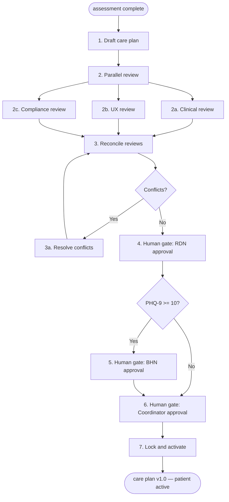

# Care Plan Creation

> Multi-expert workflow that produces an individualized, approved care plan from
> a completed patient assessment. This is the highest-stakes pre-care workflow —
> the care plan drives all downstream activity (meals, visits, monitoring, billing).

## Commander's intent

Get the patient onto active, clinically safe care as fast as possible. A patient
waiting for a care plan is a patient not receiving meals, monitoring, or support —
speed matters. But a care plan with clinical errors causes direct harm, so clinical
safety is the one thing that cannot be traded for speed.

### Priority stack

1. **Patient safety** — No clinical errors in the active plan (nutrition, meds, BH)
2. **Regulatory compliance** — PHI rules, consent coverage, audit trail
3. **Time-to-activation** — Minimize days between assessment-complete and patient-active
4. **Process completeness** — All review perspectives represented
5. **Presentation quality** — Care plan renders clearly for reviewers and patients

### Acceptable degradation boundary

The workflow succeeds if the patient activates on a clinically safe, compliant plan
— even if UX review was skipped, presentation is rough, or reconciliation was
mechanical. The workflow has fundamentally failed if: a nutrition plan activates
without RDN sign-off, a PHI violation reaches the patient-facing view, or a
PHQ-9 >= 10 patient activates without BHN review.

## Domain reference

Business logic, data objects, and step sequence: `workflows/01-patient-operations.md`
section 1.5 (Care Plan Creation) through 1.6 (Meal Prescription trigger).

## Participating experts

| Expert | Role in this workflow | Status |
|---|---|---|
| **Clinical Care** | Provides assessment data, dietary requirements, clinical guidelines. Drafts nutrition plan and behavioral health sections. | Planned |
| **UX Design Lead** | Specifies how the care plan is presented for RDN review, how approval interactions work, and how the patient-facing summary renders. | Draft |
| **Compliance** | Validates PHI display rules in care plan views, audit trail completeness, and consent scope coverage. | Planned |
| **Patient Ops** | Manages lifecycle state transitions, coordinates across reviewers, and handles error routing. | Planned |

## Hardcoded gates (cannot be overridden)

- **RDN sign-off on nutrition section** — Clinical sign-off required before plan activation
- **BHN review when PHQ-9 >= 10** — Behavioral health section requires BHN approval
- **Care coordinator final approval** — Integrated plan must be reviewed before locking

## Flow overview

