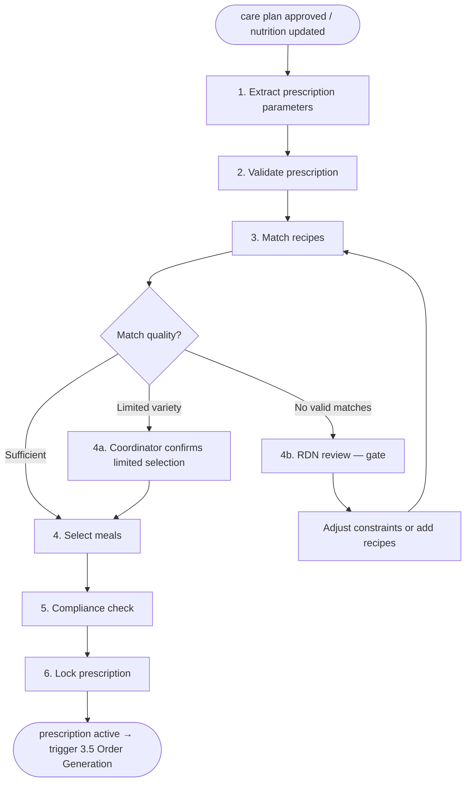

# Meal Prescription

> Translates an approved care plan's nutrition section into a weekly meal
> prescription that the meal operations domain can execute against. This is
> the bridge between clinical intent and food delivery — the point where
> caloric targets, macro limits, and allergen exclusions become actual meals
> on a patient's table.
>
> Triggered by two events: initial care plan activation (workflow 1.5 → 1.6)
> and care plan update when the nutrition section changes (workflow 1.9).

## Commander's intent

Get the right food to the right patient as fast as the clinical plan allows.
A patient with an approved care plan but no meal prescription is a patient
not receiving the core service. Speed matters — but never at the cost of
serving food that violates allergen exclusions or clinical restrictions.

### Priority stack

1. **Allergen safety** — No allergen violations reach the patient. Ever.
2. **Clinical restriction compliance** — Meals match the nutrition plan's caloric, macro, and electrolyte targets
3. **Time-to-first-meal** — Minimize days between care plan activation and first delivery
4. **Preference match** — Cultural preferences, taste, hot/cold within constraints
5. **Variety** — Minimize repetition across weeks

### Acceptable degradation boundary

The workflow succeeds if the patient receives clinically safe, allergen-verified
meals — even if preference matching is poor, variety is limited, or the
prescription was generated with manual coordinator involvement.

The workflow has fundamentally failed if: meals are delivered that violate an
allergen exclusion, meals are delivered that exceed a hard clinical restriction
(e.g., potassium for a CKD patient), or no prescription is generated within
the delivery cycle cutoff.

## Domain references

- Nutrition plan parameters: `workflows/01-patient-operations.md` section 1.6
- Recipe catalog and matching: `workflows/03-meal-operations.md` sections 3.1-3.3
- Meal prescription data object: `workflows/01-patient-operations.md` section 1.6 (schema)

## Participating experts

| Expert | Role in this workflow | Status |
|---|---|---|
| **Clinical Care** | Provides nutrition plan parameters from the care plan. Validates that the prescription accurately translates clinical targets. | Draft |
| **Meal Ops** (planned) | Matches prescription constraints against recipe catalog. Handles inventory-aware substitutions. | Planned |
| **Compliance** (planned) | Validates PHI handling on prescription artifacts (packing slips, kitchen orders). Verifies consent scope covers meal delivery data sharing. | Planned |

## Hardcoded gates (cannot be overridden)

- **RDN review when no valid recipes exist** — If allergen + restriction filters produce zero matches, an RDN must review before constraints are relaxed
- **Coordinator approval on kitchen reroute** — If primary kitchen can't fulfill, coordinator approves alternative kitchen before rerouting

## Flow overview

