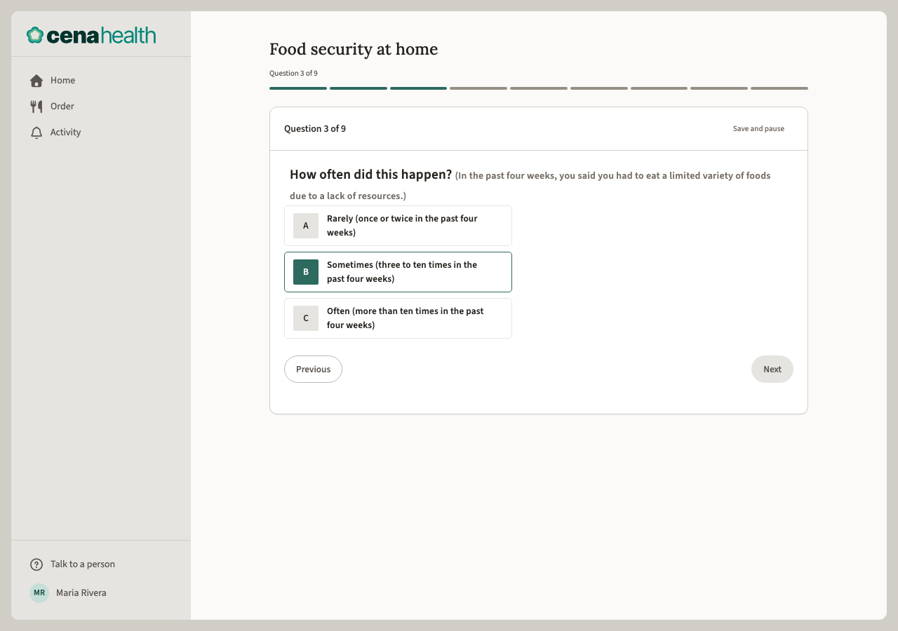
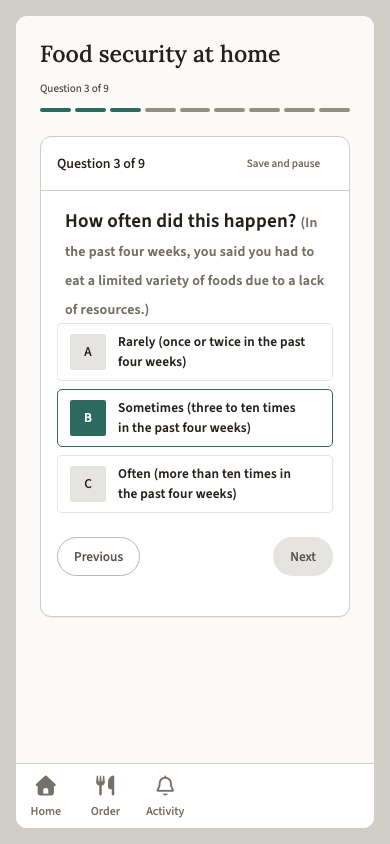

# Render Check — take-assessment.question.html

- **Source:** `/Users/aaronsleeper/Vaults/Lab/haven-ui/handoff/cena-uconn/assessments/take-assessment.question.html`
- **Rendered:** 2026-05-25T16:08:44.631Z
- **Tool:** `render-check.mjs` — slot-22 render sub-step (Principle 13), assertion-free
- **Viewports:** desktop 1280×900, mobile 390×844
- **Verdict:** PASS

> All mechanical checks passed. No render-time defects detected by this tool.

## Page-level checks

_From the desktop render (1280×900)._

### Stylesheets

| href | loaded | introspectable | rules |
| --- | --- | --- | --- |
| `https://fonts.googleapis.com/css2?family=Lora:wght@400;500;600;700&family=Source+Sans+3:wght@300;400;500;600;700&family=Source+Code+Pro:wght@400;500;600&display=swap` | yes | no (opaque) | — |
| `file:///Users/aaronsleeper/Vaults/Lab/haven-ui/handoff/cena-uconn/assets/haven.css` | yes | yes | 7953 |

Stylesheet load failures — pass: no failed stylesheet requests.

### Undefined classes

Undefined classes — pass: all 54 markup classes resolve to a CSS rule.

## Per-viewport checks

### desktop — 1280×900

- Duplicate-label affordance — pass: no identical-named interactive elements within threshold.
- Overflow / clipping — pass: no horizontal overflow at document or element level.
- Console errors — pass: no console errors or uncaught exceptions.

### mobile — 390×844

- Duplicate-label affordance — pass: no identical-named interactive elements within threshold.
- Overflow / clipping — pass: no horizontal overflow at document or element level.
- Console errors — pass: no console errors or uncaught exceptions.

## Check summary

| Check | Result |
| --- | --- |
| Duplicate-label affordance | pass |
| Overflow / clipping | pass |
| Undefined classes | pass |
| Console errors | pass |
| Stylesheet load failures | pass |
